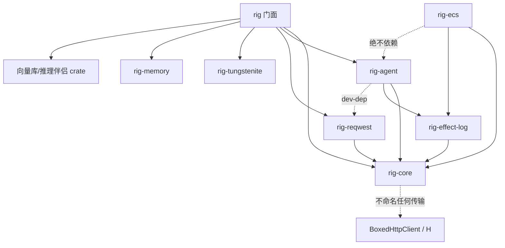
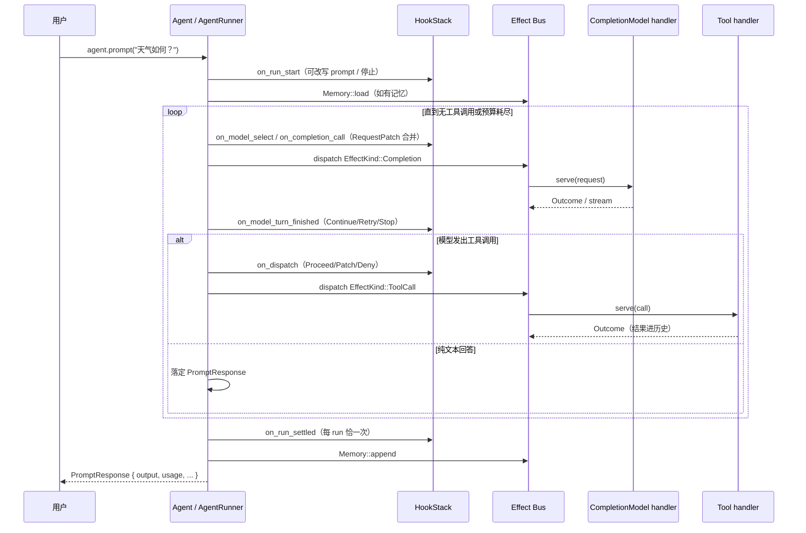

# 01-架构总览

Rig 是一个面向 GenAI（生成式 AI）应用的开源框架：用统一的抽象层对接几十家模型 Provider，在其上提供带工具调用的多轮 Agent 运行时、结构化提取、向量检索与记忆。仓库为 Cargo workspace，一个门面 crate（`rig`）加一组功能内聚的子 crate。

---

## 🧱 工作区拓扑

```
Rig workspace
├── rig                    # 门面 crate：仅重导出（src/lib.rs ~360 行），特性门控各伴侣模块
├── crates/
│   ├── rig-core           # 可移植契约：trait、消息模型、effect 协议、26 个内置 provider（无 HTTP 传输依赖）
│   ├── rig-agent          # 经典 Agent 运行时：AgentRunner、AgentRun、hook、bus 运行时、工具注册表
│   ├── rig-ecs            # Bevy World 运行时：效果即实体、运行即图（尚未发布，publish=false）
│   ├── rig-reqwest        # 绑定的 reqwest HTTP 传输 + 默认构造便捷（new/from_env）
│   ├── rig-tungstenite    # 绑定的 websocket 后端（wasm 除外）
│   ├── rig-rmcp           # MCP 工具支持（rmcp SDK）
│   ├── rig-cassette       # 录制/回放引擎（测试专用，workspace 内部）
│   ├── rig-effect-log     # effect 日志：录制与重放（rig-core 之外仅依赖它自身）
│   ├── rig-verify         # 行为级验证（0.0.0，不发布）
│   ├── rig-derive         # #[rig_tool] 过程宏
│   ├── rig-memory         # 记忆策略族（SlidingWindow / TokenWindow / Compacting…）
│   ├── rig-bedrock / rig-vertexai / rig-gemini-grpc   # 独立发布的 provider crate
│   └── rig-qdrant / rig-milvus / rig-sqlite / rig-lancedb / rig-mongodb /
│       rig-neo4j / rig-postgres / rig-surrealdb / rig-scylladb / rig-s3vectors /
│       rig-helixdb / rig-vectorize                        # 向量库伴侣 crate
├── examples/              # 68 个 workspace 示例包（每个是独立 crate）
├── tests/                 # 根集成测试目标（provider / core / ecs_parity / integrations）
└── xtask/                 # cargo xtask verify 验证规划器
```

### 依赖方向（谁依赖谁）



要点：

- **rig-core 不命名任何传输**。`Client<P, H>` 的 `H` 默认是擦除的 `BoxedHttpClient`（`crates/rig-core/src/http_client/erased.rs`），具体传输由 `rig-reqwest` 供给；websocket 契约在 `crates/rig-core/src/ws_client.rs`（feature `websocket` 门控）。
- **rig-ecs 与 rig-agent 是两个互不依赖的运行时**：都消费 rig-core 的 effect 协议与 serve 契约，一个用 tokio 时代的 future 驱动（rig-agent），一个用 Bevy `World` 的系统调度（rig-ecs）。rig-ecs 内有守卫拒绝引用 rig-agent 的名字。
- facade `rig` 的重导出矩阵见 `src/lib.rs`：`pub use rig_core::*` 为主体，`agent`/`bus`/`run`/`extractor` 模块在 `agent` feature 下来自 rig-agent，17 个伴侣 crate 经 `companion_modules!` 宏按 feature 暴露（bedrock/candle/fastembed/gemini-grpc/helixdb/lancedb/milvus/mongodb/neo4j/postgres/qdrant/s3vectors/scylladb/sqlite/surrealdb/vectorize/vertexai）。

---

## 📌 核心抽象层

所有能力都是 provider 无关的 trait，定义在 rig-core。**当前签名**如下（均为 2026-09 核对）：

### 1. CompletionModel — 文本/对话补全

```rust
// File: crates/rig-core/src/completion/request.rs:697

pub trait CompletionModel: WasmCompatSend + WasmCompatSync {
    fn completion(&self, request: CompletionRequest)
        -> impl Future<Output = Result<CompletionResponse, CompletionError>> + WasmCompatSend;
    fn stream(&self, request: CompletionRequest)
        -> impl Future<Output = Result<StreamingCompletionResponse, CompletionError>> + WasmCompatSend;
    // 观测钩子（见证者用，默认转发 completion）
    fn completion_with_context(...) { ... }
    fn stream_with_context(...) { ... }
}
```

注意：**错误与响应不再是关联类型**，统一为 `CompletionError` / `CompletionResponse`。请求 `CompletionRequest` 的字段见 03 篇。

### 2. EmbeddingModel — 向量嵌入

```rust
// File: crates/rig-core/src/embeddings/embedding.rs:100

pub trait EmbeddingModel: WasmCompatSend + WasmCompatSync {
    fn max_documents(&self) -> usize;
    fn ndims(&self) -> usize;
    // 必须保持输入顺序
    fn embed_texts_response(&self, texts: impl IntoIterator<Item = String> + WasmCompatSend)
        -> impl Future<Output = Result<EmbeddingResponse, EmbeddingError>> + WasmCompatSend;
    // 派生便捷：embed_texts / embed_text / embed_text_response
}
```

### 3. VectorStoreIndex — 相似度检索

```rust
// File: crates/rig-core/src/vector_store/mod.rs:133

pub trait VectorStoreIndex: WasmCompatSend + WasmCompatSync {
    type Filter: SearchFilter + WasmCompatSend + WasmCompatSync;

    fn top_n<T: DeserializeOwned + WasmCompatSend>(&self, req: VectorSearchRequest<Self::Filter>)
        -> impl Future<Output = Result<Vec<(f64, String, T)>, VectorStoreError>> + WasmCompatSend;

    fn top_n_ids(&self, req: VectorSearchRequest<Self::Filter>)
        -> impl Future<Output = Result<Vec<(f64, String)>, VectorStoreError>> + WasmCompatSend;
}
```

返回 `(score, id, document)` 三元组；每个后端有专属的 `Filter` 类型。

### 4. Tool — 可被模型调用的工具

上下文版（可访问 `ToolContext`，`crates/rig-core/src/tool/contextual.rs:141`）：

```rust
pub trait Tool: Sized + WasmCompatSend + WasmCompatSync {
    const NAME: &'static str;
    type Args: for<'de> Deserialize<'de> + WasmCompatSend + WasmCompatSync;
    type Output: IntoToolOutput;
    type Error: std::error::Error + WasmCompatSend + WasmCompatSync + 'static;

    fn description(&self) -> String;
    fn parameters(&self) -> serde_json::Value;
    fn map_error(&self, error: Self::Error) -> ToolExecutionError { ... }
    fn call(&self, context: &mut ToolContext, args: Self::Args)
        -> impl Future<Output = Result<Self::Output, Self::Error>> + WasmCompatSend;
}
```

可移植版 `PortableTool`（无上下文，`crates/rig-core/src/tool/portable.rs:21`）签名相同但 `call` 不取 context——**每个 `PortableTool` 自动实现 `Tool`**（blanket impl），所以运行时只认上下文版即可。

### 5. Effect 协议 — 一切外部调用皆数据

rig-core 把"一次对外部世界的请求"表达为**值**而非 trait 对象调用（`crates/rig-core/src/effect/mod.rs`）：

```rust
pub enum EffectKind {
    Completion { request: CompletionRequest, stream: bool },
    ToolCall { name: String, args: String },
    Embed { inputs: EmbedInputs },
    Rerank { request: RerankRequest },
    Memory { op: MemoryOp },
    Retrieve { query: RetrieveQuery },
    Custom { kind: Arc<str>, payload: serde_json::Value },   // 出树自定义
}
```

七种家族 `EffectFamily`（Completion/Tool/Embed/Rerank/Memory/Retrieve/Custom）。处理方实现 `rig_core::serve::Serve`（`crates/rig-core/src/serve/handler.rs`），由 bus（rig-agent 的 `bus/` 或 rig-ecs 的 `bus/`）把 `EffectKind` 送到注册在 `HandlerKey` 下的 handler 并带回 `Outcome`。`EffectLog`（rig-effect-log）记录每次交换，可整段重放。

> 这是 0.42 后引入的核心架构：原来各处持有的 `dyn CompletionModel`/`dyn Tool`/`dyn ConversationMemory` vtable 全部换成 `HandlerKey` + 总线。hook 的 gate 能力、录制重放、rig-ecs 的"效果即实体"都建立在这一层上。

---

## 🧠 两个运行时

| | rig-agent（经典） | rig-ecs（新） |
|---|---|---|
| 驱动模型 | `AgentRunner` 持有 future，tokio 上下文 | Bevy `World`，host 自己跑调度循环 |
| 状态 | `AgentRun` sans-IO 状态机 + `HookContext` | 组件/关系即状态，serde 化 |
| 干预 | `AgentHook` 13 个生命周期方法 | 用户系统写 `Cancelled`/`Retry`/`RequestPatch` 等组件 |
| 存取续跑 | 序列化 `AgentRun`（`Agent::resume`） | 场景：`agent::scene::save_world`/`load_world` |
| 重放 | effect log + replayer 注册 | 同一 log + `replay::stamp_run`/`check_replayable` 身份校验 |
| 位置 | `crates/rig-agent/src/agent/`、`src/run/`、`src/bus/` | `crates/rig-ecs/src/{bus,agent,systems,policy,replay}/` |

两个运行时在 `tests/ecs_parity/` 与各 provider 的 `ecs_*.rs` 测试里做逐 wire 的行为对齐（OpenAI Chat/Responses、Anthropic、Gemini、DeepSeek、Doubleword、Venice、OpenRouter、xAI 等）。

---

## 🌐 Provider 系统一览

每个 Provider 是**一个值类型实现 `Provider` trait + 若干 `Has*` 能力实现**，挂在泛型 `Client<P, H>` 上（详见 05 篇）。当前内置 26 个 provider 模块（`crates/rig-core/src/providers/mod.rs:113-139`）：

anthropic、azure、chatgpt、cohere、copilot、deepseek、doubleword、gemini、groq、huggingface、hyperbolic、llamacpp（原 llamafile）、minimax、mira、mistral、moonshot、ollama、openai、openrouter、perplexity、together、venice、voyageai、xai、xiaomimimo、zai；另有独立发布的 rig-bedrock / rig-vertexai / rig-gemini-grpc。共享样板在 `providers/internal/`（36 个文件：openai_chat_completions_compatible / anthropic_compatible 适配层、envelope、auth、device_auth、model_listing 等）。

---

## 🔄 一次带工具的多轮请求（经典运行时）



- 流式面 `AgentRunner::stream` 与非流式 `run` 共享同一个循环（`drive_agent`），行为一致，只多了增量事件。
- `AgentRunner::run_channel` 把 run 拆成"驱动 future + `RunEvents` 事件流"两半。
- rig-ecs 的对应旅程见 07 篇：同样的边界，但每一步都是一次系统 pass（`RigSet::Advance → Assemble → Patch → bus(Gate/Dispatch/Collect/Judge) → Fold → Materialise → Settle`）。

---

## 🔍 总结

- **分层**：rig-core（契约+provider，零传输依赖）→ rig-agent / rig-ecs（两个运行时）→ rig 门面（feature 门控重导出）。
- **统一抽象**：四大 trait（Completion/Embedding/VectorStoreIndex/Tool）+ effect 协议（一切外部调用皆可序列化的数据）。
- **可组合干预**：经典运行时用 AgentHook；ECS 运行时用系统写组件。两者语义逐 wire 对齐，由 cassette 回放与 golden 比对锁定。
- **WASM 兼容**贯穿所有公共 trait：`WasmCompatSend`/`WasmCompatSync` 替代裸 `Send`/`Sync`，浏览器目标可编译。