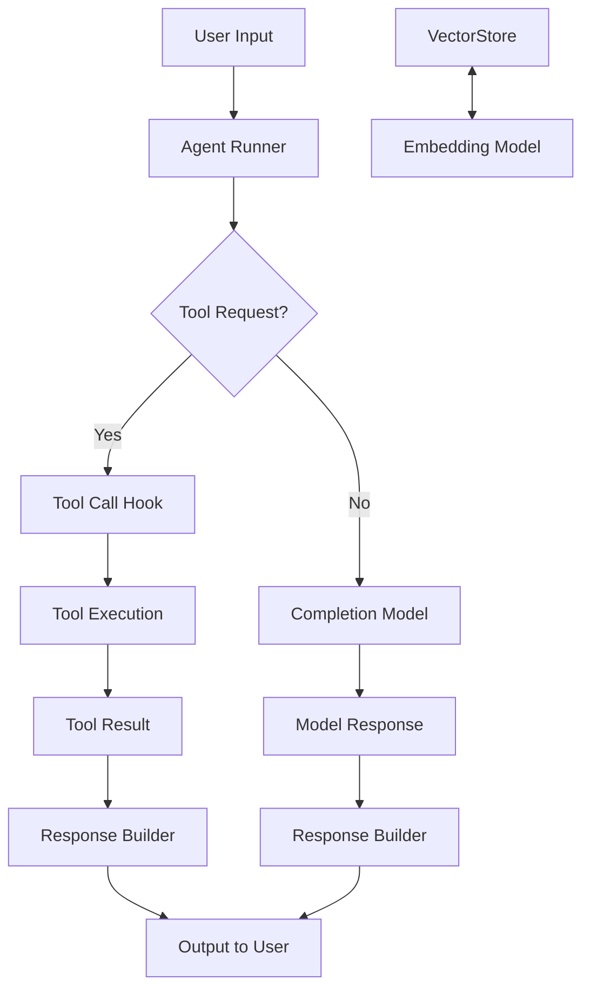

# 01-架构总览

Rig 是一个通用的 GenAI（生成式人工智能）应用开发框架，主要面向构建支持多模型、多工具以及向量数据库交互能力的 AI Agent 应用。该框架提供统一抽象层，便于快速实现不同提供商（Provider）模型接口之间的切换，并支持复杂任务的多轮对话与自动任务驱动。

---

## 🧱 项目结构概览

整个 Rig 项目的代码组织围绕着几个关键层级结构构建：

```
Rig
├── rig-core             # 核心 trait 定义和通用类型（如 Client, CompletionModel）
├── rig-agent            # Agent 实现与运行时逻辑
├── rig-derive           # 自定义 derive macros 用于简化工具定义、配置等
├── rig-*                # 各种 Provider 的实现，例如：rig-openai, rig-gemini, rig-ollama 等
└── rig-*                # Vector Store 实现（如 rig-qdrant, rig-milvus）
```

---

## 📌 核心模型与抽象层

Rig 通过一些统一接口来实现不同 AI 模型和向量存储系统的兼容：

### 1. CompletionModel
```rust
// File: crates/rig-core/src/model/completion.rs

pub trait CompletionModel: Send + Sync {
    type Error: std::error::Error + Send + Sync + 'static;
    type Response: ProviderResponse<Completion = Self::Completion>;
    type Completion: CompletionResponse;

    async fn complete(&self, request: CompletionRequest) -> Result<Self::Response, Self::Error>;
}
```

此 trait 定义了一个 AI 模型完成文本生成或对话的能力，支持同步和异步请求。

### 2. EmbeddingModel
```rust
// File: crates/rig-core/src/model/embedding.rs

pub trait EmbeddingModel: Send + Sync {
    type Error: std::error::Error + Send + Sync + 'static;
    type Response: ProviderResponse<Embedding = Self::Embedding>;
    type Embedding: EmbeddingResponse;

    async fn embed(&self, request: EmbeddingRequest) -> Result<Self::Response, Self::Error>;
}
```

用于模型的嵌入功能，可将文本转为向量表示以便后续搜索。

### 3. VectorStoreIndex
```rust
// File: crates/rig-core/src/vector_store/mod.rs

pub trait VectorStoreIndex {
    type Error: std::error::Error + Send + Sync + 'static;
    type Document: VectorDocument;

    async fn top_n(&self, query: &Embedding, n: usize) -> Result<Vec<Self::Document>, Self::Error>;
    async fn top_n_ids(&self, query: &Embedding, n: usize) -> Result<Vec<DocId>, Self::Error>;
}
```

实现基于嵌入向量相似度的内容检索接口，可以对接如 Qdrant、Milvus、SurrealDB 等数据库。

### 4. Tool
```rust
// File: crates/rig-core/src/tool/mod.rs

pub trait Tool {
    type Error: std::error::Error + Send + Sync + 'static;
    type Output: serde::Serialize;

    async fn call(&self, input: &str) -> Result<Self::Output, Self::Error>;
}
```

用于定义可被 AI Agent 执行的任务（例如：调用 API、查询数据库）。

---

## 🌐 Provider 系统概览

在 Rig 中，每个模型提供方（Provider）都实现了上述核心 trait，这使得可以在不同模型之间轻松切换：

- `CompletionModel` -> 可用于调用 chat 模型（如 GPT-4）
- `EmbeddingModel` -> 通常用来构建知识库向量索引（如 Sentence Transformers）
- `VectorStoreIndex` -> 构建与查询语义信息的底层能力

支持的提供方包括但不限于：

| 提供方 | Crate 名称 | 命名空间 | 文件路径 |
|--------|------------|----------|----------|
| OpenAI | rig-openai | rig_openai | crates/rig-openai/src/lib.rs |
| Anthropic | rig-anthropic | rig_anthropic | crates/rig-anthropic/src/lib.rs |
| Google Gemini | rig-gemini | rig_gemini | crates/rig-gemini/src/lib.rs |
| Ollama | rig-ollama | rig_ollama | crates/rig-ollama/src/lib.rs |
| Mistral | rig-mistral | rig_mistral | crates/rig-mistral/src/lib.rs |

每个 Provider 提供自己的 client、trait 实现以及 builder 模式接口。

---

## 🧠 Agent 与 Lifecycle Hook 架构

Agent 是整个系统的工作单元，它会调用 Model、使用工具（Tool）、与 Vector Store 交互来完成一项具体任务。

Agent 的运行控制由多个 Hook 支持，例如：

- 在请求前注入上下文
- 工具调用前后处理
- 修改返回内容或中止流程
- 处理错误或超时情况

---

## 🧠 整体流程图说明（Mermaid）



### 说明：

- 用户输入会触发 Agent Runner。
- 如果需要执行工具，则调用 Hook 处理，最终通过工具实现生成输出。
- 若不需要工具，则直接使用 Completion 模型获取响应并返回给用户。

---

## 📦 示例程序

```rust
// File: examples/basic_usage.rs

use rig::agent::{Agent, Client};
use rig_openai::OpenAI;

#[tokio::main]
async fn main() {
    let client = Client::new(OpenAI::default());

    let agent = client
        .agent("gpt-4")
        .preamble("You are a helpful assistant.")
        .tool(my_tool)
        .temperature(0.8)
        .build();

    let response = agent.run("What is 2 + 2?").await.unwrap();
    println!("Answer: {}", response);
}
```

这个小例子展示了如何配置并使用一个简单的 AI Agent。

---

## 🔍 总结

Rig 提供了一个清晰且统一的 API 来与多种主流 AI 模型和服务进行交互。其模块化的设计便于扩展，同时也具备强大的抽象能力，从而让开发者能够专注于业务逻辑实现而不是模型细节。