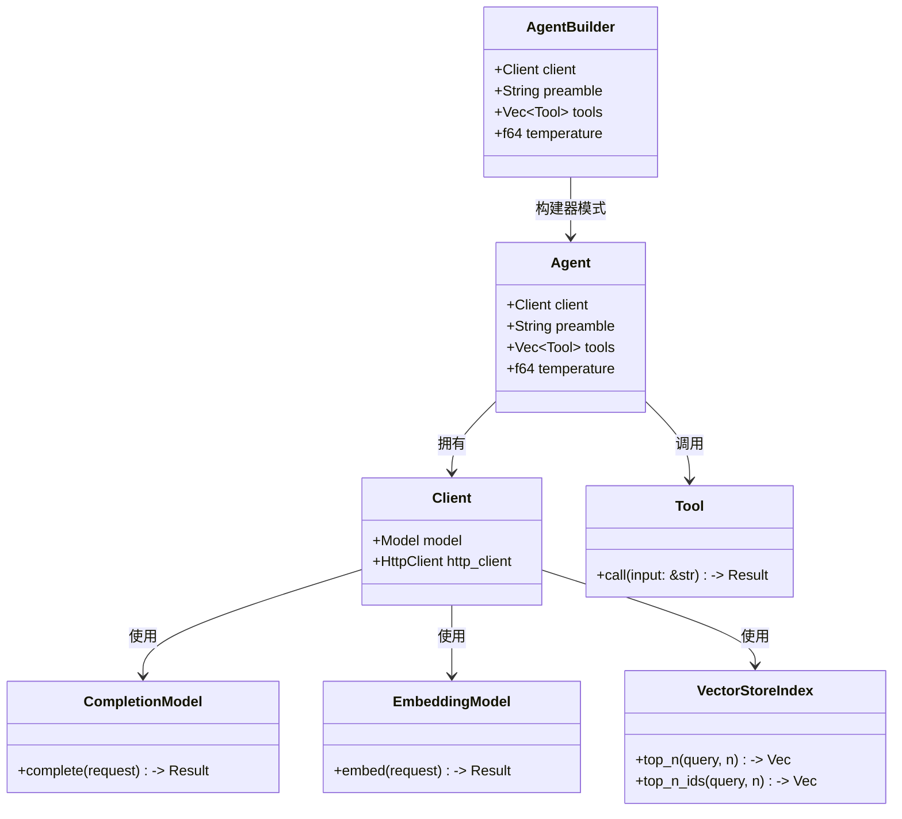
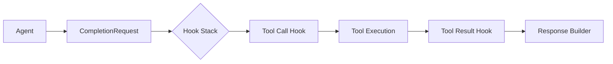

# 02-核心模块与类关系

Rig 构建在模块化、可插拔的基础之上。核心模块和关键类型通过抽象 trait 相互组合，实现模型、工具和向量存储统一接口。以下将从模块结构、关键类型及类图三方面详细分析。

---

## 🗂️ 核心模块概述

| 模块名称        | 功能描述                                  | 文件路径 |
|-----------------|-------------------------------------------|----------|
| `rig-core`      | 包含所有核心 trait 和定义，如 `CompletionModel`, `EmbeddingModel`, 以及通用客户端结构 | crates/rig-core/src/lib.rs |
| `rig-agent`     | 实现 Agent 的运行逻辑和执行生命周期钩子系统 | crates/rig-agent/src/lib.rs |
| `rig-derive`    | 自定义 derive macros，如 `#[derive(Tool)]` 使用宏实现工具快速定义 | crates/rig-derive/src/lib.rs |
| `rig-openai`    | OpenAI API Provider 客户端适配器与模型实现 | crates/rig-openai/src/lib.rs |
| `rig-gemini`    | Google Gemini Provider 适配器与模型实现 | crates/rig-gemini/src/lib.rs |
| `rig-ollama`    | Ollama 兼容环境支持模块 | crates/rig-ollama/src/lib.rs |
| `rig-qdrant`    | Qdrant 向量存储接口的封装与实现 | crates/rig-qdrant/src/lib.rs |
| `rig-surrealdb` | SurrealDB 向量索引适配器 | crates/rig-surrealdb/src/lib.rs |

---

## 🔧 关键类型结构

### 1. Client 结构体 (core)

```rust
// File: crates/rig-core/src/client.rs

pub struct Client<Ext = Nothing, H = reqwest::Client> {
    pub model: Ext,
    http_client: H,
}

impl<Ext, H> Client<Ext, H>
where
    Ext: CompletionModel + EmbeddingModel + VectorStoreIndex,
{
    pub fn new(model: Ext) -> Self {
        Self {
            model,
            http_client: reqwest::Client::new(),
        }
    }
}
```

`Client` 是系统入口点，它持有一个模型（`model`）和一个 HTTP 客户端。类型参数 `Ext` 用于实现泛型扩展支持，允许不同 Provider 实现的接入。

---

### 2. Agent 结构体 (agent)

```rust
// File: crates/rig-agent/src/agent.rs

pub struct Agent<Ext, H = reqwest::Client> {
    client: Client<Ext, H>,
    preamble: Option<String>,
    tools: Vec<Box<dyn Tool>>,
    temperature: f64,
    max_tokens: Option<u32>,
    stop_sequences: Vec<String>,
    hooks: Vec<Box<dyn AgentHook>>,
    ...
}

impl<Ext, H> Agent<Ext, H> {
    pub fn new(client: Client<Ext, H>) -> Self {
        Self {
            client,
            preamble: None,
            tools: Vec::new(),
            temperature: 0.7,
            max_tokens: None,
            stop_sequences: Vec::new(),
            hooks: Vec::new(),
        }
    }
}
```

Agent 负责执行任务，可以设置前置提示、注册工具集，并指定调用模型。

---

### 3. Builder 模式支持

```rust
// File: crates/rig-agent/src/agent.rs

pub struct AgentBuilder<Ext, H = reqwest::Client> {
    client: Client<Ext, H>,
    preamble: Option<String>,
    tools: Vec<Box<dyn Tool>>,
    temperature: f64,
    max_tokens: Option<u32>,
    stop_sequences: Vec<String>,
    hooks: Vec<Box<dyn AgentHook>>,
}

impl<Ext, H> AgentBuilder<Ext, H> {
    pub fn preamble(self, preamble: impl Into<String>) -> Self {
        Self {
            preamble: Some(preamble.into()),
            ..self
        }
    }

    pub fn tool<T: Tool + 'static>(self, tool: T) -> Self {
        let mut tools = self.tools;
        tools.push(Box::new(tool));
        Self {
            tools,
            ..self
        }
    }

    pub fn temperature(self, temp: f64) -> Self {
        Self {
            temperature: temp,
            ..self
        }
    }

    pub fn build(self) -> Agent<Ext, H> {
        Agent {
            client: self.client,
            preamble: self.preamble,
            tools: self.tools,
            temperature: self.temperature,
            max_tokens: self.max_tokens,
            stop_sequences: self.stop_sequences,
            hooks: self.hooks,
        }
    }
}
```

Agent 构建器采用链式调用方式，允许用户自定义参数和行为。

---

### 4. 工具 Trait (`Tool`)

```rust
// File: crates/rig-core/src/tool/mod.rs

pub trait Tool {
    type Error: std::error::Error + Send + Sync + 'static;
    type Output: serde::Serialize;

    async fn call(&self, input: &str) -> Result<Self::Output, Self::Error>;
}  
```

工具必须实现该特性，以供 Agent 在运行时执行。例如：

```rust
// File: examples/weather_tool.rs

#[derive(Tool)]
pub struct WeatherTool {}

impl Tool for WeatherTool {
    type Error = Box<dyn std::error::Error + Send + Sync>;
    type Output = String;

    async fn call(&self, input: &str) -> Result<Self::Output, Self::Error> {
        Ok("It's sunny today.".to_string())
    }
}
```

---

### 5. Provider Traits（完整实现参考）

#### CompletionModel trait:

```rust
// File: crates/rig-core/src/model/completion.rs

pub trait CompletionModel: Send + Sync {
    type Error: std::error::Error + Send + Sync + 'static;
    type Response: ProviderResponse<Completion = Self::Completion>;
    type Completion: CompletionResponse;

    async fn complete(&self, request: CompletionRequest) -> Result<Self::Response, Self::Error>;
}
```

#### EmbeddingModel trait:

```rust
// File: crates/rig-core/src/model/embedding.rs

pub trait EmbeddingModel: Send + Sync {
    type Error: std::error::Error + Send + Sync + 'static;
    type Response: ProviderResponse<Embedding = Self::Embedding>;
    type Embedding: EmbeddingResponse;

    async fn embed(&self, request: EmbeddingRequest) -> Result<Self::Response, Self::Error>;
}
```

#### VectorStoreIndex trait:

```rust
// File: crates/rig-core/src/vector_store/mod.rs

pub trait VectorStoreIndex {
    type Error: std::error::Error + Send + Sync + 'static;
    type Document: VectorDocument;

    async fn top_n(&self, query: &Embedding, n: usize) -> Result<Vec<Self::Document>, Self::Error>;
    async fn top_n_ids(&self, query: &Embedding, n: usize) -> Result<Vec<DocId>, Self::Error>;
}
```

这些 trait 定义了 AI 系统中核心模型与功能所需的抽象接口。

---

## 🧭 模块间类关系图（Mermaid）



---

## 🧩 总结

Rig 的结构设计充分遵循了“组合优于继承”和模块化的思想。通过将功能拆分为 Trait 和实现不同 Provider，开发者可以灵活地接入新的模型与资源，同时保持高度可维护性和通用性。

该体系允许用户：

- 快速切换不同 AI 提供商
- 使用统一 API 来编写工具及应用逻辑
- 扩展新的向量数据库或模型能力

---

## 🧠 调用关系详细说明

### 1. Agent 运行时调用流程

```rust
// File: crates/rig-agent/src/agent.rs

impl<Ext, H> Agent<Ext, H> {
    pub async fn run(&self, prompt: impl Into<String>) -> Result<String, RigError> {
        let mut history = Vec::new();
        ...
        
        // 构造请求内容
        let mut request = CompletionRequest::default();
        if let Some(preamble) = &self.preamble {
            request.extra_context.push(preamble.clone());
        }
        request.messages.push(Message::user(prompt.into()));

        // 调用 Hook 前置处理
        let patched_request = self.apply_hooks_before_completion(&request).await?;
        
        let response = self.client.model.complete(patched_request).await.map_err(RigError::from)?;
        
        let text = self.extract_text_from_response(&response).await?;
        
        // 应用响应后处理 Hook
        self.apply_hooks_after_response(&response).await?;
        
        Ok(text)
    }
}
```

### 2. 工具调用流程

```rust
// File: crates/rig-agent/src/execution.rs

async fn execute_tools(&mut self, tool_calls: Vec<ToolCall>) -> Result<Vec<ToolResult>, RigError> {
    let mut results = Vec::new();
    
    for tool_call in tool_calls {
        // 应用工具调用前 Hook
        let action = self.apply_hook_on_tool_call(&tool_call).await?;
        
        match action {
            ToolCallAction::Skip => continue,
            ToolCallAction::Stop => return Err(RigError::ToolExecution("Tool call stopped by hook".to_string())),
            ToolCallAction::Continue => {
                // 实际调用工具
                let result = self.invoke_tool(&tool_call).await?;
                results.push(result);
            }
        }
    }
    
    Ok(results)
}
```

### 3. 数据流传递过程

```rust
// File: crates/rig-core/src/model/mod.rs

pub struct CompletionRequest {
    pub messages: Vec<Message>,
    pub temperature: f64,
    pub max_tokens: Option<u32>,
    pub stop_sequences: Vec<String>,
    pub extra_context: Vec<String>,
}

pub struct Message {
    pub role: Role,
    pub content: String,
    pub tool_calls: Vec<ToolCall>,
}

// 请求转换链路图（Mermaid）
```

