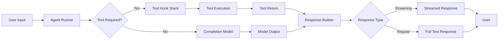

# 04-配置与数据流

Rig 是一套高度模块化、灵活扩展的 AI 应用基础框架。为了实现良好的可配置性和可维护性，它设计了清晰的数据流向和配置机制。

---

## 🎯 配置机制概述

所有配置项均在构建 Agent 或调用 API 时通过构造函数/链式方法传递。具体配置可以分为以下几种类型：

| 类型 | 描述 |
|------|------|
| 模型选择 | `agent("gpt-4")` / `client.model("gpt-3.5-turbo")` |
| 工具注册 | `.tool(weather_tool)` |
| 温度控制 | `.temperature(0.7)` |
| 预设提示词 | `.preamble("You are a helpful assistant.")` |

---

## 🧱 构造流程与数据流转图



### 说明：

1. 用户发出输入请求（Prompt）
2. Agent 决定是否需要调用工具
3. 若需调用，进入 Hook 栈处理
4. 工具执行完毕后返回结果用于生成最终响应
5. 如果不使用工具，直接使用 CompletionModel 生成回答
6. 最终通过 Response Builder 构造字符串返回给用户

---

## 📦 具体配置参数详解

### 1. Agent 配置项（AgentBuilder）

```rust
pub struct AgentBuilder<Ext, H> {
    client: Client<Ext, H>,
    preamble: Option<String>,       // 系统提示词
    tools: Vec<Box<dyn Tool>>,      // 工具集
    temperature: f64,               // 生成随机性控制
    max_tokens: Option<u32>,        // 最大输出 token 数量
    stop_sequences: Vec<String>,    // 停止序列（防止模型持续生成）
    ...
}
```

#### 示例用法

```rust
let agent = client
    .agent("gpt-4")                           // 指定模型名称
    .preamble("You are a helpful assistant.") // 设置默认系统消息
    .tools(vec![weather_tool, calendar_tool]) // 注册工具集
    .temperature(0.7)                         // 控制输出多样性
    .max_tokens(Some(1024))                   // 限制最大返回长度
    .stop_sequences(vec!["\n\n".to_owned()])  // 避免换行过多
    .build();
```

所有这些参数在构建 Agent 时作为配置项传入，最后组合成完整的运行逻辑。

---

## ⚙️ 模型客户端配置方式 (`Client`)

```rust
let client = Client::new(MyCustomModel::builder()
    .api_key("sk-your-key")
    .base_url("https://api.example.com/v1")
    .build());
```

这种 builder 模式允许在编译期设定模型连接参数，并灵活支持多种 Provider。

---

## 🔁 状态与上下文传递机制

Rig 的每个 Agent 实例都有一个内部的状态机来管理任务之间的上下文（如历史对话记录、工具执行结果等）。

```rust
fn run(&self, prompt: impl Into<String>) -> Result<String, Error> {
    let mut history = Vec::new();
    ...
}
```

Agent 内部维护以下信息：

- 当前对话轮次（Turn）
- 已有的对话历史记录
- 当前活跃工具集（Active Tools）
- 请求上下文（Extra Context）

这些状态会伴随一次完整的 run 流程进行流转，并在需要时传递给不同的 Hook 中。

---

## 🔁 Hook 数据传入/传出控制接口

Hook 是对 Agent 生命周期行为的干预机制，允许用户在模型调用前后进行修改。Hook 数据通过以下方式传入：

```rust
impl<H> HookStack<H>
where
    H: AgentHook,
{
    pub async fn drive_agent(&self, agent: &Agent, prompt: String) -> Result<String, Error> {
        ...
        let patched_request = self.before_completion(agent, request).await?;
        ...
    }
}
```

Hook 还可以通过 `extra_context`、`additional_params` 等字段注入额外信息。

---

## 🧠 流程总结

1. **配置阶段**
   - 构造 Client
   - 使用 Builder 模式配置 Agent
   - 注册工具、设置参数等

2. **执行阶段**
   - 发起请求（run 或 stream）
   - 触发模型调用
   - 执行工具逻辑（如有）

3. **反馈阶段**
   - 构造响应文本
   - 支持流式或非流式返回

---

## 🧩 使用建议

- 对于复杂场景，建议结合 Hook 多次介入来增强控制能力
- 所有模型、工具、向量存储组件都可以根据需要插件化替换

---

## 📌 总结

Rig 使用灵活、可扩展的配置体系，确保：

- 配置项易于构建和管理
- 模块间解耦清晰
- 状态流转过程透明可控
- Hook 机制提供丰富扩展可能性

此架构不仅便于开发调试，在大规模系统中也提供了良好的性能与伸缩性。