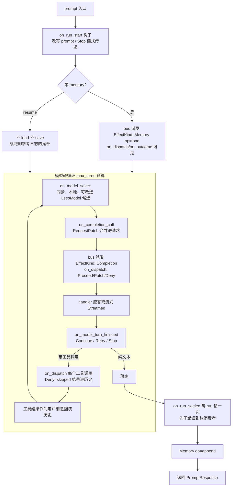

# 04-配置与数据流

本篇解释配置从 builder 到一次 run 的流转、每轮请求的逐步数据流、以及门面 feature 矩阵。

---

## 🎯 配置机制概述

所有配置都在构造期通过链式方法传递。当前的核心结构是**一份共享的 `AgentConfig`**（`crates/rig-agent/src/agent/completion.rs:212`，`pub(crate)`）——builder、agent、runner 三者共用同一类型（#2326 的合并），避免同名字段在三层各写一份：

```rust
pub(crate) struct AgentConfig {
    name: Option<String>,                    // 日志/调试名
    description: Option<String>,             // 子 agent 工作流用
    bus: AgentBus,                           // 每次 run 的派发总线
    model_key: Key<family::Completion>,      // 总线上默认模型的 key
    preamble: Option<String>,                // 系统提示词
    static_context: Vec<Document>,           // 常驻上下文文档
    additional_params: Option<Value>,        // provider 专属参数
    record_telemetry_content: bool,          // 是否记录敏感内容到 OTel span（默认 false）
    max_tokens: Option<u64>,
    temperature: Option<f64>,
    tool_choice: Option<ToolChoice>,
    max_turns: usize,                       // 总模型调用预算（含重试/续跑，默认 1）
    hooks: HookStack,                        // 默认钩子栈
    output_schema: Option<Schema>,          // 原生结构化输出约束
    // ...（工具策略、输出工具配置等）
}
```

### 配置流转


- `AgentRunner`（`agent/runner.rs:56`）还携带 run 私有的：`origin`（Prompt / Resume(Box\<AgentRun\>)）、`chat_history` 覆写、`max_invalid_tool_call_retries`、`tool_context`（每次工具派发新鲜克隆）、`output_tool_name/description`、`concurrency`、`error_usage` 等。
- `RunSpec`（`run/spec.rs`）是 run 的"规格摘要"，可算 `run_spec_hash()`（`completion.rs:500`）——effect 日志 header 记录的就是它，重放时比对。

---

## 🧱 一次 run 的逐步数据流（经典运行时）

以 `agent.prompt("...").run().await` 为例：



关键规则（都能在代码注释中找到依据）：

1. **RequestPatch 合并语义**（`run/patch.rs`）：`extra_context` 追加、`additional_params` 浅合并、`active_tools` 交、`history` 整体替换；同名标量后写者赢并 `tracing::warn!`。补丁**每轮生效、不粘滞**。
2. **run 与 stream 同循环**：`drive_agent` 共享，行为一致；stream 只多发增量事件。
3. **重试在 run 内部**：可重试的瞬时失败（见 08 篇的状态码表）由 runner 消耗总预算重试，`ModelTurnAction::Retry`（Repeat / Feedback）也走同一预算。
4. **resume 语义**：续跑不再 load/save 记忆，续跑段恰好等于参考日志的尾部。

### RequestPatch 字段（`run/patch.rs:25`）

```rust
pub struct RequestPatch {
    pub preamble: Option<String>,
    pub temperature: Option<f64>,
    pub max_tokens: Option<u64>,
    pub tool_choice: Option<ToolChoice>,
    pub active_tools: Option<Vec<String>>,      // 收窄本轮广告的工具
    pub additional_params: Option<Value>,
    pub extra_context: Vec<Document>,          // 追加上下文
    pub history: Option<Vec<Message>>,         // 整体替换历史
}
```

---

## 📦 客户端级配置

- **API key**：`builder().api_key(..)` / `new(key)` / `from_env()`（`from_env_api_key` 支持 `<PROVIDER>_BASE_URL` 覆写）。
- **base URL**：`builder().base_url(..)`；Azure 等允许空 base 以便用户填 endpoint。
- **默认头**：`http_headers(HeaderMap)`、`headers_mut()`；provider 的 `finish`/`prepare` 钩子再补默认头与每请求头。
- **传输**：`http_client(h)` 显式给；`reqwest` feature 下 `build()` 可缺省（默认填 `ReqwestClient`）。`Client::boxed()` 擦类型。
- **TLS**：feature `rustls`（默认）/`native-tls` 可切换；`socks` 代理支持。

---

## ⚙️ 门面 feature 矩阵（`Cargo.toml [features]`，src/lib.rs 配套）

**默认**：`reqwest + agent + derive + rustls`。

| 类别 | feature | 作用 |
|------|---------|------|
| 运行时 | `agent` | 重导出 rig-agent（Agent/AgentBuilder/bus/run/extractor） |
| 传输 | `reqwest`、`reqwest-middleware[-rustls]`、`socks`、`websocket[-rustls/-native-tls]` | HTTP 传输 / websocket 会话（`client.responses_websocket`） |
| 能力 | `audio`、`image`、`pdf`、`epub` | 音频生成 / 图像生成 / 文档加载器 |
| 工具 | `derive`（`#[rig_tool]`）、`rmcp` | 过程宏 / MCP 工具（native only） |
| 记忆 | `memory` | 重导出 rig-memory 策略 |
| 向量库 | `lancedb` `milvus` `mongodb` `neo4j` `postgres` `qdrant` `scylladb` `sqlite` `surrealdb` `s3vectors` `helixdb` `vectorize` | 伴侣模块 `rig::xxx` |
| 推理 | `candle` | 本地 CPU 推理（Llama/SmolLM2/Qwen3） |
| Provider | `bedrock`、`vertexai`、`gemini-grpc` | 独立 provider crate |
| 嵌入 | `fastembed[-hf-hub/-ort-download-binaries]` | 本地嵌入 |
| 测试 | `test-utils`、内部 `facade-build-tests` | 录制 HTTP 假传输等 |

feature 名与门面模块路径对齐（`rig::lancedb` ← feature `lancedb`）；`rig-core` 直连依赖时无此面。

---

## 🌍 环境变量一览（常见 provider）

`from_env()` 约定：`<PREFIX>_API_KEY` 必需，`<PREFIX>_BASE_URL` 可选（如 `OPENAI_API_KEY`/`OPENAI_BASE_URL`、`ANTHROPIC_API_KEY`…）。无凭据 provider（ollama/llamacpp）不需要。

---

## 🧠 流程总结

1. **构造期**：builder setter → `AgentConfig` → `Agent`。
2. **run 期**：runner 克隆配置为私有副本；每轮：模型选择 → 补丁合并 → bus 派发 → 轮终裁定 → 工具批 → 回填。
3. **落定期**：`on_run_settled` 恰一次 → 记忆 append → 返回 `PromptResponse`。
4. **持久期**：`AgentRun` 可 serde；`run_spec_hash` 进日志 header 供重放校验。