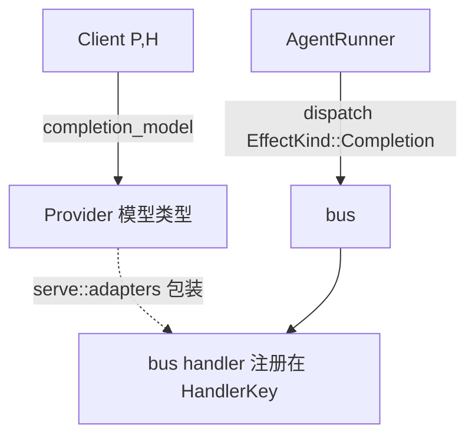

# 05-Provider 体系说明

Rig 用"一个 Provider 值类型 + 每种能力一个 trait 实现"的模型接入各家模型服务。本篇讲清楚这套编写模型、内置名录、共享适配层，以及新增一个 provider 的完整步骤。

---

## 🌐 为什么需要 Provider 系统

把"哪家模型服务、什么鉴权、什么 URL 形状、支持哪些能力"封装进独立模块，业务层只面对 `Client<P, H>` 与四大能力 trait。换 provider = 换一个 client 构造，业务代码零改动；provider 缺哪种能力，是编译期缺一个 trait impl，而不是运行时 panic。

---

## 🧱 编写模型（0.42 后定形）

一个 provider 由三块组成（顺序即编写顺序）：

1. **一个值类型实现 `Provider`**（`crates/rig-core/src/client/mod.rs:246`）——`NAME`/`BASE_URL`/`VERIFY_PATH`、`ApiKey`/`Config`/`EnvInput` 关联类型、`build`/`from_env`/`from_val`，必要时覆写 `finish`/`build_uri`/`prepare`。值类型被克隆进每个 client 和模型，必须廉价可克隆；**持有凭据的字段要用自定义 Debug 打码**（参考 `BearerAuth` 的 `BearerAuth(<redacted>)`）。
2. **每个能力一个 `Has*` impl**（`client/completion.rs` 等）：`HasCompletion`/`HasEmbeddings`/`HasRerank`/`HasTranscription`/`HasModelListing`/`HasImageGeneration`(feature `image`)/`HasAudioGeneration`(feature `audio`)，各自在 `Model<H>` 里命名具体模型类型并从 `&Client<Self, H>` 构造。`ModelTransport` 是唯一的传输 bound 集。
3. **模块别名与重导出**（以 openai 为例，`providers/openai/client.rs:46`）：

```rust
pub type Client<H = crate::http_client::BoxedHttpClient> = client::Client<OpenAIResponses, H>;
pub type ClientBuilder<H = crate::markers::Missing> = client::ClientBuilder<OpenAIResponses, H>;
// + 从模块根重导出 provider 类型与每个模型类型
```

### 官方最小示例（client/mod.rs 模块文档，可编译）

```rust
#[derive(Debug, Clone, Default)]
struct Example;

impl Provider for Example {
    const NAME: &'static str = "example";
    const BASE_URL: &'static str = "https://example.invalid/v1";
    const VERIFY_PATH: &'static str = "/models";
    type ApiKey = BearerAuth;
    type Config = ();
    type EnvInput = String;

    fn build(_: (), _: &BearerAuth) -> http_client::Result<Self> { Ok(Example) }
    fn from_env<H: HttpClientExt>(http: H) -> ProviderClientResult<Client<Self, H>> {
        Client::from_env_api_key("EXAMPLE_API_KEY", None, http)
    }
    fn from_val<H: HttpClientExt>(key: String, http: H) -> ProviderClientResult<Client<Self, H>> {
        Client::new_with(key, http)
    }
}

impl HasCompletion for Example {
    type Model<H> = ExampleModel<H> where H: ModelTransport;
    fn completion_model<H: ModelTransport>(client: &Client<Self, H>, model: String) -> ExampleModel<H> {
        ExampleModel { client: client.clone(), model }
    }
}
```

用户侧效果：`let model: ExampleModel<_> = Client::<Example, _>::builder()...build()?.completion_model("m");`

---

## 🧩 请求/响应转换

- `Client` 提供 `post/get/patch/delete(path)`（client/mod.rs:488-525）——拼 URI（`build_uri`）、合并默认头、过 `prepare`。PATCH/DELETE 是一等公民（Gemini `cachedContents` 改 TTL、资源生命周期）。
- Provider 模块负责：**请求转换**（Rig `CompletionRequest` → 该家 wire 格式）与**响应转换**（回 `CompletionResponse`/`StreamingCompletionResponse`）。**不要添加真实 API 不存在的字段**（仓库规则）。
- 流式：把 SSE 帧翻译成 `StreamEvent` 块模型（BlockStart/Delta/End + `BlockId`）。
- 鉴权三型：头键（`BearerAuth` → 默认 Authorization 头）、query-string 键（覆写 `build_uri` 追加）、token 交换/设备流（覆写 `prepare` 或自带凭据字段）。

---

## 📦 内置 Provider 名录（`crates/rig-core/src/providers/mod.rs:113`）

| provider | 模块 | 备注 |
|---|---|---|
| OpenAI | `openai` | Chat Completions + Responses 双 API（`responses_api`）、websocket 会话、图像/音频/转录/列表 |
| Anthropic | `anthropic` | 含 stop_sequence 修复等大量 cassette 固化行为 |
| Google Gemini | `gemini` | Interactions API、cachedContents、音频/图像生成、gRPC 版在 rig-gemini-grpc |
| xAI / zai / Moonshot / Mistral / Ollama | … | 各自 wire |
| Azure | `azure` | 空 base URL 允许自填 endpoint |
| DeepSeek、Groq、Together、Perplexity、OpenRouter、HuggingFace、Hyperbolic、Venice、Cohere、Minimax、Mira、Doubleword、xiaomimimo、Copilot、ChatGPT | … | 多数走 internal 兼容适配层 |
| llama.cpp | `llamacpp` | 原 `llamafile` 更名 |
| VoyageAI | `voyageai` | 嵌入请求参数 |
| 独立 crate | rig-bedrock（AWS）、rig-vertexai、rig-gemini-grpc | 经门面 feature 暴露 |

### `providers/internal/`（36 个文件）

OpenAI-Chat 兼容（`openai_chat_completions_compatible`）、Anthropic 兼容（`anthropic_compatible`）两大适配层 + envelope（响应信封）、auth、device_auth（设备流）、completion_send、chunk_lifecycle、model_listing（分页列表共享循环，#2339）、audio/image generation 共享件。新 provider 若 wire 兼容某家，优先薄包装适配层而不是重写。

---

## 🔄 与 Agent / bus 的关系

Provider 模型实现 `CompletionModel`/`EmbeddingModel` 等实现侧 trait；bus 的适配器（`rig_core::serve::adapters`，如 `CompletionAdapter`、`RerankAdapter`）把它们包装成 handler 注册到 `HandlerKey` 下。Agent 只见 key 与 effect，不见具体 provider 类型——这也是录制/重放能整体替掉 provider 的原因。



---

## 🔨 新增一个 Provider 的步骤

1. 读最接近的现有实现（OpenAI 兼容 → `providers/openai/`；Anthropic 兼容 → `providers/anthropic/`；纯薄包装 → 任一 internal 用户）。
2. 在 `providers/` 建模块：provider 值类型（`Clone + Debug`，凭据打码）→ `Provider` impl → `Has*` impl → `Client`/`ClientBuilder` 别名与重导出 → 模型常量。
3. 请求/响应转换 + 流式 + 错误保留（`ProviderResponseError` 保 status/body/headers/request-id；遥测 span 与 `ProviderResponseExt` 遵循现有 GenAI 约定）。
4. cassette 回归测试：`tests/providers/<provider>/cassette/` + `tests/cassettes/<provider>/`（回放不需要 key；录制需 `RIG_PROVIDER_TEST_MODE=record`）。
5. 根 README/crate 文档的 provider 名录若有维护，随 PR 更新。

---

## 🧩 总结

- 能力即 trait：缺能力是缺 impl，编译器替你把关。
- 值类型 + 泛型 Client：无 vtable、无运行时探测，Debug 自动打码凭据。
- 兼容层复用：OpenAI/Anthropic 兼容服务走 `internal/`，一处修复全线受益。
- 行为由 cassette 固化：provider 回归默认回放录制流量，录制发现的 wire 缺陷按 provider 落修复 + 回归测试（近期 20+ 个 provider bug 都是这样钉住的）。