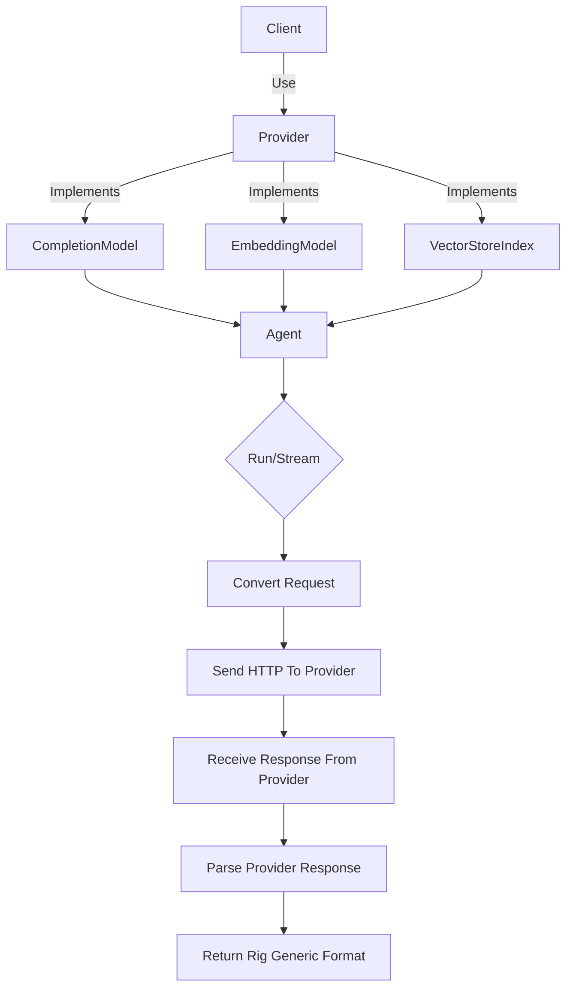

# 05-Provider 体系说明

Rig 是一个模块化的设计，允许开发者通过不同的 Provider 来访问多种 AI 模型或服务。该体系提供了统一的接口用于连接 OpenAI、Gemini、Anthropic 等模型提供者，并支持无缝切换和扩展功能。

---

## 🌐 为什么需要 Provider 系统？

在 GenAI 应用中，用户希望能够在不改变业务实现代码的情况下，轻松切换不同 AI 提供商的服务。例如：

- 将模型从 `gpt-4` 切换为 `claude-3`
- 使用本地部署的 Ollama 服务代替远程 API
- 在多个提供商之间进行 A/B 测试

Provider 系统允许开发者将这些差异封装到独立模块中，而不需要修改业务逻辑层代码。

---

## 🧱 Provider 架构概述

每个 Provider 都围绕以下核心概念构建：

| 组件 | 说明 |
|------|------|
| **Client** | 实现 `CompletionModel`, `EmbeddingModel` 和 `VectorStoreIndex` 等 trait 的结构体 |
| **Builder** | 负责构造 Client 并提供认证与配置选项 |
| **API 请求转换器** | 把 Rig 的通用请求转换为特定 Provider 的格式 |
| **响应解析器** | 将 provider 返回的结果封装成 Rig 统一格式 |

---

## 🧩 Provider 接口

每一个 Provider 都实现如下基础接口：

```rust
pub trait Provider {
    type Completion: CompletionModel;
    type Embedding: EmbeddingModel;
    type VectorIndex: VectorStoreIndex;

    fn client_builder(&self) -> Self::ClientBuilder;
}
```

此外通常还会实现 `CompletionRequest` 到特定格式的转换，及对应响应的解析。

---

## 📦 典型 Provider 实现样例：OpenAI

我们以 `rig-openai` 为例来说明如何实现一种 Provider。

### 1. 模型定义结构

```rust
// rig-openai/src/lib.rs

pub struct OpenAI {
    api_key: String,
    base_url: String,
}

impl OpenAI {
    pub fn from_env() -> Self {
        // 从环境变量加载 API Key 和 URL
    }

    pub fn builder() -> OpenAIBuilder {
        OpenAIBuilder::default()
    }
}
```

### 2. Builder 支持

```rust
pub struct OpenAIBuilder {
    api_key: Option<String>,
    base_url: Option<String>,
}

impl OpenAIBuilder {
    pub fn api_key(mut self, key: impl Into<String>) -> Self {
        self.api_key = Some(key.into());
        self
    }

    pub fn build(self) -> OpenAI {
        OpenAI {
            api_key: self.api_key.unwrap_or_else(|| std::env::var("OPENAI_API_KEY").expect("Missing API Key")),
            base_url: self.base_url.unwrap_or("https://api.openai.com/v1".to_string()),
        }
    }
}
```

> 这部分逻辑在 `rig-derive` 或其他构建器工具中有更复杂的封装实现。

### 3. Model 实现

```rust
impl CompletionModel for OpenAI {
    type Error = OpenAIError;
    type Response = OpenAIResponse;
    type Completion = OpenAICompletion;

    async fn complete(&self, request: CompletionRequest) -> Result<Self::Response, Self::Error> {
        ...
    }
}
```

> 这里 `OpenAIResponse` 和 `OpenAICompletion` 是具体针对 OpenAI 返回结构进行了包装。

---

## 🔁 请求与响应转换机制（Conversion Layer）

### 转换器接口

```rust
pub trait RequestConverter<Req, Res> {
    fn convert_request(&self, req: &Req) -> Result<ProviderRequest, Error>;
    fn convert_response(&self, resp: &ProviderResponse) -> Result<Res, Error>;
}
```

这使得不同 Provider 之间的接口能够统一，而无需暴露底层细节。

### 示例：OpenAI 中的转换

```rust
// Convert Completion Request to OpenAI format

impl RequestConverter<CompletionRequest, OpenAIRequest> for OpenAI {
    fn convert_request(&self, req: &CompletionRequest) -> Result<OpenAIRequest, Error> {
        ...
    }
}
```

### 响应解析器

```rust
// Convert provider’s raw JSON response to Rig's generic format

impl ResponseParser<OpenAIResponse, CompletionResponse> for OpenAI {
    fn parse_response(&self, res: &OpenAIResponse) -> Result<CompletionResponse, Error> {
        ...
    }
}
```

这个机制确保了 Rig 能够兼容任意模型提供商的输出格式，并保持一致性的返回接口。

---

## 📊 Provider 使用实例

### 一、使用默认 OpenAI 配置加载：

```rust
use rig_openai::OpenAI;

let client = Client::new(OpenAI::default()); // 加载环境变量中的 KEY
```

### 二、自定义配置：

```rust
use rig_agent::{Agent, Client};

let client = Client::new(
    OpenAI::builder()
        .api_key("sk-proj-xxx")
        .base_url("https://api.openai.com/v1")
        .build()
);
```

### 三、与 Agent 集成：

```rust
let agent = client
    .agent("gpt-4") // 指定模型
    .preamble("You are a helpful assistant.")
    .tool(weather_tool) // 自定义工具
    .temperature(0.7)
    .build();

let result = agent.run("What is the weather like today?").await?;
```

这样可以在不同服务间轻松切换，例如换用 Claude：

```rust
use rig_anthropic::Anthropic;

let client = Client::new(Anthropic::default());
let agent = client.agent("claude-3-opus").build();
```

---

## 🔄 与其他模块的交互关系（Mermaid 图）



---

## 🔨 实现新 Provider 的步骤

1. 添加新的 crate 到 `Cargo.toml`，命名为 `rig-xxx`
2. 定义模型结构体 `XxxProvider`
3. 编写 Builder 类型用于初始化和配置参数
4. 实现 `CompletionModel`, `EmbeddingModel` 等 trait 接口
5. 提供请求转换和响应解析器逻辑
6. 编写单元测试与 cassette 测试样例（见 `tests/providers/<provider>/cassette/`）
7. 更新 `rig` 的主模块导出，以便支持特性开关

---

## 📦 已支持的 Provider 示例列表

| 提供方 | Crate 名称 | 命名空间 |
|--------|-------------|-----------|
| OpenAI | rig-openai | rig_openai |
| Anthropic | rig-anthropic | rig_anthropic |
| Google Cloud Gemini | rig-gemini | rig_gemini |
| Ollama | rig-ollama | rig_ollama |
| Mistral | rig-mistra | rig_mistral |
| Qwen | rig-qwen | rig_qwen |

> 注：部分可能尚未完成，或仅实现部分功能（如目前只支持 Completion 模型）

---

## 🧩 总结

Provider 体系是 Rig 灵活性的核心，它通过标准化接口让开发者可以：

- 轻松集成新模型
- 支持多种认证模式
- 控制各服务配置
- 运用 Hook 或工具系统进行统一操作

这为 AI 应用提供了一种可扩展、高性能又易于维护的构建方式。