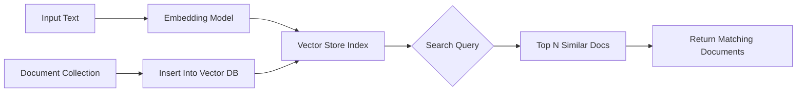

# 06-VectorStore 系统

Rig 的 VectorStore 系统旨在为 AI 应用提供强大的语义搜索与知识库能力，支持将文档或内容转换为向量以进行相似度匹配。它作为一个独立的模块集成在 Rig 中，允许任意模型服务接入并实现向量索引功能。

---

## 🌐 为什么需要 VectorStore？

在许多实际应用场景中，AI 需要处理非结构化信息（如长文本、日志等），并对其进行理解和检索。典型的使用场景包括：

- 搜索相关的文档片段
- 基于语义的问答系统
- 知识库中的内容推荐与提取

为了完成上述任务，Rig 引入了 VectorStore 抽象层，将向量嵌入和相似度搜索抽象出来。

---

## 💡 VectorStore 系统概览

### 🔗 核心概念

- **Document (文档)**：一个由文本内容组成的基本单位
- **Embedding (嵌入)**：文档转化为数学向量形式的过程
- **Vector Index **(向量索引)：用于快速查找近似最近邻项的数据结构

---

## 🧱 接口定义详解

Rig 的 VectorStore 系统通过以下 trait 定义其核心功能：

### 1. `VectorStoreIndex` Trait

```rust
pub trait VectorStoreIndex {
    type Error: std::error::Error + Send + Sync + 'static;
    type Document: VectorDocument;

    async fn top_n(&self, query: &Embedding, n: usize) -> Result<Vec<Self::Document>, Self::Error>;
    async fn top_n_ids(&self, query: &Embedding, n: usize) -> Result<Vec<DocId>, Self::Error>;
}
```

#### 方法说明

| 方法名     | 输入         | 输出             | 功能描述                        |
|------------|--------------|------------------|---------------------------------|
| `top_n`    | 嵌入向量、数量 | 文档列表         | 返回最相似的 n 个文档           |
| `top_n_ids`| 嵌入向量、数量 | ID 列表          | 获取最相似文档的唯一标识符集合   |

> 通常这两个方法是相互配套使用的。比如先获取 ID，再根据这些 ID 查询完整内容。

---

## 📦 支持的实现方式（Providers）

以下是一些已支持的 VectorStore 实现：

| 实现名称 | Crate 名称        | 原生后端     |
|----------|-------------------|--------------|
| Qdrant   | `rig-qdrant`      | Qdrant       |
| Milvus   | `rig-milvus`      | Milvus       |
| SurrealDB| `rig-surrealdb`   | SurrealDB    |

这些实现都遵循统一的 trait 接口，因此在不同数据库之间进行切换非常简单。

---

## 🧩 示例：Qdrant 实现结构

### 1. 初始化过程：

```rust
use rig_qdrant::Qdrant;

let qdrant_client = Qdrant::builder()
    .endpoint("http://localhost:6333")
    .api_key(Some("my_api_key")) // 可选
    .build();
```

### 2. 注册到 Agent 中：

```rust
use rig_agent::{Client, Agent};

let client = Client::new(qdrant_client); // 将 VectorStore 接口注入 Client

let agent = client
    .agent("gpt-4")
    .preamble("You are a helpful assistant.")
    .build();

```

> 注意：当前仅支持 `CompletionModel` 和 `EmbeddingModel` 与 `VectorStoreIndex` 共同使用。

---

## 🔄 文档存储与检索流程（Mermaid 图）



### 说明：
1. 输入文本被转换为嵌入向量
2. 向量存储系统索引这些数据并支持高效搜索
3. 用户查询时，传入新的嵌入向量，从索引中返回最相关的结果

---

## 🔁 数据交换机制（Embedding 转换）

Rig 保证了嵌入处理的统一性：

```rust
// EmbeddingRequest -> EmbeddingResponse -> Vec<f32>

let embedding_request = EmbeddingRequest {
    input: vec!["What is the weather today?".to_string()],
};

let embedding_response = client.embed(embedding_request).await?;
let embeddings = embedding_response.embeddings;

// 将向量传入 VectorStore
let result_documents = vector_store.top_n(&embeddings[0], 5).await?;
```

> 这里 `vector_store` 是实现了 `VectorStoreIndex` 的客户端，比如 Qdrant、Milvus 等。

---

## 📐 高阶使用示例（Agent 中结合文档）

```rust
use rig_agent::{Client, Agent};
use rig_qdrant::Qdrant;
use rig_openai::OpenAI;

let vector_store = Qdrant::builder()
    .endpoint("http://localhost:6333")
    .build();

let client = Client::new((vector_store, OpenAI::default()));

let agent = client
    .agent("gpt-4")
    .preamble("Answer based on provided context only.")
    .temperature(0.3)
    .build();
```

在这种情况下，Agent 使用 `Client` 来调用两者功能，实现完整的向量知识检索流程。

---

## ⚙️ Qdrant 向量存储接口说明

Qdrant 接口通常需要以下参数：

```rust
pub struct QdrantBuilder {
    endpoint: String,
    api_key: Option<String>,
    collection_name: Option<String>,
}
```

### 构建方法：

```rust
let qdrant = Qdrant::builder()
    .endpoint("https://qdrant.example.com")
    .api_key(Some("your-api-key"))
    .collection_name("my_docs")
    .build();
```

---

## 🔄 插件化机制

所有 VectorStore 实现都应遵循下面接口，从而实现通用性：

```rust
trait VectorStoreIndex {
    type Error: std::error::Error + Send + Sync + 'static;
    type Document: VectorDocument;

    async fn top_n(&self, query: &Embedding, n: usize) -> Result<Vec<Self::Document>, Self::Error>;
    async fn top_n_ids(&self, query: &Embedding, n: usize) -> Result<Vec<DocId>, Self::Error>;
}

// 所有向量库必须实现这些方法。
```

> 这使得我们可以轻松添加新的后端存储（如 LanceDB、Pinecone），而无需修改现有应用逻辑。

---

## 🧩 总结

VectorStore 是 Rig 的关键模块之一，主要提供：

- 统一的查询接口用于语义搜索
- 面向多数据库的支持能力
- 低耦合文档插入/检索过程
- 易于扩展的新存储类型实现方式

结合 `Agent` 和 `EmbeddingModel`，可以构建出功能强大的知识库系统。