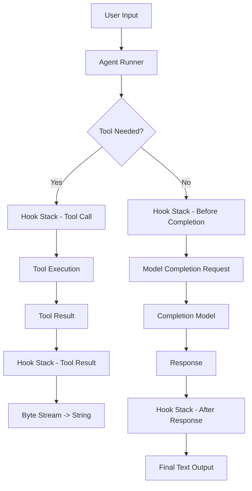
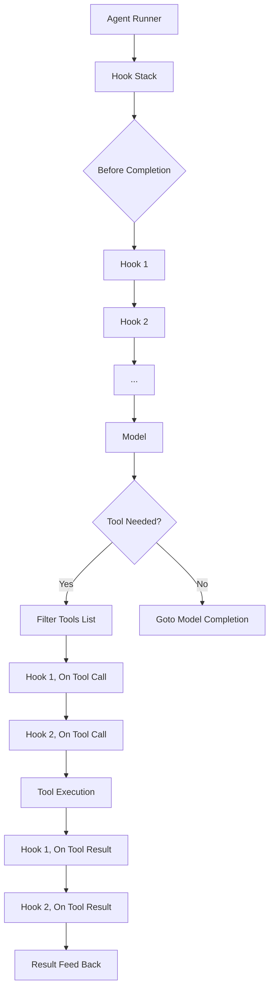

# 07-Agent 与钩子系统

在 Rig 中，Agent 是执行 AI 工作流的运行单元。每一个 Agent 都围绕一个模型（`CompletionModel`）和一组工具（`Tool`）来进行任务推理与执行。而钩子（Hook）机制则为 Agent 提供了在运行生命周期内干预和控制行为的能力。

---

## 🧠 什么是 Agent？

Agent 是 Rig 中执行自然语言交互的核心实体。它可以：

- 运行基于模型的文本生成
- 调用工具完成具体任务
- 管理多轮对话会话状态
- 根据预设参数决定行为方式（如温度、最大 token）

Agent 的生命周期控制依赖于 **Hook Stack**，即一组可配置的 Hook 处理函数，它们可以在以下阶段介入：

| 阶段 | 描述 |
|------|------|
| Before Completion | 在向模型发送请求之前 |
| On Tool Call        | 工具调用前执行 |
| On Tool Result      | 工具输出后 |
| After Response      | 响应生成完毕后 |

---

## 🧩 Agent 架构图（Mermaid）



---

## 🔗 Hook 系统设计

### 1. `AgentHook` Trait 定义

```rust
pub trait AgentHook {
    type Error: std::error::Error + Send + Sync + 'static;

    async fn before_completion(
        &self,
        agent: &Agent,
        request: CompletionRequest,
    ) -> Result<RequestPatch, Self::Error>;

    async fn on_tool_call(
        &self,
        context: &HookContext,
        tool_call: &ToolCall,
    ) -> Result<ToolCallAction, Self::Error>;

    async fn on_tool_result(
        &self,
        context: &HookContext,
        result: &ToolResult,
    ) -> Result<ToolResultAction, Self::Error>;

    async fn after_response(
        &self,
        agent: &Agent,
        response: &CompletionResponse,
    ) -> Result<ObservationAction, Self::Error>;
}
```

#### 关键组件说明：

- `HookContext`: 包含当前运行状态信息（如 turn 数，是否 streaming 等）
- `RequestPatch/ToolCallAction`：用于更改输入或中途终止操作的指令
- `ToolResultAction`: 控制对工具调用结果的处理逻辑

---

## 📦 Hooks 类型详解

### 1. Before Completion Hook（请求前钩子）

```rust
pub struct RequestPatch {
    pub extra_context: Vec<String>, // 添加额外上下文内容
    pub additional_params: HashMap<String, Value>, // 添加模型特定参数
    pub active_tools: Option<Vec<ToolName>>, // 控制可用工具列表
}
```

此 hook 可用于：

- 在每次请求前动态注入信息（如时间戳、用户 ID）
- 增加模型参数或行为调整（如设置 temperature 或 stop sequence）

### 示例用法

```rust
use rig_agent::{Hook, Agent};

struct TimestampHook;

impl Hook for TimestampHook {
    async fn before_completion(
        &self,
        _agent: &Agent,
        mut request: CompletionRequest,
    ) -> Result<RequestPatch, Self::Error> {
        request.extra_context.push(format!("Current time is: {}", chrono::Utc::now()));
        Ok(RequestPatch {
            extra_context: vec![],
            additional_params: Default::default(),
            active_tools: None,
        })
    }
}
```

### 2. Tool Call Hook（工具调用钩子）

提供两种选择：

| 类型         | 描述                                     |
|--------------|------------------------------------------|
| `ToolCallAction` | 决定是否应跳过当前工具调用（Skip）或中断流程（Stop） |

```rust
pub enum ToolCallAction {
    Continue,      // 继续正常调用
    Skip,          // 不执行此动作
    Stop,          // 中止整个 agent 运行
}
```

### 3. Tool Result Hook（工具调用后处理）

允许修改/过滤来自某个工具的返回结果：

```rust
pub enum ToolResultAction {
    Continue,   // 保留原样
    Rewrite(String), // 替换为新内容
    Redact,     // 忽略该结果
    Stop,       // 终止 agent 运行
}
```

### 示例

```rust
impl_hook! {
    struct SecretFilterHook;
    on_tool_result = |context, tool_result| {
        if tool_result.output.contains("secret") {
            Ok(ToolResultAction::Redact)
        } else {
            Ok(ToolResultAction::Continue)
        }
    };
}
```

---

## 🧠 多 Hook 系统处理机制（Mermaid）



---

## 🧩 示例：构建一个带 Hook 的 Agent

```rust
use rig_agent::{Agent, Client, HookStack};
use rig_openai::OpenAI;

#[derive(Clone)]
struct LoggingHook;

impl Hook for LoggingHook {
    async fn before_completion(
        &self,
        _agent: &Agent,
        request: CompletionRequest,
    ) -> Result<RequestPatch, Self::Error> {
        println!("Sending request: {:?}", request);
        Ok(RequestPatch {
            extra_context: vec![],
            additional_params: Default::default(),
            active_tools: None,
        })
    }

    async fn after_response(
        &self,
        _agent: &Agent,
        response: &CompletionResponse,
    ) -> Result<ObservationAction, Self::Error> {
        println!("Received response: {:?}", response);
        Ok(ObservationAction::Continue)
    }
}

#[tokio::main]
async fn main() {
    let client = Client::new(OpenAI::default());

    let agent = client
        .agent("gpt-4")
        .preamble("You are a helpful assistant.")
        .tool(weather_tool)
        .hooks(vec![LoggingHook])
        .temperature(0.8)
        .build();

    let output = agent.run("Tell me the weather today.").await?;
    println!("Output: {}", output);
}
```

---

## 🧪 Hook 测试支持

Rig 提供了丰富的测试辅助模块用于单元/集成钩子验证：

```rust
// test_hooks.rs
use rig_agent::test_utils::MockHook;
use rig_agent::{Agent, Client, HookStack};
use rig_openai::OpenAI;

#[tokio::test]
async fn test_hook_interception() {
    let hook = MockHook::builder()
        .before_completion(|_agent, req| {
            // 修改 request 内容
            Ok(RequestPatch { extra_context: vec!["test".to_string()], ..req })
        })
        .build();

    let client = Client::new(OpenAI::default());
    let agent = client.agent("gpt-4").hooks(vec![hook]).build();
    
    assert_eq!(agent.run("dummy").await.unwrap(), "result");
}
```

---

## 🧩 总结

Hook 是 Rig 实现强大扩展能力的关键机制，其作用如下：

- 给定 Agent 提供**运行期修改行为的能力**
- 允许**在模型请求前后介入流程控制**
- 支持工具调用及返回内容的灵活处理
- 易于编写单元测试、保证安全性与稳定性

通过 Hook 系统，用户可以在不改变基础逻辑的前提下扩展 AI 应用的功能边界。