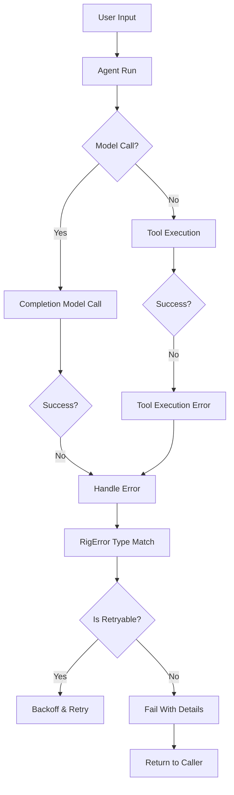

# 08-错误与异常处理

在 AI 应用中，错误处理至关重要。无论是模型调用失败、网络中断、工具执行出错，还是用户输入非法等，都可能引发异常。Rig 提供了一套完整的错误处理机制，帮助开发者快速定位问题并优雅地恢复。

---

## 🛑 为什么需要统一的错误处理？

在构建 AI 应用时，程序可能会因为多种因素报错：

| 类型 | 描述 |
|------|------|
| 网络错误 | 如超时、重连失败、API 访问权限不足 |
| 模型错误 | 如无效模型参数、模型接口变更、输出不支持等 |
| 工具执行错误 | 如数据库连接中断、外部 API 返回异常数据 |
| 用户输入错误 | 如格式不符、超出长度限制等 |

统一的错误处理能：

- 确保信息一致性和可追溯性
- 提升调试效率
- 增强应用鲁棒性与稳定性

---

## 📦 全局 Error 结构

Rig 的所有错误类型都实现了 `std::error::Error`，并使用 `thiserror` 宏进行生成。

```rust
#[derive(Debug, thiserror::Error)]
pub enum RigError {
    #[error("Network error occurred: {0}")]
    Network(#[from] reqwest::Error),

    #[error("Provider error: {0}")]
    Provider(#[from] Box<dyn std::error::Error + Send + Sync + 'static>),

    #[error("Tool execution failed: {0}")]
    ToolExecution(String),
    
    #[error("Invalid parameter: {0}")]
    InvalidParameter(String),

    #[error("Model not found: {0}")]
    ModelNotFound(String),

    #[error("Embedding generation failed")]
    EmbeddingFailed(#[from] EmbeddingError),

    #[error("Agent error")]
    Agent(#[from] AgentError),

    // 其他自定义错误...

    #[error("Unknown error occurred")]
    Unknown,
}
```

### 关键特点

- 所有错误类型都能转换为 `RigError`
- 使用 `[from]` 自动实现嵌套错误类型继承
- 支持标准 panic 和 async 错误传递机制

---

## 🧠 核心 Trait 与错误处理接口

在 Rig 中存在如下几个关键的 Trait 来管理不同类型的错误：

### 1. `CompletionModel::Error`

```rust
pub trait CompletionModel: Send + Sync {
    type Error: std::error::Error + Send + Sync + 'static;

    async fn complete(&self, request: CompletionRequest) -> Result<Self::Response, Self::Error>;
}
```

> 所有 Provider 都需实现这个错误类型，并在内部包装具体错误。

### 2. `VectorStoreIndex::Error`

```rust
pub trait VectorStoreIndex {
    type Error: std::error::Error + Send + Sync + 'static;

    async fn top_n(&self, query: &Embedding, n: usize) -> Result<Vec<Self::Document>, Self::Error>;
}
```

### 3. `Tool::Error`

```rust
pub trait Tool {
    type Error: std::error::Error + Send + Sync + 'static;
    type Output: serde::Serialize;

    async fn call(&self, input: &str) -> Result<Self::Output, Self::Error>;
}
```

---

## 🧾 典型错误类型说明

### 1. `RigError::Network`

```rust
#[error("Network error occurred: {0}")]
Network(#[from] reqwest::Error)
```

表示网络通信过程中的异常，这类异常往往需要通过 retry 机制来处理。

例如：

```rust
use rig::agent::Client;
use rig_openai::OpenAI;

let client = Client::new(OpenAI::builder().api_key("sk-...").build());

match client.model.complete(request).await {
    Ok(_) => println!("Success"),
    Err(e) if e.is::<reqwest::Error>() => {
        // 实现在重试后继续执行操作
        println!("Retry logic triggered.");
    },
    _ => panic!("Unexpected error"),
}
```

---

### 2. `RigError::ToolExecution`

```rust
#[error("Tool execution failed: {0}")]
ToolExecution(String),
```

表示调用某个工具失败的情况。常见于：
- 数据库查询错误
- 接口未提供预期字段
- JSON 解析异常等

---

### 3. `RigError::ModelNotFound`

```rust
#[error("Model not found: {0}")]
ModelNotFound(String),
```

当尝试使用一个不存在的模型名进行请求时触发。

比如在以下调用中：

```rust
let client = Client::new(OpenAI::default());
let agent = client.agent("fake-model").build();
let result = agent.run("What is 2 + 2?").await;
assert!(result.is_err()); // 由于 model 名无效导致错误
```

---

### 4. `EmbeddingError` & `AgentError`

这些子错误由特定模块定义，在调用链中自动传播。通过 `#[from]` 可以方便地向上层抛出。

```rust
#[derive(Debug, thiserror::Error)]
pub enum EmbeddingError {
    #[error("Invalid dimensions")]
    InvalidDimensions,

    #[error("Encoding failed")]
    EncodingFailed(#[from] Box<dyn std::error::Error + Send + Sync>),
}

#[derive(Debug, thiserror::Error)]
pub enum AgentError {
    #[error("Max turns exceeded")]
    MaxTurnsExceeded,
    
    #[error("Invalid tool name: {0}")]
    InvalidToolName(String),
}
```

---

## 🔁 异常处理流程（Mermaid）



---

## 🛠️ 错误恢复策略示例

### 1. 重试机制（Retry）

Rig 提供了一种内置的重试策略，适用于网络不稳定或临时性故障。

```rust
use tokio_retry::strategy::{ExponentialBackoff, FibonacciBackoff};
use tokio_retry::Retry;

let strategy = FibonacciBackoff::from_millis(100).take(3); // 最多尝试 3 次

let retryable_call = Retry::spawn(strategy, || async {
    model.complete(request).await
});

let result = retryable_call.await?;
```

### 2. 使用 try! 宏捕获多层级错误

```rust
fn process_request() -> Result<String, RigError> {
    let embedding = client.embed(embedding_req).map_err(RigError::from)?;
    
    let docs = vector_store.top_n(&embedding, 5)
        .map_err(|e| {
            if let Some(err) = e.downcast_ref::<reqwest::Error>() {
                RigError::Network(err.clone()))
            } else {
                RigError::Provider(Box::new(e))
            }
        })?;

    Ok(format!("Found {} matching docs", docs.len()))
}
```

---

## 🧪 单元测试中的错误验证

Rig 支持通过测试工具进行断言验证：

### 示例测试代码

```rust
#[tokio::test]
async fn test_invalid_model_errors() {
    let client = Client::new(OpenAI::default());
    let agent = client.agent("invalid-model").build();

    let res = agent.run("Hello").await;
    assert!(res.is_err());

    let err = res.unwrap_err();
    matches!(err, RigError::ModelNotFound(_));
}
```

---

## 🧩 总结

Rig 的错误处理机制具备以下几个特性：

- 采用 `thiserror` 实现统一、语义清晰的异常结构
- 每个模块都提供具体错误定义接口以确保细节明确
- 对标准库/第三方依赖进行自动转换与包装，保障兼容性
- 提供了丰富的错误枚举支持业务逻辑判断与恢复策略制定

这套系统既满足快速开发需求，也易于后期扩展调试和维护。