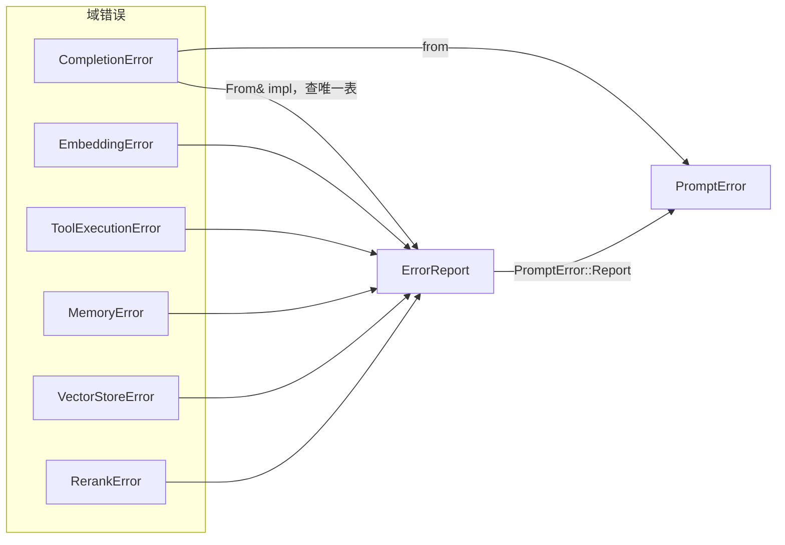

# 08-错误与异常处理

Rig 的错误体系分两层：**域错误**（`CompletionError`、`EmbeddingError`…，thiserror 枚举，携带类型化细节）与**线错误** `ErrorReport`（serde 结构体，能跨任务/通道/进程边界）。转换是单向的：每个域错误都能无损地（对策略而言）折算成 report。

---

## 🧱 线错误模型（`crates/rig-core/src/error.rs`）

### `ErrorKind`（error.rs:34）— 归一化分类

`Http`（无 provider 应答的传输失败，**不带状态码**）、`Json`、`Url`、`Request`、`Response`、`Provider`（无保留原始响应的 provider 报错）、`ProviderResponse`（**有保留的原始响应**：状态/体/请求 id/头都在 report 上）、`Tool(ToolErrorKind)`、`MemoryBackend` / `MemoryPolicy`、`Internal`、`Cancelled`、`Timeout`、`BusClosed`（driver 没了）、`HandlerUnavailable`（key 没人服务）、`Divergence`（重放发散，永不重试）、`Denied`（策略拒绝，永不重试）、`Other`。

每个 kind 有稳定机器码 `code()`（如 `"provider_response"`、`"handler_unavailable"`）。

### `ErrorReport`（error.rs:127）— 可序列化报告

| 字段 | 含义 |
|---|---|
| `kind` | `ErrorKind` |
| `retryable` | **唯一**的策略信号，转换时由源分类决定 |
| `message` | 源的 `Display` |
| `code` | provider/工具机器码 |
| `http_status` | 失败带的 HTTP 状态 |
| `refusal` | 故意拒绝而非故障（Gemini 的 block、拒答） |
| `source_chain` | 各层 `source()` 的 Display，外层在前 |
| `request_id` | provider 请求 id |
| `provider_response` | 保留的原始响应：status + body + headers（429 的 `Retry-After`）+ id（`ProviderResponseError`） |

便捷读取：`provider_response_body()/provider_response_json()/provider_response_headers()/provider_response_status()/provider_request_id()`。`ErrorReport` 在**所有目标**（含浏览器 wasm）上 `Send + Sync + Serialize`（编译期断言）。

### 可重试判定：**只有一张表**（error.rs:255）

```rust
pub const fn retryable_status(status: Option<u16>) -> bool {
    match status {
        Some(408 | 425 | 429) => true,     // 超时/过早/限流
        Some(s) => s >= 500 && s <= 599,   // 服务器错误
        None => false,
    }
}

// 无状态码的传输失败（error.rs:274）：
// StreamEnded、Instance(reset/DNS/TLS/超时) → 可重试
// Protocol、InvalidHeaderValue、NoHeaders、InvalidContentType → 不可重试
```

`CompletionError::is_retryable` 与各 `From` impl 都查这一张表；**runner 在 run 内部替你消耗总预算做重试**（可重试的瞬时失败），而不是抛给调用方。

---

## 🛑 域错误枚举

### `CompletionError`（completion/request.rs:82）

`HttpError(http_client::Error)`（无应答）、`JsonError`、`UrlError`、`RequestError(Box<dyn Error>)`（wasm 上无 Send bound）、`ResponseError(String)`、`ProviderError(String)`、`ProviderResponse(ProviderResponseError)`（**非 2xx 带体 / 2xx 错误信封**——状态、体、头、请求 id 全保留，#2333 起头也在）。

### `PromptError`（rig-agent，run/response.rs:309）

run 的顶层错误：

```rust
pub enum PromptError {
    CompletionError(CompletionError),
    Report(ErrorReport),        // 总线上的效果失败：bus/handler 故障、hook 拒绝、流项错误
    MemoryError(MemoryError),
    MaxTurnsError { max_turns, chat_history, prompt },   // 预算耗尽，附现场
    PromptCancelled { reason, .. },          // 提问环被取消
    // ...
}
```

### 其他域错误

- `EmbeddingError`（embeddings/）：Http/Json/Url/Document/Response/UnsupportedParameter/InvalidParameterValue/UnsupportedResponseEncoding/MissingUsage/MismatchedDimensions/Provider/ProviderResponse。
- `VectorStoreError`（vector_store/mod.rs:32）：`EmbeddingError`、`JsonError`、`DatastoreError(Box<dyn Error>)`、`FilterError(FilterError)`、`BuilderError`、`MissingIdError`、`Http`、`ExternalAPIError(status, body)`（后端自己的非 2xx 应答——按 provider 同规则分类）。
- `MemoryError`：`Backend` / `Policy` / `Internal`。
- `ToolExecutionError`（tool/）：`kind()` 为 `ToolErrorKind`（分类 + 默认可重试表），`retryable()` 显式覆写优先。
- `RerankError`、`TranscriptionError`、`ProviderClientError`（构造期：`EnvironmentVariable{name,source}` / `Http` / `InvalidConfiguration(&'static str)` / `MissingApiKey(provider_name)`）。

---

## 🔁 转换链



要点：

- **provider 响应随报告旅行**：`CompletionError::ProviderResponse` → report 的 `provider_response` 字段原样带过（429 的 `Retry-After`、请求 id 都还在），跨线不丢信息。
- `VectorStoreError::EmbeddingError` 折算时保留外层 message + 源链，避免双层包装。
- 拒答（`refusal`）与故障分开：Gemini `block_reason=OTHER` 不是 refusal；截断的 reasoning-only 轮不落定任何东西（这些行为都有 cassette 钉住的回归）。

---

## 🧭 run 内错误处理流

```mermaid
flowchart TD
    D[dispatch EffectKind] --> R{handler 应答}
    R -- Err -->> CL{ErrorReport.retryable?}
    CL -- 是 -->> RT[runner 消耗总预算重试<br/>同 run 内不外抛]
    CL -- 否 -->> HOOK[outcome 钩子可 Replace 成功/错误]
    HOOK -- 未救 -->> ST[run 落定 PromptError]
    RT -- 预算内成功 -->> OK[继续]
    RT -- 预算耗尽 -->> MX[MaxTurnsError 附历史/提示现场]
    ST --> SET[on_run_settled 先于错误到消费者]
```

- **工具失败**不是 run 失败：规范化成 `ToolResultContent::error` 回给模型（除非 hook Deny 一个 `Cancelled` 报告）。
- **无效工具调用**（名字不存在/参数不合法）由 `InvalidToolCallAction` 决定：默认 fail-fast，或 Retry（带纠正反馈）/Repair（改名为已注册工具）/Skip（合成 skipped 结果）。
- **流被截断**（终帧前断流）按可重试传输失败处理；重放遇到发散报 `Divergence`，失败而不是继续用记录没给过的答案。

---

## 🧪 用户侧模式匹配

```rust
match agent.prompt("...").run().await {
    Ok(resp) => { /* PromptResponse */ }
    Err(PromptError::MaxTurnsError { max_turns, .. }) => { /* 加预算重试 */ }
    Err(PromptError::Report(r)) if r.provider_response_status() == Some(StatusCode::TOO_MANY_REQUESTS) => {
        let retry_after = r.provider_response_headers()
            .and_then(|h| h.get("retry-after").cloned());
    }
    Err(PromptError::CompletionError(CompletionError::ProviderResponse(pr))) => {
        // pr.status / pr.body / pr.headers / pr.provider_request_id
    }
    Err(e) => { /* 其余 */ }
}
```

仓库工程规则（AGENTS.md）：**新可失败 API 禁止拿 `String` 当错误类型**；用 thiserror 显式枚举；`unwrap/expect` 仅限"从代码上看显然不可能"；凭据 Debug 必须打码。

---

## 🧩 总结

- 两层模型：类型化域错误（开发时）→ `ErrorReport`（跨边界）。
- 一张重试表、一次决策：`retryable_status` + 各域自己的 `is_retryable`，别处不复制。
- provider 原始应答全程保留：非 2xx 的状态/体/头/请求 id 一直可读。
- 语义化分类驱动策略：refusal ≠ 故障、Deny ≠ Cancelled、Divergence 永不重试。