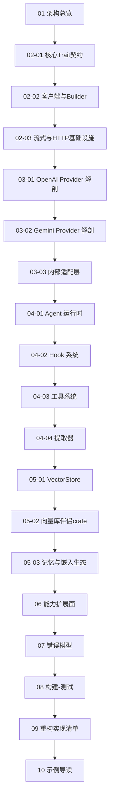

# Rig 源码级文档库（新手重构级指南）

> 目标读者：想读懂 Rig 源码、并仅凭这份文档就能**重新实现（Re-implement）**一个功能等价版本的开发者。
>
> 文档原则：**每一篇都对应真实的文件路径、真实的 trait/struct/fn 名称、真实的调用链**；
> 大量使用 Mermaid 图表（架构图 / 时序图 / 类图 / 流程图）；每篇遵循
> **Why（设计初衷）→ What（核心概念）→ How（代码级拆解）** 的节奏。
>
> 同步基线：workspace `version = "0.42.0"` 之后的 main HEAD（2026-09）。全部 20 篇已按当前
> 源码重写，签名均带 `file:line` 坐标；行号会随提交漂移，漂移后以符号名 grep 为准。

## 目录结构

```
docs/sourceReader2/
├── 00-目录与阅读指南.md                     # 本文件
├── 01-架构总览.md                           # 工作区拓扑、分层设计、一次请求的完整旅程
├── 02-核心类型与运行时/
│   ├── 01-核心Trait契约.md                  # CompletionModel / EmbeddingModel / VectorStoreIndex / Tool / Provider 等
│   ├── 02-客户端与Builder系统.md            # Provider trait、ProviderBuilder、ProviderClient、Client/ClientBuilder 别名体系
│   └── 03-流式与HTTP基础设施.md             # AsyncStream、SSE、重试、multipart、WASM 兼容层
├── 03-Provider体系/
│   ├── 01-OpenAI-Provider深度解剖.md        # 最完整的 Provider：全部模块、类型、请求/响应转换、流式、Responses API
│   ├── 02-Gemini-Provider深度解剖.md        # 另一种 API 形态：Interactions API、图像/音频生成、转录
│   └── 03-内部适配层与兼容Provider.md       # providers/internal/* 适配器机制 + Azure/deepseek/groq 等薄包装
├── 04-Agent与工具系统/
│   ├── 01-AgentBuilder与运行时.md           # Agent / AgentBuilder / AgentRunner / drive_agent 生命周期
│   ├── 02-钩子Hook系统.md                   # AgentHook、HookStack、各类 Action、RequestPatch 合并语义
│   ├── 03-工具系统.md                       # PortableTool vs 上下文 Tool、ToolSet、#[rig_tool] derive、rmcp
│   └── 04-提取器Extraction与序列化.md       # Extractor、OutputMode、AgentRun 可序列化状态机
├── 05-向量库与记忆/
│   ├── 01-VectorStore-trait与内存实现.md    # trait、Builder、InMemoryVectorStore、LSH
│   ├── 02-向量库伴侣crate模式.md            # 以 rig-sqlite / rig-qdrant 为例的完整实现范式
│   └── 03-记忆与嵌入模型生态.md             # memory trait、rig-memory 策略、rig-fastembed、rig-candle
├── 06-能力扩展面/
│   ├── 01-嵌入/重排/音频/图像能力.md        # embeddings 模块族、rerank、transcription、audio/image generation
│   └── 02-遥测与测试基础设施.md             # telemetry 约定、test_utils、streaming conformance 套件
├── 07-错误模型.md                           # 各 crate 错误枚举全景、错误转换链、provider 错误保留
├── 08-构建-测试与工程化.md                  # workspace 特性门控、clippy lint 规则、cassette 测试、CI/CD、WASM 构建
├── 09-重构实现清单.md                       # 从零重实现 Rig 的分阶段任务清单与验收标准
└── 10-示例导读.md                           # examples/ 下每个示例对应的知识点索引
```

## 建议阅读顺序



## 每篇文档的固定结构（写作规范）

1. **定位**：这一层在整体架构中的位置（配架构图）。
2. **Why**：为什么需要这个抽象 / 不这样做会有什么坏味道（反例对照）。
3. **What**：核心类型与接口，全部列出真实签名（`src/lib.rs` 行级可定位）。
4. **How**：
   - 关键函数的逐步走读（真实入参 → 内部变换 → 返回值）；
   - **调用关系图**（Mermaid sequence/flowchart，标明函数名）；
   - 类图（Mermaid classDiagram，标明 impl 关系）；
   - 至少一个"如果要从零实现，你会写什么代码"的映射说明。
5. **边界与坑**：WASM 约束、特性门控（`#[cfg(feature=...)]`）、clippy deny 规则对实现方式的影响。
6. **自检问题**：3~5 个检验是否读懂的问题。

## 关键代码坐标（全局索引）

| 主题 | 路径 |
|------|------|
| Facade 门面 | `src/lib.rs`（特性门控重导出矩阵、`companion_modules!` 宏 :307） |
| 核心契约 trait | `crates/rig-core/src/lib.rs`、`crates/rig-core/src/prelude.rs` |
| 客户端/Builder | `crates/rig-core/src/client/mod.rs`（Provider:246、Client:342、ClientBuilder:655） |
| 完成请求/响应 | `crates/rig-core/src/completion/{mod,request,message}.rs`（CompletionModel: request.rs:697） |
| 流式 | `crates/rig-core/src/streaming/{mod,event,block_id,accumulator}.rs` |
| HTTP 基础设施 | `crates/rig-core/src/http_client/{mod,sse,retry,multipart,erased,middleware}.rs`、`ws_client.rs` |
| Provider trait 家族 | 见 `client/mod.rs` 与 `providers/mod.rs` |
| 效果协议 | `crates/rig-core/src/effect/`（EffectKind 七族）、`crates/rig-core/src/serve/`（handler 契约） |
| 内部适配层 | `crates/rig-core/src/providers/internal/`（36 个文件） |
| OpenAI Provider | `crates/rig-core/src/providers/openai/`（client/completion/responses_api/embedding…） |
| Gemini Provider | `crates/rig-core/src/providers/gemini/`（含 `interactions_api/`） |
| Agent 运行时 | `crates/rig-agent/src/agent/`（builder/runner/drive/engine/hook/ 全目录化）、`crates/rig-agent/src/run/` |
| ECS 运行时 | `crates/rig-ecs/`（publish=false：bus/、systems/、agent/、policy/、replay/） |
| 工具注册/服务 | `crates/rig-agent/src/tool/`（registry/catalog/server） |
| 上下文 + 可移植工具 | `crates/rig-core/src/tool/`（contextual/portable/context/result） |
| `#[rig_tool]` | `crates/rig-derive/src/lib.rs` |
| 向量库 trait | `crates/rig-core/src/vector_store/`（mod.rs、request.rs、in_memory_store.rs、lsh.rs） |
| 记忆 | `crates/rig-core/src/memory.rs`、`crates/rig-memory/src/lib.rs`（策略层） |
| 嵌入/重排/转录/图像/音频 | `crates/rig-core/src/embeddings/`、`rerank.rs`、`transcription.rs`、`image_generation.rs`、`audio_generation.rs` |
| 线错误模型 | `crates/rig-core/src/error.rs`（ErrorReport/ErrorKind/retryable_status）、`provider_response.rs` |
| 观测/遥测 | `crates/rig-core/src/observe/`、`crates/rig-core/src/telemetry/mod.rs` |
| WASM 兼容 | `crates/rig-core/src/wasm_compat.rs`、`crates/rig-core/src/markers.rs` |
| 测试设施 | `crates/rig-core/src/test_utils/`（含 streaming_conformance*）、`tests/`（cassette 体系见 `tests/README.md`）、`tests/ecs_parity/` |
| 传输实现 | `crates/rig-reqwest/`、`crates/rig-tungstenite/` |
| 记录/重放 | `crates/rig-effect-log/`、`crates/rig-cassette/` |
