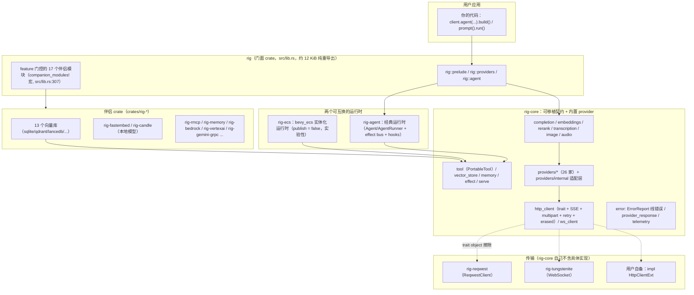
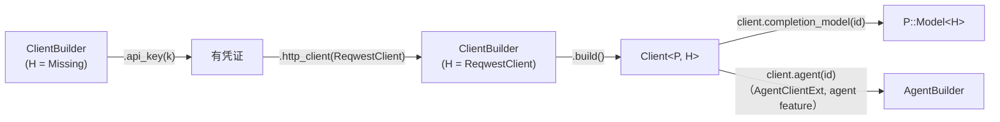
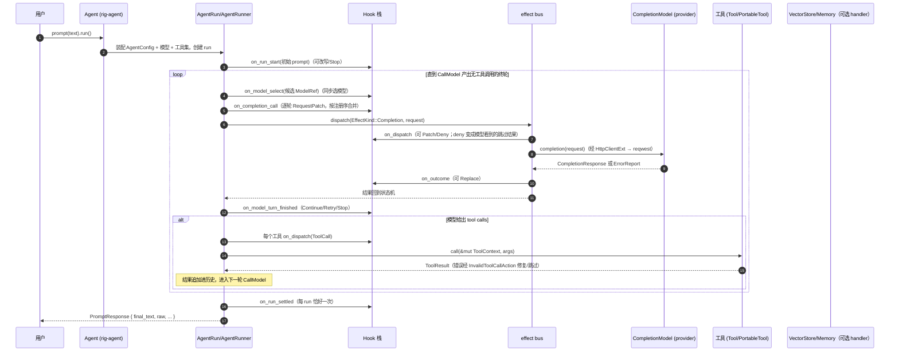

# 01 · 架构总览：工作区拓扑、分层与一次请求的完整旅程

> 同步基线：workspace `version = "0.42.0"`（`Cargo.toml:107`）之后的 main HEAD（2026-09）。
> 本篇所有名称、路径、行号均对照当前源码；行号会随提交漂移，漂移后以符号名为准。

## 1. 定位

Rig 是一个"provider 无关的 LLM 应用库"。它的全部设计可以用一句话概括：

> **用一组可移植的 trait 描述 LLM 能力（补全、嵌入、重排、转录、图像/音频生成），把"如何与某家厂商通信"压到 provider 适配层，把"如何驱动多轮工具循环"压到独立运行时，把"如何收发 HTTP/WS"压到传输层。**

关键事实：

- **门面 `rig` 不含逻辑**：`pub use rig_core::*;`（`src/lib.rs:42`），经典运行时 `rig_agent` 在 `agent` feature 后重导出。
- **传输是注入的**：`rig-core` 只定义 `HttpClientExt`，具体后端在 `rig-reqwest` / `rig-tungstenite`，或用户自备。类型位置上 `Client<P, H = BoxedHttpClient>` 的 `H` 默认擦除（`crates/rig-core/src/client/mod.rs:342`）。
- **两个运行时并存**：`rig-agent`（发布、默认）与 `rig-ecs`（`publish = false`，bevy_ecs 数据导向实验台）。二者都只依赖 `rig-core` 的契约，互不依赖。
- **伴侣 crate 不被核心依赖**：向量库/本地模型等通过 facade 的 feature 模块暴露（`src/lib.rs:337` 起的 `companion_modules!` 列表）。

## 2. Why：为什么切成这样

| 切分 | 不这样做的坏味道 |
|------|------------------|
| `rig`（门面） vs `rig-core` | 用户被迫启用所有集成、编译所有向量库客户端；核心版本与集成版本无法分别演进 |
| `rig-core` vs `rig-agent` | 只想发一次补全请求、或想在 WASM/裸 runtime 里跑状态机的用户，被迫拉入 tokio 多轮循环、bus、hook 栈 |
| 核心 vs 传输（`H: HttpClientExt`） | 库替用户选定 reqwest/TLS 栈，与应用已有 HTTP 客户端重复、无法插桩、无法在 WASM/嵌边环境替换 |
| provider 值类型 `P` 泛型 vs `dyn` 枚举 | 新增厂商要改上帝枚举；编译期缺少某能力时无法用"trait 没实现"表达 |
| `providers/internal/` 适配层 | 20+ 家 OpenAI/Anthropic 兼容厂商各自复制请求转换/SSE/工具桥，修一处 bug 要改 20 处 |
| `ErrorReport`（serde 线错误） vs `Box<dyn Error>` | 错误要跨 effect bus、任务、进程（replay、ECS、远程 worker）时无法序列化，重试策略无统一判定点 |
| `rig-ecs` 独立 crate | 数据导向运行时（效果=实体、取消=despawn、因果=父子关系）是另一种范式，放在主运行时里会污染稳定 API |

## 3. What：crate 全景

### 3.1 workspace 成员（根 `Cargo.toml`）

- `members = ["crates/*", "examples/*", "xtask", "test-support/service-tests", "test-support/rig-test-support"]`（`Cargo.toml:24`）。
- `examples/*` 下 **68 个独立 Cargo 包**（不是 `cargo example`，每个有自己的 Cargo.toml）。
- `default-members`（`Cargo.toml:44`）显式列出 facade、rig-core、rig-agent、rig-ecs、rig-cassette、rig-effect-log、两个传输、bedrock/candle/gemini-grpc/verify 与两个 test-support——这是 #2258 的教训：不写默认集，裸 `cargo nextest run` 只测到 facade，rig-core 约 1200 个单测无人执行。
- 排除：`archived/`、`examples/documents`、`examples/otel`（数据包）、`examples/discord_bot`（serenity 锁了带安全公告的 rustls，独立 workspace）。
- 打包时 `exclude = ["tests/cassettes/**"]`：1,100+ 录制 fixture 会把 crate tarball 顶到 crates.io 10 MiB 上限（`Cargo.toml:13`）。

### 3.2 crates 分类

| 类别 | crate |
|------|-------|
| 门面 | `rig` |
| 核心 | `rig-core`、`rig-derive`（过程宏：`#[rig_tool]` 等） |
| 运行时 | `rig-agent`（经典）、`rig-ecs`（实验、不发布） |
| 传输 | `rig-reqwest`、`rig-tungstenite` |
| 记录/校验 | `rig-effect-log`（record/replay）、`rig-cassette`（录制 HTTP）、`rig-verify`（凭证探活，不发布） |
| 本地模型 | `rig-fastembed`（ONNX 嵌入）、`rig-candle`（Candle CPU 推理） |
| 向量库 | `rig-sqlite`、`rig-qdrant`、`rig-lancedb`、`rig-milvus`、`rig-postgres`、`rig-scylladb`、`rig-mongodb`、`rig-neo4j`、`rig-surrealdb`、`rig-helixdb`、`rig-s3vectors`、`rig-vectorize` |
| 云/协议 | `rig-bedrock`、`rig-vertexai`、`rig-gemini-grpc`、`rig-rmcp`（MCP 工具） |
| 记忆 | `rig-memory`（窗口/摘要等策略族） |

### 3.3 rig-core 顶层模块（`crates/rig-core/src/`）

`client/` · `completion/` · `embeddings/` · `rerank.rs` · `transcription/` · `image_generation/` · `audio_generation/` · `tool/` · `vector_store/` · `memory.rs` 与 `memory/` · `effect/`（效果协议词汇）· `serve/`（handler 契约）· `providers/`（26 家 + internal）· `http_client/` · `ws_client.rs` · `error.rs`（`ErrorReport`）· `provider_response.rs` · `streaming/` · `transcript.rs` · `telemetry/` · `loaders/` · `json_utils.rs` · `id.rs` · `markers.rs`（`Missing`）· `wasm_compat.rs` · `test_utils/` · `model/` · `observe/`。

## 4. How：一次请求的完整旅程

### 4.1 构造期（零 IO）

`Provider` trait（`client/mod.rs` 内）描述"如何建客户端、如何拼 URL"；`HasCompletion` 等能力 trait 描述"这家厂商有哪种模型类型"；blanket impl 把它们变成用户可见的 `CompletionClient::completion_model(..)`。详见 `02-核心类型与运行时/02-客户端与Builder系统.md`。

### 4.2 运行期：带工具的多轮对话

以 `agent.prompt("...").run()` 为例（经典运行时，sans-IO 核心是 `AgentRun`）：

要点：

1. **一切效果都过 bus**。补全、工具、记忆读写、检索、嵌入、重排、自定义效果是 `EffectKind` 的七个族（`crates/rig-core/src/effect/mod.rs`），以 serde 数据表示，按 `HandlerKey` 派发给注册的 handler（`Serve` 契约，`crates/rig-core/src/serve/`）。这让补全能被记录（rig-effect-log）、在 ECS 里实体化、或被远程进程服务。
2. **AgentRun 是 sans-IO 状态机**：步骤只有 `CallModel / CallTools / Done`，可序列化、可单步（见 `examples/agent_run_stepping`）。`AgentRunner` 在它外面包 hook、bus 与未来驱动；`run` 与 `stream` 共享同一个 `drive_agent`，因此 hook 语义在流式/非流式上必须一致。
3. **流式只是输出形态不同**：delta（text/reasoning/tool-call）逐块过 `on_*_delta` 钩子，但在该 model turn 被接受前都是临时的；turn 结束走同一个 `on_model_turn_finished`。
4. **错误沿同一条路回传**：provider 错误在适配层转成 `CompletionError`，跨 bus 时转成 `ErrorReport`（携带 status/body/headers/request-id 与可重试判定），run 决定重试还是终止（见 `07-错误模型.md`）。

### 4.3 ECS 运行时里的同一件事

`rig-ecs` 把上述循环翻译成 bevy 系统每 tick 推进的世界状态：效果是实体（`PendingEffect → InFlight → EffectOutcome`，流式片段挂 `Streamed`），handler 是带 `Bound` 的实体（`HandlerTable` 登记），因果用 `ChildOf`，取消就是 despawn，用户拦截点是 `Gate`/`Judge` 实体；host 每 tick 调 `run_to_quiescence`（静默上限 64）。请求构造全 crate 只有 `fold_request` 一处。详见 `04-Agent与工具系统/01-AgentBuilder与运行时.md`。

## 5. 边界与坑

- **没有默认具体传输**：不开 `reqwest` feature 时 `Client::new(key)` 不存在；用 `Client::new_with(key, http)` 或 builder 的 `.http_client(..)`。
- **能力缺失是编译错误**：某 provider 不实现 `HasRerank`，就没有 `client.rerank_model(..)` 方法——不要试图在运行期查询。
- **WASM**：trait 界限定 `WasmCompatSend/WasmCompatSync`，boxed future 用 `WasmBoxedFuture`；tungstenite 只在 native（`#[cfg(not(target_family = "wasm"))]`）。
- **facade 模块名 = feature 名**（尽量），多 feature 别名见 `companion_modules!`（如 fastembed 挂三个 feature 任一即启用，`src/lib.rs:341`）。
- **行号漂移**：本文集所有 `file:line` 是写作时坐标；重构后用符号名 grep。

## 6. 自检问题

1. 不依赖 reqwest，如何让 Rig 跑在你自己的 HTTP 客户端上？要实现哪个 trait、从哪个构造口进？
2. 一个新 provider 要支持"补全 + 嵌入"，需要 impl 哪几个 trait？缺 rerank 时用户侧表现是什么？
3. 为什么 `AgentRun` 可以序列化而 `Agent` 不能？哪一层持有 IO？
4. 补全请求从 prompt 到 HTTP 发出，穿过哪些抽象（按顺序列 5 个）？
5. rig-ecs 里"取消一个在飞的补全"在数据层面意味着什么？
