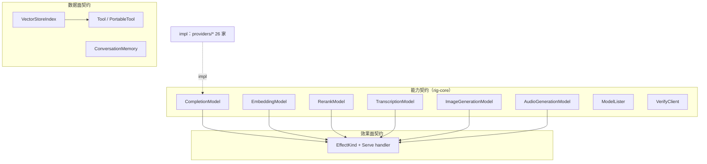
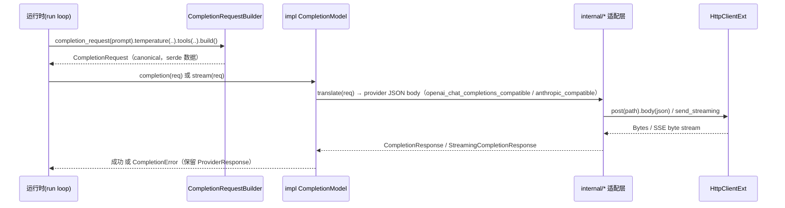

# 02-01 · 核心 Trait 契约：能力面的七个动词

> 本篇回答"Rig 到底用哪些 trait 描述一个 LLM 平台"。所有 trait 都是 **provider 无关、transport 无关、runtime 无关** 的：rig-agent 与 rig-ecs 建在它们之上，provider 实现它们。

## 1. 定位



能力 trait 与"客户端能力"是两层：provider 值 impl `HasCompletion`/`HasEmbeddings`…（关联类型 `Model<H>`），blanket impl 才在 `Client<P,H>` 上产出 `completion_model(id)` 并返回具体模型类型。本篇只讲模型/数据 trait；客户端层见 `02-客户端与Builder系统.md`。

## 2. Why：为什么是这些形状

1. **`impl Future` 而非 `BoxFuture`**：trait 方法全部用原生 async-in-trait 风格（`-> impl Future<...> + WasmCompatSend`），避免 `Box` 开销，并允许 WASM 上 `Send` 退化为空约束。
2. **输入/输出是 Rig 自己的 canonical 类型**（`CompletionRequest`/`CompletionResponse`/`Message`…）：provider 适配层负责翻译，运行时永远只见一种形状，这是 hook、patch、record/replay 能成立的前提。
3. **流式与非流式对称**：`CompletionModel` 同时有 `completion` 与 `stream`，且 stream 最终能被 accumulator 折叠成同一个 `CompletionResponse`，这是"流式/非流式 hook 语义必须一致"的物质基础。
4. **`max_documents()`/`ndims()` 是方法不是关联常量**：擦成 `dyn` 后常量会丢；bus 注册时要按值捕获描述符（见 `embeddings/embedding.rs:104` 注释）。
5. **Tool 分两层**：`Tool`（带 `&mut ToolContext`，经典运行时）与 `PortableTool`（无可变上下文、可跨线）。所有 `PortableTool` 自动 impl `Tool`，不是两套生态。

## 3. What：真实签名清单

### 3.1 CompletionModel — `crates/rig-core/src/completion/request.rs:697`

```rust
pub trait CompletionModel: WasmCompatSend + WasmCompatSync {
    fn completion(&self, request: CompletionRequest)
        -> impl Future<Output = Result<CompletionResponse, CompletionError>> + WasmCompatSend;

    fn stream(&self, request: CompletionRequest)
        -> impl Future<Output = Result<StreamingCompletionResponse, CompletionError>> + WasmCompatSend;

    // 带观测上下文的调用，默认委托 self.completion(..)（request.rs:721）
    fn completion_with_context(
        &self, request: CompletionRequest,
        _context: Option<crate::observe::AdapterContext>,
    ) -> impl Future<Output = Result<CompletionResponse, CompletionError>> + WasmCompatSend { /* */ }
}
```

- 请求构造不在 trait 上，而在扩展 trait 上：`CompletionModel::completion_request(prompt)` 由 `completion/request.rs:742` 附近的 builder 扩展提供，产出 `CompletionRequestBuilder`。
- `StreamingCompletionResponse` 见 `streaming/mod.rs`：一个 `Stream<Item = Result<StreamEvent, CompletionError>>` 加 `PauseControl`（背压：`pause()`/`resume()`，单消费者 waker，见 `streaming/mod.rs:28`）。
- 事件词汇在 `streaming/event.rs`：`StreamEvent`（`Delta` 文本/推理/工具参数、`BlockClose`、`ToolCallEnd`），块身份由 `streaming/block_id.rs` 的 `BlockId`/`MintKind`/`SyntheticIds` 产生——增量片段必须有稳定关联 id 才能在多工具调用时正确折叠。

### 3.2 EmbeddingModel — `crates/rig-core/src/embeddings/embedding.rs:100`

```rust
pub trait EmbeddingModel: WasmCompatSend + WasmCompatSync {
    fn max_documents(&self) -> usize;
    fn ndims(&self) -> usize;

    // provider 实现这一个；必须保证返回嵌入与输入同序
    fn embed_texts_response(
        &self, texts: impl IntoIterator<Item = String> + WasmCompatSend,
    ) -> impl Future<Output = Result<EmbeddingResponse, EmbeddingError>> + WasmCompatSend;

    // 以下三个为默认派生方法（embedding.rs:130/139/154）
    fn embed_texts(&self, texts: impl IntoIterator<Item = String> + WasmCompatSend)
        -> impl Future<Output = Result<Vec<Embedding>, EmbeddingError>> + WasmCompatSend;
    fn embed_text(&self, text: String)
        -> impl Future<Output = Result<Embedding, EmbeddingError>> + WasmCompatSend;
    fn embed_text_response(&self, text: String) -> /* EmbeddingResponse */ _;
}
```

方向不可反过来：默认方法不能转发给 `embed_texts` 再凭空填 provider 名——所以 provider 必须实现携带 usage/provider/identity 的完整 `EmbeddingResponse`。

### 3.3 RerankModel — `crates/rig-core/src/rerank.rs:22`

```rust
pub trait RerankModel: WasmCompatSend + WasmCompatSync {
    fn max_documents(&self) -> usize;
    fn rerank(&self, query: &str, documents: Vec<String>)
        -> impl Future<Output = Result<RerankResponse, RerankError>> + WasmCompatSend;
}
// RerankResult { index /* 原列表下标 */, score, document }（rerank.rs:40）
```

### 3.4 TranscriptionModel — `crates/rig-core/src/transcription.rs:124`

```rust
pub trait TranscriptionModel: WasmCompatSend + WasmCompatSync {
    fn transcription(&self, request: TranscriptionRequest)
        -> impl Future<Output = Result<TranscriptionResponse, TranscriptionError>> + WasmCompatSend;
    fn transcription_request(&self) -> TranscriptionRequestBuilder<Self, Missing>
    where Self: Sized + Clone { /* */ }
}
```

### 3.5 ImageGenerationModel / AudioGenerationModel

- `image_generation.rs:113`：`image_generation(ImageGenerationRequest) -> Result<ImageGenerationResponse, ImageGenerationError>`，自带 `image_generation_request()` builder。
- `audio_generation.rs:118`：同构，builder 为 `AudioGenerationRequestBuilder<Self, Missing, Missing>`（两个 `Missing`：模型/语音等参数状态）。

### 3.6 ModelLister / VerifyClient

- `client/model_listing.rs:118`：`ModelLister<H>`，一个方法列出/翻页完所有模型，返回 `ModelList`。provider 通过 `HasModelListing` 接入。
- `client/verify.rs:34`：`VerifyClient { async fn verify(&self) -> Result<(), VerifyError> }`，打 `Provider::VERIFY_PATH` 探活凭证。

### 3.7 VectorStoreIndex — `crates/rig-core/src/vector_store/mod.rs:133`

```rust
pub trait VectorStoreIndex: WasmCompatSend + WasmCompatSync {
    type Filter: SearchFilter + WasmCompatSend + WasmCompatSync;

    fn top_n<T: DeserializeOwned + WasmCompatSend>(
        &self, req: VectorSearchRequest<Self::Filter>,
    ) -> impl Future<Output = Result<Vec<(f64, String, T)>, VectorStoreError>> + WasmCompatSend>;

    fn top_n_ids(
        &self, req: VectorSearchRequest<Self::Filter>,
    ) -> impl Future<Output = Result<Vec<(f64, String)>, VectorStoreError>> + WasmCompatSend>;
}
```

- 请求体 `VectorSearchRequest<F>`：`query`（文本，由存储内部嵌入）、`samples`（top-N 数）、`threshold`、`additional_params`、`filter: F`（`vector_store/request.rs`）。
- **任何 `VectorStoreIndex` 自动成为名为 `search_vector_store` 的 `PortableTool`**（`vector_store/mod.rs:161`），输出 `Vec<VectorStoreOutput { score, id, document: Value }>`（`:151`）——这就是 RAG 能直接 `.tool(index)` 的原因，前提是 `Filter` 能用 JSON 值表示。

### 3.8 ConversationMemory — `crates/rig-core/src/memory.rs:98`

```rust
pub trait ConversationMemory: WasmCompatSend + WasmCompatSync {
    fn load<'a>(&'a self, conversation_id: &'a ConversationId)
        -> WasmBoxedFuture<'a, Result<Vec<Message>, MemoryError>>;
    fn append<'a>(&'a self, conversation_id: &'a ConversationId, messages: Vec<Message>)
        -> WasmBoxedFuture<'a, Result<(), MemoryError>>;
}
```

注意这里用 `WasmBoxedFuture`（返回 `dyn` 而非泛型 `impl Future`），因为记忆后端常被按 trait object 注册到 bus。`MemoryError::Backend/Policy/Internal`。

### 3.9 Tool / PortableTool — `crates/rig-core/src/tool/`

```rust
// tool/contextual.rs:141 —— 经典运行时工具（带可变执行上下文）
pub trait Tool: Sized + WasmCompatSend + WasmCompatSync {
    const NAME: &'static str;
    type Args: for<'de> Deserialize<'de> + WasmCompatSend + WasmCompatSync;
    type Output: IntoToolOutput;                       // 任何 owned 可序列化值自动满足
    type Error: std::error::Error + WasmCompatSend + WasmCompatSync + 'static;
    fn description(&self) -> String;
    fn parameters(&self) -> serde_json::Value;         // JSON Schema
    fn map_error(&self, error: Self::Error) -> ToolExecutionError { ToolExecutionError::from_error(error) }
    fn call(&self, context: &mut ToolContext, args: Self::Args)
        -> impl Future<Output = Result<Self::Output, Self::Error>> + WasmCompatSend;
}

// tool/portable.rs:21 —— 无上下文、可跨线的可移植工具
pub trait PortableTool: Sized + WasmCompatSend + WasmCompatSync {
    const NAME: &'static str;
    type Args; type Output; type Error;
    fn description(&self) -> String;
    fn parameters(&self) -> serde_json::Value;
    fn call(&self, args: Self::Args) -> impl Future<Output = Result<Self::Output, Self::Error>> + WasmCompatSend;
    // ...
}
```

- 关系：`impl<T: PortableTool> Tool for T`（`contextual.rs:185`）——可移植工具注入空 `ToolContext` 即可，**一个 impl 同时进两种运行时**。
- `ToolContext`（`tool/context.rs:172`）是唯一入站上下文通道：`inbound: BTreeMap<String, Value>`（宿主注入的凭据/配置）+ `result`（工具发布的元数据）+ `scopes: Vec<Arc<dyn Any + Send + Sync>>`（运行时按类型反查，如 bus `Dispatcher`，**不上线**）。键由 `ContextValue::KEY` 声明而非 `type_name`——重构、持久化 effect log、换工具链后键仍稳定。
- 工具作者的类型错误只在直接调用时出现；擦除派发边界才归一化为 `ToolExecutionError`（保留 `?` 与类型化单测）。

### 3.10 效果面：EffectKind + Serve（横切契约）

- `crates/rig-core/src/effect/mod.rs`：`EffectKind` 七族——`Completion / ToolCall / Embed / Rerank / Memory / Retrieve / Custom`，每族是 serde 数据，带 `FamilyDescriptor`（如 Embed 携带 `max_documents`）。
- `crates/rig-core/src/serve/`：handler 契约 `Serve` + 适配器（`adapters::RerankAdapter` 等）把模型/工具/记忆包成按 `HandlerKey` 服务的 handler。这是 rig-agent bus 与 rig-ecs handler 实体共同依赖的唯一契约。

## 4. How：一个补全请求穿过契约的变换



"从零实现一个新能力动词"的映射：① 在 rig-core 定义 canonical 请求/响应/错误（serde + thiserror）→ ② 定义 `XxxModel` trait（`impl Future + WasmCompatSend`，完整响应方法 + 便利默认方法）→ ③ 定义 `HasXxx` + blanket 出客户端方法 → ④ 定义 `EffectKind` 族与 `Serve` 适配器 → ⑤ 各 provider 翻译。rerank/transcription 都是这个五步法的既成范例。

## 5. 边界与坑

- 所有 trait 的 `Send/Sync` 都走 `WasmCompatSend/WasmCompatSync`（`wasm_compat.rs`）；手写 bound 用裸 `Send` 会在 wasm 目标报错。
- `Tool`/`PortableTool` 要求 `Sized`（ blanket 擦除外派在内部 `ErasedTool`）；不要在自己的 API 里 `dyn Tool`。
- `embed_texts_response` 必须保序——向量库 `insert_documents` 用 zip 配对文本与向量，乱序即静默脏数据。
- `VectorSearchRequest` 的查询是**文本**不是向量；嵌入发生在存储内部。需要自带向量的低层 API 是另一套（`InMemoryVectorStore::from_documents` 接收已嵌入结果，见 05 篇）。
- `ConversationMemory` 用 boxed future，模型 trait 用 `impl Future`：要加新记忆后端就按 object safety 的形状写。

## 6. 自检问题

1. 为什么 `ndims()` 是方法，而不是 `const NDIMS: usize`？
2. 给 `VectorStoreIndex` 加一个新过滤字段，会影响哪几层（请求类型、自动工具的 JSON Schema、伴侣 crate）？
3. 一个只实现了 `PortableTool` 的工具，在带 `ToolContext` 的经典 agent 里能否被调用？谁负责填上下文？
4. `CompletionModel::stream` 的增量片段靠什么 id 关联同一个工具调用？为什么不能靠"顺序出现"？
5. 新增"视频生成"能力需要动 rig-core 的哪五处？
