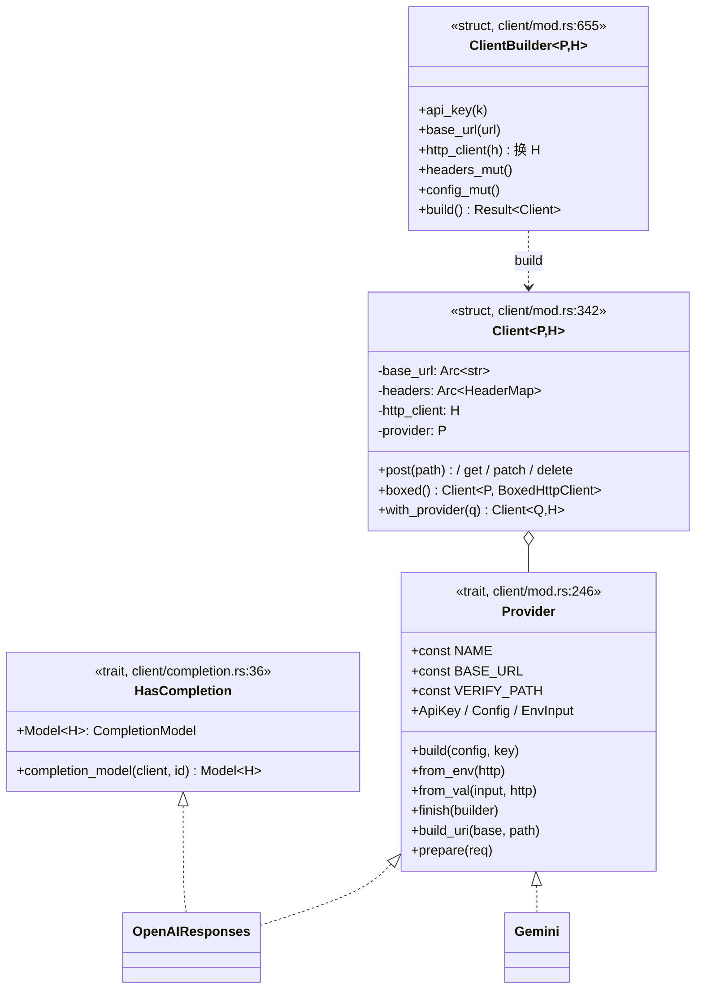
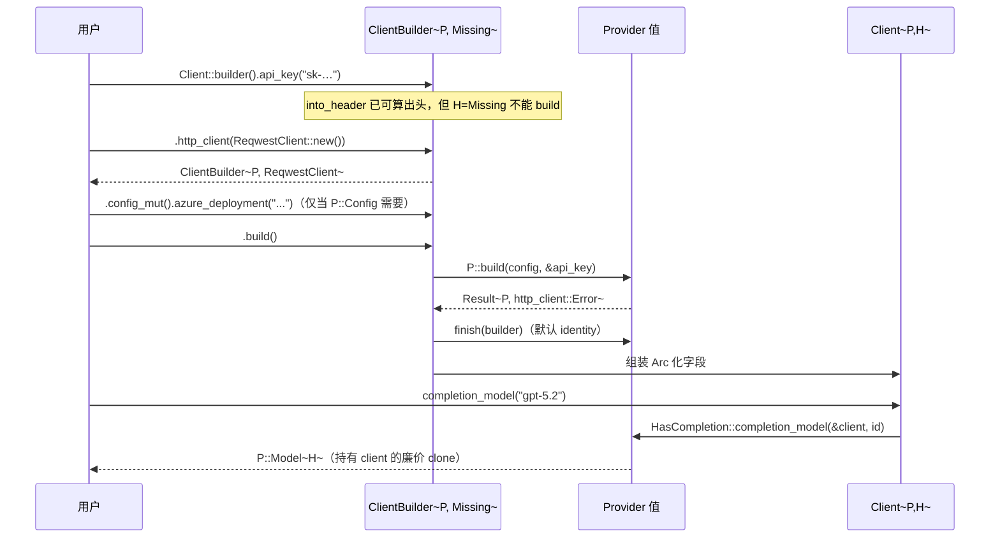

# 02-02 · 客户端与 Builder 系统：Provider 值、能力 trait、类型状态机

> 一个用户调用 `openai::Client::from_env()?.completion_model(GPT_5_2)` 时，背后有四层：`Provider`（怎么连）→ `HasCompletion`（有没有这能力、模型类型是谁）→ blanket `CompletionClient`（用户方法）→ `Client<P,H>`（实际持有 base URL/头/传输/provider 值）。本篇逐层拆。

## 1. 定位



## 2. Why

1. **能力用 trait 表示而不是枚举/运行期标志**：provider 没有 rerank，就没有 `rerank_model(..)` 方法——编译期报错，不需要文档维护"能力矩阵表"。
2. **`H` 泛型 + 默认 `BoxedHttpClient`**：库不选择 HTTP 栈（TLS、代理、插桩、WASM 全交给用户），但宿主持有多家客户端时又想要统一类型——`Client<P>`（默认擦除）与 `Client::boxed()`（`client/mod.rs` 附近）解决这个矛盾。表达式位置不默认，所以 `Client::new_with(key, h)` 的 `H` 从实参推断。
3. **类型状态机（`H = Missing` → 真传输）**：没给传输就调 `build()` 是编译错误（`Missing` 不满足 `HttpClientExt`），而不是运行期 panic。
4. **`type Config` 挂钩 builder**：Azure 需要 deployment/endpoint、query-string 厂商需要别的设置；配置通过 `ClientBuilder::config_mut()` 直达 provider 自己的 `*Config`，泛型层不认识这些字段。
5. **provider 别名约定**：每家厂商导出自己的 `Client`/`ClientBuilder` 别名，用户不用手写 `Client<OpenAIResponses, _>`。

## 3. What：四层真实形状

### 3.1 Provider trait — `client/mod.rs:246`

```rust
pub trait Provider: Clone + Debug + WasmCompatSend + WasmCompatSync + 'static {
    const NAME: &'static str;
    const BASE_URL: &'static str;
    const VERIFY_PATH: &'static str;

    type ApiKey: ApiKey;                 // BearerAuth / Nothing / 自定义（impl ApiKey）
    type Config: Default + Clone;        // 多为 ()
    type EnvInput;                       // from_val 的入参

    fn build(config: Self::Config, api_key: &Self::ApiKey) -> http_client::Result<Self>;
    fn from_env<H: HttpClientExt>(http: H) -> ProviderClientResult<Client<Self, H>>;
    fn from_val<H: HttpClientExt>(input: Self::EnvInput, http: H)
        -> ProviderClientResult<Client<Self, H>>;

    fn finish<H>(&self, builder: ClientBuilder<Self, H>)
        -> http_client::Result<ClientBuilder<Self, H>> { Ok(builder) }
    fn build_uri(&self, base_url: &str, path: &str) -> String { /* base + "/" + path */ }
    fn prepare(&self, req: http_client::Builder) -> http_client::Result<http_client::Builder> { Ok(req) }
}
```

三个鉴权挂载点：

| 机制 | API | 例子 |
|------|-----|------|
| 默认头 | `ApiKey::into_header() -> Option<Result<(HeaderName, HeaderValue)>>`；`BearerAuth` 产 `Authorization: Bearer …` | OpenAI、Anthropic、DeepSeek |
| query 串 | 覆写 `build_uri` 拼 `?key=…` | Gemini GenerateContent 面（`gemini/client.rs:103`） |
| 每请求自定义 | 覆写 `prepare` 插 header/换 `Accept` | Gemini Interactions 面 `x-goog-api-key`（`:137`）、OAuth 交换 |

`ApiKey::absent() -> Option<Self>` 决定 key 是否可缺：`Nothing` 返回 `Some(Nothing)`（本地服务），默认 `None` 使漏配 key 在 `build()` 报 `ProviderClientError::MissingApiKey(NAME)`。

### 3.2 能力 trait + blanket 客户端方法 — 以 completion 为例

`client/completion.rs`：

```rust
pub trait HasCompletion: Provider {
    type Model<H>: CompletionModel where H: ModelTransport;
    fn completion_model<H: ModelTransport>(client: &Client<Self, H>, model: String) -> Self::Model<H>;
}

// 用户面 trait；impl 是 blanket 的：
pub trait CompletionClient {
    type CompletionModel: CompletionModel;
    fn completion_model(&self, model: &str) -> Self::CompletionModel;
}
impl<P: HasCompletion, H> CompletionClient for Client<P, H> { /* 调 P::completion_model */ }
```

其余同构：`HasEmbeddings/EmbeddingsClient`、`HasRerank/RerankingClient`、`HasTranscription/TranscriptionClient`、`HasModelListing/ModelListingClient`，feature 门控的 `HasImageGeneration/ImageGenerationClient`（`image`）、`HasAudioGeneration/AudioGenerationClient`（`audio`）。`ModelTransport` 是唯一传输 bound 集：`HttpClientExt + Clone + WasmCompatSend + WasmCompatSync + 'static`（自动 impl，`client/mod.rs`）。

### 3.3 Client 与 ClientBuilder

- `Client<P, H = BoxedHttpClient>`（`client/mod.rs:342`）：字段全 `Arc` 共享（`base_url: Arc<str>`、`headers: Arc<HeaderMap>`），clone 廉价；`Debug` 对 `Authorization`/含 `api-key` 的头脱敏。
- 构造：
  - `Client::<P, Missing>::builder()`（`:589`）→ `ClientBuilder<P, Missing>`；
  - `Client::new_with(key, http)`（约 `:380`）：一步给 key 与传输；
  - `Client::from_env_api_key("X_API_KEY", Some("X_BASE_URL"), http)`：一个 key 变量 + 可选 base URL 变量的通用形状；
  - rig-reqwest 在 `DefaultTransportClient`/`DefaultTransportBuilder` 上补 `new(key)`/`from_env()`（免命名传输）。
- Builder 方法（`:678` 起）：`api_key(impl Into<P::ApiKey>)`、`base_url(impl AsRef<str>)`、`http_client(h)` **把 `H` 从 `Missing` 换成 `h` 的类型**（`:705`）、`headers_mut()`、`config()/config_mut()`（直达 `P::Config`）。
- `build()`（`:759`）：key 缺失检查 → `P::build(config, &key)` → `P::finish(builder)` → 组装 `Client`。
- 后构造工具：`client.post/get/patch/delete(path)`（走 `build_uri` + 默认头 + `prepare`）、`boxed()` 擦传输、`with_provider(q)` 复用同连接与头换厂商、`http_client()` 给 OAuth 这类要打绝对 URL 的流程。

### 3.4 构造错误 — `ProviderClientError`（`client/mod.rs:131`）

`EnvironmentVariable { name, source: VarError }` / `Http(http_client::Error)` / `InvalidConfiguration(&'static str)` / `MissingApiKey(&'static str /* Provider::NAME */)`。这是**配置期**错误，区别于请求期的 `CompletionError`。

### 3.5 provider 模块别名约定（以 OpenAI 为例）

`providers/openai/client.rs:46`：

```rust
pub type Client<H = BoxedHttpClient> = client::Client<OpenAIResponses, H>;
pub type ClientBuilder<H = Missing>      = client::ClientBuilder<OpenAIResponses, H>;
pub type CompletionsClient<H = …>        = client::Client<OpenAICompletions, H>;
pub type CompletionsClientBuilder<H = …> = client::ClientBuilder<OpenAICompletions, H>;
```

一个厂商两个 API 面时（OpenAI Responses/Chat Completions、Gemini GenerateContent/Interactions），就两个 provider 值类型 + 两套别名 + 一个转换方法（`completions_api()`/`responses_api()`，`openai/client.rs:300/316`）。

## 4. How：一次构造的完整走读



薄包装厂商（DeepSeek）的全部"客户端代码"就是：unit struct `struct DeepSeek;` + `Provider` impl（NAME/BASE_URL/BearerAuth/`from_env_api_key`）+ `HasCompletion { type Model<H> = openai::completion::GenericCompletionModel<DeepSeek, H> }` + 一个 `OpenAICompatibleProvider` profile impl（只覆写请求体收尾）——见 `providers/deepseek.rs:36/39/63/85/165`。这是"加一家 OpenAI 兼容厂商"的模板。

## 5. 边界与坑

- `Client::new` / `from_env`（单参数便利构造）**只在 rig-reqwest 的 prelude re-export 里存在**；rig-core 只有 `new_with`。
- 覆写 `build_uri` 时注意默认实现处理尾部斜杠与空 base URL（Azure 留空让用户填完整 endpoint）。
- 自定义 `ApiKey` 必须给 redacting `Debug`（凭证不能出现在 Client 的 Debug 输出里）。
- `P::Config` 加字段是非破坏性扩展（`Default + Clone`），但读取它只能通过 `config_mut()`，别在泛型 Client 上加 provider 专用方法。
- `boxed()` 两次是廉价 no-op clone；反过来不能 unbox。

## 6. 自检问题

1. 不开 reqwest feature，编译 `Client::new("k")` 报什么？正确构造方式是？
2. 给一个只有 query-string 鉴权的新厂商，`ApiKey`/`build_uri`/`prepare` 三处怎么分工？
3. 为什么 `completion_model` 定义在 `HasCompletion`（关联类型在 P 上）而用户调用来自 `CompletionClient`（blanket impl 在 Client 上）？
4. `Client::<P, Missing>::builder().build()` 为什么过不了编译？
5. 想让一个宿主进程用同一 reqwest 客户端连 5 家厂商，类型怎么写才不用 5 个泛型参数？
