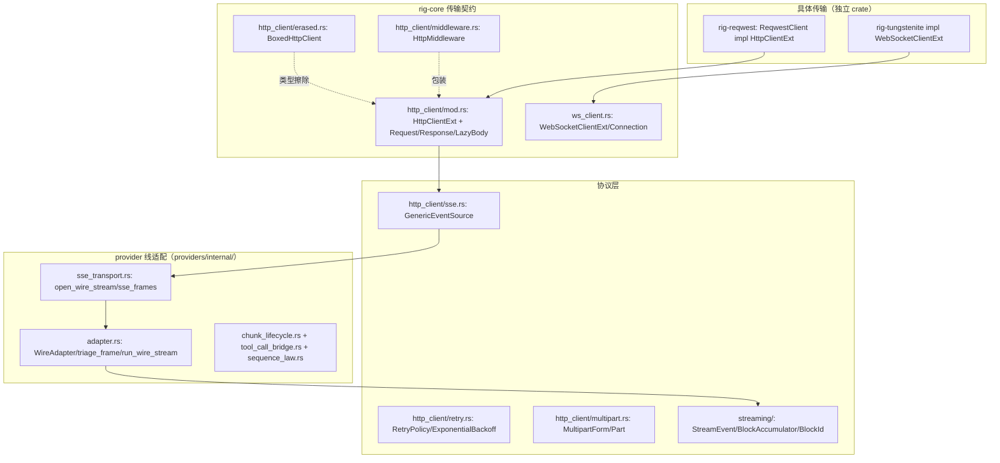
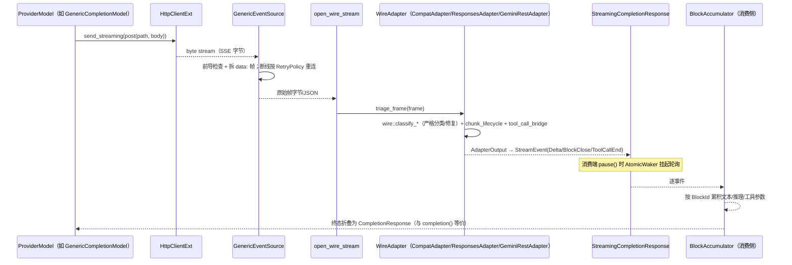

# 02-03 · 流式与 HTTP 基础设施：sans-IO 的另一半

> Rig 的 IO 栈分三层：**传输契约**（`http_client::HttpClientExt` / `ws_client::WebSocketClientExt`，不含实现）→ **协议解析**（`http_client::sse`、multipart、`streaming` 事件词汇）→ **provider 线适配**（`providers/internal/adapter.rs` 的 sans-IO 帧状态机）。具体 reqwest/tungstenite 实现在独立 crate。本篇按这个顺序拆。

## 1. 定位



## 2. Why

1. **传输与协议分离**：Rig 要支持 reqwest、浏览器 fetch（WASM）、gRPC（rig-gemini-grpc）、用户自研客户端。`HttpClientExt` 只有三个动词（普通/multipart/流式发送），SSE 解析建立在它们之上，所以换传输不重写协议。
2. **sans-IO 帧状态机**：provider 的 SSE 千奇百怪（OpenAI 的 `data:` 块、Gemini 的部分 part、Responses API 的 item 流）。`WireAdapter` 只做"字节帧 → `AdapterOutput`"的纯函数变换，不 await、不持有 socket——同一状态机被 HTTP SSE、gRPC 流、WebSocket 复用，也让序列法则检查（`sequence_law.rs`，debug 断言流事件合法序）能单测。
3. **可暂停的公共流**：上层（agent stream）需要背压（hook 异步处理 delta 时别把 provider 缓冲撑爆），`StreamingCompletionResponse` 带 `PauseControl`（`AtomicBool + AtomicWaker`），单消费者。
4. **delta 必须先能折叠成非流式响应**：`BlockAccumulator` 保证 stream 收束后等价于一次 `completion()`，这是 run/stream 共用 `drive_agent`、流式 hook 与非流式语义一致的前提。
5. **重连策略是数据**：SSE 断线重连用 `RetryPolicy`，服务端可通过事件携带的 reconnection time 改写起点（`set_reconnection_time`）。

## 3. What：类型清单

### 3.1 HttpClientExt — `http_client/mod.rs:176`

```rust
pub trait HttpClientExt: WasmCompatSend + WasmCompatSync {
    fn send<T, U>(&self, req: Request<T>)
        -> impl Future<Output = Result<Response<LazyBody<U>>>> + WasmCompatSend + 'static
    where T: Into<Bytes> + WasmCompatSend, U: From<Bytes> + WasmCompatSend + 'static;

    fn send_multipart<U>(&self, req: Request<MultipartForm>)
        -> impl Future<Output = Result<Response<LazyBody<U>>>> + WasmCompatSend + 'static
    where U: From<Bytes> + WasmCompatSend + 'static;

    fn send_streaming<T>(&self, req: Request<T>)
        -> impl Future<Output = Result<StreamingResponse>> + WasmCompatSend
    where T: Into<Bytes> + WasmCompatSend;
}
```

- 请求/响应类型直接重导出 `http` crate 的 `Request/Response/Builder/StatusCode/HeaderMap`（`http_client/mod.rs:4`），body 泛型化；`LazyBody<U>` 延迟读取。
- `Error`（`:18`）：`Protocol / InvalidHeaderValue / NoHeaders / InvalidContentType / StreamEnded / Instance(…) / InvalidStatusCodeWithDetails{status,…}`；`Result<T>` 在 `:122`。
- `BoxedHttpClient`（`erased.rs:99`）：`dyn` 擦除传输，impl `HttpClientExt`（`:197`），是所有 `Client<P, H>` 的类型位置默认值。
- `HttpMiddleware`（`middleware.rs:58`）：包装一个客户端做日志/鉴权刷新/指标（见 `examples/http_middleware`、`examples/reqwest_middleware`）。

### 3.2 SSE 与重连

- `GenericEventSource<HttpClient, RequestBody, Retry = ExponentialBackoff>`（`http_client/sse.rs:85`）：给定客户端与请求，`Stream` impl 在 `:230` 产出 SSE 事件；`new(client, req)`（`:104`）。它负责前导（非 200 的错误体读取）、`data:` 拼装、断线按策略重连。
- `RetryPolicy`（`http_client/retry.rs:6`）：`retry(&Error, last: Option<(usize, Duration)>) -> Option<Duration>` + `set_reconnection_time(Duration)`；`ExponentialBackoff { start, factor, max_duration, max_retries }`；默认 `DEFAULT_RETRY` = 300ms 起、2 倍、封顶 5s、不限次数（`:71`）。
- provider 侧的 SSE 前导循环在 `providers/internal/sse_transport.rs`：`SseTransportOptions:73`、`sse_frames:88`、`open_wire_stream:198`。

### 3.3 multipart — `http_client/multipart.rs`

`Part::text(name, value)` / `Part::bytes(name, data).filename(..).content_type(mime)`（`:25/35/45/51`），`MultipartForm::new()`（`:92`）。转录走这条（`internal::transcription::transcription_form`），由传输的 `send_multipart` 编码，rig-core 自身不依赖 multipart 第三方库。

### 3.4 streaming 事件词汇 — `crates/rig-core/src/streaming/`

| 文件 | 内容 |
|------|------|
| `mod.rs`（678 行） | `StreamingCompletionResponse`（公共流）、`PauseControl`（`:~35`，`pause()/resume()` + `AtomicWaker`，注释明示单消费者约束） |
| `event.rs`（305） | `StreamEvent`、`Delta`（text/reasoning/tool-args）、`BlockKind`、`BlockClose`、`ToolCallEnd` |
| `block_id.rs`（270） | `BlockId`、`MintKind`、`SyntheticIds`、`non_empty_id()`：增量片段的稳定关联身份；服务端缺 id 时合成 |
| `accumulator.rs`（867） | `BlockAccumulator`：把 delta 流折叠为 `CompletionResponse`（含 usage、工具调用参数拼 JSON） |
| `tests.rs`（1609） | 流契约一致性测试 |

### 3.5 WebSocket — `ws_client.rs`

`trait WebSocketClientExt`（`:106`，连接）+ `trait WebSocketConnection`（`:127`，收发帧）；`ConnectOptions::new().with_timeout(..)`（`:87/93`）、`CloseFrame:62`、URL 助手 `websocket_url(base, path):169`、`InvalidWebSocketUrl:159`。唯一内置实现是 rig-tungstenite（native only）；OpenAI Responses 的会话类型为 `responses_api/websocket.rs` 的 `ResponsesWebSocketSession`（facade 上 `client.responses_websocket("gpt-5.4")` 需要 `websocket` feature）。

### 3.6 provider 线适配三件套（`providers/internal/`）

- `adapter.rs`：`WireFrame:42`（一帧解码后的输入）→ `AdapterOutput:70`（事件或终态）；`trait WireAdapter:523`（纯状态机：喂帧、吐输出）；`triage_frame:608` 帧分诊；`run_wire_stream:666` 驱动整个流。
- `wire.rs`：**解码后**的严格分类（`WireEvent:14`、`classify_tagged_frame:61`、`classify_chat_completions_frame:111`、`classify_with_repair:249`），明确禁止 serde untagged 静默兜底——未知帧要可诊断（对应 `streaming/unknown_payload_tests.rs`）。
- `chunk_lifecycle.rs`：无边界 reasoning 线的生命周期推导（`ChunkParts:46`、`MintedReasoningLifecycle:78`、`emit_chunk:118`）；`tool_call_bridge.rs`：上游 index → 稳定身份的槽位桥（`ToolCallSlot:31`、`ToolCallBridge<I>:117`）；`tool_call_ids.rs`：上行工具调用 id 规划（`ToolCallIds:44`）；`sequence_law.rs`：debug 下流事件序列法则（`SequenceLaws:78`、`check_batch:86`）。
- `envelope.rs`：HTTP 200 体内的 Ok/Err 信封（`ProviderEnvelope:67`、`DirectPayload<T>:79`）——部分厂商把错误放进成功响应里。

## 4. How：一个流式补全的字节旅程



"从零实现一个新传输"：impl `HttpClientExt` 三个方法（把 `http::Request<T: Into<Bytes>>` 发出去，响应包成 `http::Response<LazyBody<U>>`，流式返回字节 `Stream`）即可——SSE、multipart、全部 provider 自动可用。rig-reqwest 与 WASM fetch 传输就是仅有的两份范本。

## 5. 边界与坑

- `PauseControl` 只支持单消费者（`poll_next` 取 `Pin<&mut Self>` + 单 waker）；多任务广播同一个流要自己分叉。
- `send()` 的 body 类型 `U: From<Bytes>`：通常直接用 `Bytes`，别在传输边界引入 provider 专用 body 类型。
- 新 provider 的 SSE **不要**手写 `while let line = …`：走 `open_wire_stream` + impl `WireAdapter`，否则丢掉重连、序列检查与 unknown-frame 诊断。
- 不要用 serde `#[serde(untagged)]` 吞掉未知 provider 负载——wire 层刻意分类后修复（`classify_with_repair`），未知负载有专门测试（`unknown_payload_tests.rs`）。
- WASM 上无 `WebSocketClientExt` 内置实现、无 tungstenite；multipart 能力取决于所选传输。
- `RetryPolicy` 管的是**传输层断线重连**；模型调用的 429/5xx 重试是 run 层基于 `ErrorReport::retryable` 的另一套（见 07 篇），不要混用。

## 6. 自检问题

1. 为什么 SSE 解析不写在 rig-reqwest 里，而在 rig-core 的协议层？
2. 一个 delta 流凭什么保证折叠结果与非流式 `completion()` 等价？哪些组件参与？
3. provider 返回的工具调用只有 index 没有 id，哪一层、用什么结构补齐身份？
4. `PauseControl` 为什么不能安全地服务两个消费任务？
5. 200 OK 但体内是 `{"error":…}` 的响应在哪一层被识别为失败？
