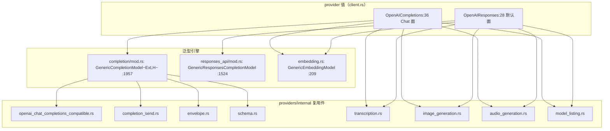
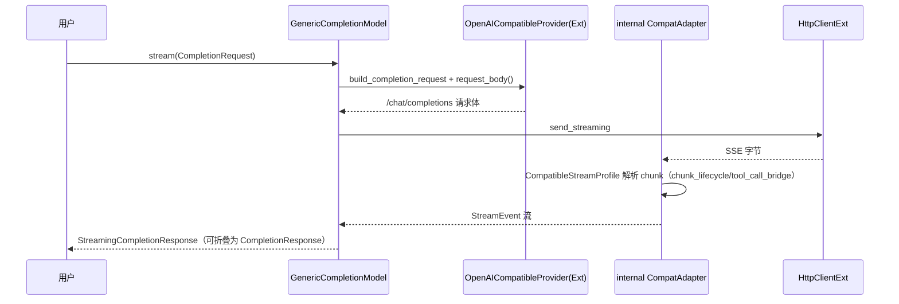

# 03-01 · OpenAI Provider 深度解剖：两条 API 面与一个泛型引擎

> OpenAI 是最完整的 provider：两种补全 API（**Chat Completions** 与 **Responses**）、嵌入、转录、图像、音频、模型列表、WebSocket。本篇拆解它如何用"两个 provider 值类型 + 一个泛型兼容引擎 + internal 复用件"覆盖全部能力。
> 基目录：`crates/rig-core/src/providers/openai/`，行号对应当前 HEAD。

## 1. 定位



## 2. Why：为什么是两个 provider 值而不是一个

OpenAI 同时维护两代补全 API：Chat Completions（`/chat/completions`，行业事实标准，也是十几家兼容厂商复用的协议）与 Responses（`/responses`，新的有状态/内置工具协议，支持 WebSocket）。请求体、事件流、工具形态都不同，无法用一个类型的 flag 表达。Rig 的解法：

- 两个 `Provider` 值：`OpenAIResponses`（client.rs:28，默认）与 `OpenAICompletions`（:36）；
- 两套客户端别名（client.rs:46-53）：`Client/ClientBuilder`（Responses 面）、`CompletionsClient/CompletionsClientBuilder`（Chat 面）；
- 面之间转换：`client.completions_api()`（:300）/ `.responses_api()`（:316），共享 key/base URL/传输。

## 3. What：模块树与类型

`mod.rs:14-37,76-85`：

```
openai/
├── mod.rs                    # pub use 汇总；feature 门控 audio(23)/image(27)
├── client.rs                 # 两个 Provider 值 + 四个 Client 别名 + ApiErrorResponse
├── completion/
│   ├── mod.rs                # Chat 面：DTO、GenericCompletionModel、转换（约 2600 行）
│   └── streaming.rs          # Chat SSE：StreamingCompletionChunk/Delta/FinishReason
├── responses_api/
│   ├── mod.rs                # Responses 面：DTO、GenericResponsesCompletionModel（约 2700 行）
│   ├── streaming.rs          # Responses 事件流分类与 ResponsesAdapter
│   └── websocket.rs          # feature=websocket：ResponsesWebSocketSession
├── embedding.rs              # GenericEmbeddingModel、EmbeddingModel 别名
├── transcription.rs          # internal OpenAi* 的别名接线
├── image_generation.rs       # feature=image，常量 DALL_E_*/GPT_IMAGE_*
├── audio_generation.rs       # feature=audio，常量 TTS_1/TTS_1_HD
├── model_listing.rs          # OpenAIModelLister / OpenAICompletionsModelLister
├── observation.rs            # 私有：provider 观测投影（Envelope:49）
└── 各模块 tests.rs
```

模型常量：Chat 模型在 `completion/mod.rs:41-135`（`GPT_5_6:41`、`GPT_5_5:53`、`GPT_5_2:56`、`GPT_5_1:59`、`GPT_5:62`、`O3:108`、`GPT_4O:75`）；嵌入常量 `embedding.rs:14-18`；`WHISPER_1`（transcription.rs:13）；`DALL_E_2/3`、`GPT_IMAGE_1/1_5/2`（image_generation.rs:16-20）；`TTS_1/TTS_1_HD`（audio_generation.rs:6-7）。

## 4. How

### 4.1 Provider 构造（client.rs）

```rust
impl Provider for OpenAIResponses {            // :55
    const NAME: &'static str = "openai";       // :56
    const BASE_URL = "https://api.openai.com/v1";   // :57（常量 :22）
    const VERIFY_PATH = "/models";             // :58
    type ApiKey = BearerAuth;                  // :59（别名 :43）
    type Config = ();                          // :60
    type EnvInput = String;                    // :61
    fn build(..) -> Result<Self> { .. }        // :63
    fn from_env<H>(http: H) -> .. { Client::from_env_api_key("OPENAI_API_KEY", Some("OPENAI_BASE_URL"), http) }  // :67
    fn from_val<H>(key: String, http: H) -> .. { Client::new_with(key, http) }  // :71
}
impl Provider for OpenAICompletions { /* :162 起，同构 */ }
```

2xx 内错误信封：`ApiErrorResponse`（client.rs:330，错误文案经 `internal::envelope::error_message`，:343）与 `enum ApiResponse<T>`（:350）。

### 4.2 Chat Completions 面

- 泛型引擎：`GenericCompletionModel<Ext, H>`（completion/mod.rs:1957），`Ext: OpenAICompatibleProvider`（trait 在 :1645）提供 profile 钩子（base URL、请求体收尾、响应归一化差异）。`impl CompletionModel` 在 :2546（`completion` :2574、`stream` :2581）。OpenAI 自己的接线 `impl … for OpenAICompletions`（:1873），用户拿到的别名 `CompletionModel`（:1969）。
- 请求转换：`TryFrom<OpenAIRequestParams> for CompletionRequest`（:2165，参数体 :2150）、`TryFrom<(String, CoreCompletionRequest)>`（:2387）；profile 钩子 `build_completion_request`（:1782）；序列化 `request_body()`（:1933）；消息 `TryFrom<Message> for Vec<Message>`（:1017）。
- 一元发送与归一化：`raw_completion_observed`（:2474）→ internal `send_completion`；`NormalizeCompletionResponse::normalize`（:1337-1338），薄包装厂商（DeepSeek 等）也复用它。
- 流式（completion/streaming.rs）：入口 `stream_observed:312` → 构造 `StreamingCompletionResponse`（:411）；chunk 类型 `StreamingCompletionChunk:185`、`StreamingDelta:72`、`FinishReason:97`、终帧 `StreamingCompletionResponse:206`；适配 internal 的 `OpenAICompatibleProfile`（`impl CompatibleStreamProfile` :425）与 `send_compatible_streaming_request`（:562）。

### 4.3 Responses 面

- 引擎 `GenericResponsesCompletionModel`（responses_api/mod.rs:1524），别名 `ResponsesCompletionModel`（:1541），`impl CompletionModel` :2646（`completion` :2666、`stream` :2673）。
- 请求：`TryFrom<(String, CompletionRequest)>`（:1335）、`ResponsesRequestParams`（:1350/1356）、`create_provider_request`（:1624）、`raw_completion_observed`（:2565）、归一化（:2708）。
- 流式（responses_api/streaming.rs）：入口 `stream_observed:1474`；事件枚举 `StreamingCompletionChunk { Response, Delta }`（:36）、`ResponseChunk:175`、`ItemChunk:1250`；帧分类 `classify_responses_frame:258`、`sse_data_frames:295`；sans-IO 适配 `ResponsesAdapter`（`impl WireAdapter` :1141）；驱动 `responses_stream_from_event_source_with_options:1057`（基于 `http_client::sse::GenericEventSource`），产出在 :1532。
- WebSocket（responses_api/websocket.rs）：`ResponsesWebSocketSessionBuilder:215`、`ResponsesWebSocketSession:295`；经 `WebSocketClientExt`（rig-tungstenite），facade 上 `client.responses_websocket("gpt-5.4")`。

### 4.4 其余能力（全部复用 internal）

| 能力 | 接线 | internal 件 |
|------|------|-------------|
| 嵌入 | `embedding.rs` 别名 :222，impl `EmbeddingModel` :365；错误带 request-id/headers（:346-360） | `OpenAIEmbeddingsCompatible:104` + `GenericEmbeddingModel:209` |
| 转录 | 别名 :129/:133，impl :136/:152，路径 `/audio/transcriptions`（:148） | `transcription::{OpenAiTranscriptionModel, OpenAiTranscriptionClient}` |
| 图像（`image`） | :51/:55，provider impl :101/:115，`/images/generations` | `image_generation::{GenericImageGenerationModel, JsonImageGenerationProvider}` |
| 音频（`audio`） | :10/:14，impl :17/:23，`/audio/speech` | `audio_generation::{GenericAudioGenerationModel, RawAudioGenerationProvider}` |
| 模型列表 | model_listing.rs:6/:16 | `internal::model_listing::impl_model_lister!`，`GET /models` |
| Rerank | **无** | internal/rerank.rs 供 Cohere/Jina 形厂商，OpenAI 不接 |

### 4.5 错误与观测保留

- `telemetry::ProviderResponseExt`（`telemetry/mod.rs:923`，方法 `response_id:928 / text_response:934 / usage:937`）的 impl 在 completion/mod.rs:1404、responses_api/mod.rs:2489——观测器能看到每次调用的请求、响应、厂商裁决、usage、结束方式（conformance harness 强制）。
- 跨线错误进 `ErrorReport` 时 status/body/headers/request-id 全保留（见 07 篇）。

## 5. 调用关系图（一次 Chat 流式补全）



## 6. 测试布局

- **内联单测**：`openai/tests.rs`、`client/tests.rs`、`completion/tests.rs`（约 2275）、`completion/streaming/tests.rs`（1162）、`completion/image_tool_result_gate_tests.rs`、`responses_api/tests.rs`（2824）、`responses_api/streaming/tests.rs`（2644）、`responses_api/websocket/tests.rs`（538）及各能力 tests.rs。
- **cassette 回归**：`tests/providers/openai/`——`mod.rs`（约 90 个 cassette 模块 + 7 个 live 模块）、`support.rs`（`with_openai_cassette:17`）、`regressions.rs`、`cassette/`（按主题：streaming、error_envelope、embedding_matrix、ecs_*、corpus_*）、`live/`（真实 API：gpt_5_5、websocket、transcription）；fixture 在 `tests/cassettes/openai/`（72 个子目录，每用例一目录 YAML）。
- 另有 `crates/rig-core/tests/openai_responses_websocket.rs`。
- 回放不需要 key：`cargo test -p rig --all-features --test openai openai::cassette -- --test-threads=1`；录制需 `RIG_PROVIDER_TEST_MODE=record` 与 `OPENAI_API_KEY`，且必须审查 diff 无密钥/账号标识。

## 7. 边界与坑

- 默认 `Client` 是 **Responses 面**；需要 Chat 协议（或兼容厂商）用 `CompletionsClient` 或薄包装 crate。
- Responses 与 Chat 的工具调用、reasoning、usage 形状不同，转换代码不可互换。
- WebSocket 面需要 `websocket` feature + native 目标。
- OpenAI 没有 rerank；不要给它接 `RerankModel`。

## 8. 自检问题

1. 默认 `openai::Client` 走哪条 API？如何切到另一条？两者共享什么？
2. DeepSeek 这类厂商复用的是 OpenAI 的哪个泛型类型？它需要自己写 HTTP/SSE 代码吗？
3. Responses 流的 sans-IO 适配器叫什么、在哪？它产出什么事件？
4. 为什么转录/图像/音频在 openai 模块里几乎只有别名？
5. 新增一个 cassette 回归用例，测试代码与录制文件分别落在哪个目录？
