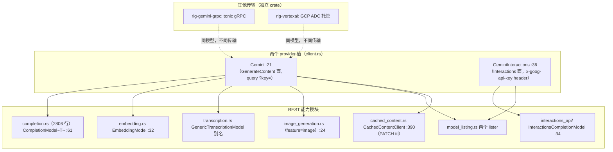
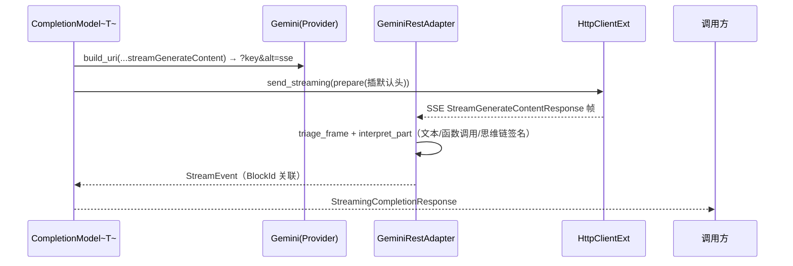

# 03-02 · Gemini Provider 深度解剖：两种鉴权、两代 API、三条传输

> Gemini 展示了与 OpenAI 完全不同的 API 形态：query 参数/header 双鉴权、GenerateContent 与 Interactions 两代协议、图像/转录复用同一个 `:generateContent` 端点、PATCH 管理缓存内容，以及 gRPC/Vertex 两个树外传输面。
> 基目录：`crates/rig-core/src/providers/gemini/`，行号对应当前 HEAD。

## 1. 定位



## 2. Why：Gemini 特有的设计压力

1. **两种鉴权**：公钥 API 习惯 query 串 `?key=`（且流式要加 `alt=sse`）；Interactions/企业面用 `x-goog-api-key` 头。`Provider` 的 `build_uri` 与 `prepare` 两个钩子正好分别承载（见 02-02 篇）。
2. **一个端点多种任务**：图像生成、音视频转录都走 `generateContent`，只是请求 part 的模态不同——所以转录是 `internal::transcription::GenericTranscriptionModel` 的配置化别名（transcription.rs:24），图像模块复用同一端点（image_generation.rs:128）。
3. **缓存内容有生命周期且按用量计费**，必须能 `PATCH cachedContents/{id}?updateMask=ttl`——这是 `Client::patch` 存在的理由（client/mod.rs 的通用方法注释直接以 Gemini 为例）。
4. **gRPC 与 Vertex 是同模型不同传输**：internal 的 `WireAdapter` 等刻意 `pub`（internal/mod.rs:4-9），让树外 crate 用事件作为一致性接缝接入，而不是复制协议逻辑。

## 3. What：文件与模块树（`mod.rs:15-26`）

```
gemini/
├── mod.rs(86)               # 模块树；interactions_api 在 :22，observation 私有 :24
├── client.rs(299)           # Gemini :21 / GeminiInteractions :36 / GeminiApiKey :50
├── completion.rs(2806)      # GenerateContent 面补全（常量 :6-28，模型 impl :61/:254）
├── streaming.rs(509)        # REST SSE：GeminiRestAdapter :145，stream_observed :448
├── interactions_api/
│   ├── mod.rs               # InteractionsCompletionModel :34（impl :190）
│   └── streaming.rs(597)    # InteractionEventStream，断点续传 by_id
├── embedding.rs(240)        # EmbeddingModel :32（impl 方法 :154），常量 EMBEDDING_001/004
├── transcription.rs(183)    # GenericTranscriptionModel 别名（generateContent, :96）
├── image_generation.rs(228) # ImageGenerationModel :24（feature=image）
├── model_listing.rs(190)    # GeminiModelLister :141 / GeminiInteractionsModelLister :169
├── cached_content.rs(739)   # CachedContentClient（PATCH ttl）
├── observation.rs(126)      # 私有观测投影
└── 各能力模块 tests.rs
```

模型常量：chat 在 `completion.rs:6-28`（`GEMINI_3_1_FLASH_LITE_PREVIEW` … `GEMINI_2_0_FLASH`，图像模型 `GEMINI_2_5_FLASH_IMAGE:24`）；嵌入 `embedding.rs:16/18`；图像常量再导出于 `image_generation.rs:20`。

## 4. How

### 4.1 两个 Provider impl（client.rs）

```rust
struct Gemini { api_key: String }                 // :21
impl Provider for Gemini {                        // :87
    const NAME = "gcp.gemini";                    // :88
    const BASE_URL = "https://generativelanguage.googleapis.com";  // 常量 :16，:89
    const VERIFY_PATH = "/v1beta/models";         // :90
    type ApiKey = GeminiApiKey;                   // GeminiApiKey(String) :50，impl ApiKey :75
    fn build_uri(&self, base, path) -> String {   // :103-108
        // 拼 ?key=…；流式路径在请求侧另加 &alt=sse
    }
}
struct GeminiInteractions;                        // :36
impl Provider for GeminiInteractions { /* :119 */ }
fn prepare(&self, req) { /* :137-139 插 x-goog-api-key 头 */ }
```

别名：`Client`（:68）、`InteractionsClient`（:72）；互转 `interactions_api()`（:256）。能力绑定 impl 集中在 client.rs:153-239。

### 4.2 GenerateContent 面转换链（completion.rs）

- 端点：`completion_endpoint:579`（`:generateContent`），请求体 `create_request_body:294`，总入口转换 :226。
- 响应：`impl TryFrom<GenerateContentResponse> for CompletionResponse`（:882）；part 映射 `map_response_part:741`；思维链以"尾部签名"挂接 `attach_trailing_signature:845`。
- 模型类型 `CompletionModel<T>`（:61，trait impl :254，方法 :258/:265/:272）。

### 4.3 流式（streaming.rs）

- 入口 `CompletionModel::stream_observed`（:448），发 `...:streamGenerateContent?alt=sse`（:479），:491 构造公共流；:493 经 internal `open_wire_stream` 与 `GenericEventSource`。
- sans-IO 核心：`struct GeminiRestAdapter:145`（`impl WireAdapter:195`），part 解释 `interpret_part:360`；SSE 帧型 `StreamGenerateContentResponse:80`。

### 4.4 Interactions 面（interactions_api/）

- POST `/v1beta/interactions`（mod.rs:163），`create_request_body:304`；`impl TryFrom<Interaction>:470`、`assistant_content_from_output:515`。
- 流式：`stream_observed`（streaming.rs:99）打 `/v1beta/interactions?alt=sse`（:126），`stream_interaction_events:433`，事件流类型 `InteractionEventStream`（streaming.rs:70），支持按 id 断点续传（mod.rs:104 `by_id`）。

### 4.5 嵌入/转录/图像/列表/缓存

- 嵌入：`EmbeddingModel`（embedding.rs:32），实现者方法 `embed_texts_response:154`。
- 转录：`transcription.rs:24` 别名到 `GenericTranscriptionModel`，内部打 generateContent（:96）。
- 图像：`ImageGenerationModel`（image_generation.rs:24/128）。
- 模型列表：两个 lister 按面分页（model_listing.rs:141/169）。
- 缓存：`CachedContentClient`（cached_content.rs:390）用 `PATCH` 只改 ttl（`updateMask=ttl`）。
- **无 rerank、无 audio generation。**

### 4.6 树外传输面

- **rig-gemini-grpc**（`crates/rig-gemini-grpc/`）：tonic gRPC，`lib.rs:24` `include_proto!` 生成 `generativelanguage.v1beta`；含 client/completion/embedding/streaming，以**事件**为一致性接缝，复用 internal 的 `chunk_lifecycle`/`tool_call_bridge`。
- **rig-vertexai**（`crates/rig-vertexai/`）：走 GCP Application Default Credentials 托管 Vertex AI 端点，含 client/completion/types。
- 两者都能实现树外 `WireAdapter`：internal 层 `pub` 与 `resolve_empty_tool_result_names`（internal/mod.rs:52）就是为此开放的接缝。

## 5. 调用关系图（REST 流式）



## 6. 边界与坑

- 公钥面与 Interactions 面鉴权不同、base path 不同，选错面会得到 401/404。
- 流式 URL 必须带 `alt=sse`，否则拿到的是非流式 JSON 数组。
- 图像/转录不是独立端点，参数形状按 generateContent part 构造。
- Vertex/gRPC 面不在 rig-core；用对应伴侣 crate，别在 REST provider 上找它们的类型。
- 缓存内容不删除会持续计费；`CachedContentClient` 是一等操作不是便利方法。

## 7. 自检问题

1. Gemini 两个 provider 值的鉴权分别落在 `Provider` 的哪个钩子？
2. 流式请求 URL 与非流式差在哪？漏掉会怎样？
3. 为什么 Gemini 的转录没有独立协议实现？
4. rig-gemini-grpc 如何避免重写 chunk/工具桥逻辑？它依赖 internal 层的什么性质？
5. 修改缓存 TTL 用哪个 HTTP 方法、什么 updateMask？
