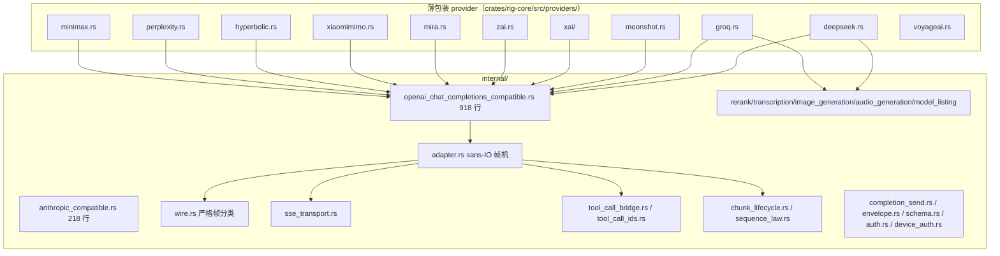
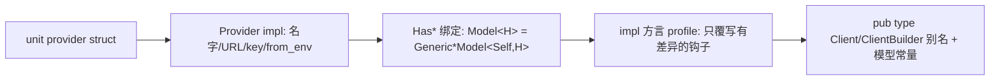

# 03-03 · internal 适配层与兼容 Provider：20 家厂商如何共享一套引擎

> `crates/rig-core/src/providers/internal/`（36 个文件）是 Rig 最大的杠杆：OpenAI/Anthropic 两大方言的请求收尾、SSE 状态机、工具调用身份、推理块生命周期、模型分页与各能力的通用模型，全部只写一次。DeepSeek/Groq/Moonshot/xAI 等厂商因此只剩几百行"声明 + profile 钩子"。
> 行号对应当前 HEAD。

## 1. 定位



## 2. Why：internal 层解决的五类重复

1. **协议方言重复**：十几家厂商说"OpenAI Chat Completions + SSE"，差异只在 base URL、少数字段与 finish reason 映射 → `openai_chat_completions_compatible.rs` 提供完整引擎，差异外提成 profile trait。
2. **双语厂商**：有的端点同时讲 OpenAI 与 Anthropic 两种方言 → `anthropic_compatible.rs` 的 `impl_dual_dialect_provider!`（:85）一次生成两套脚手架。
3. **流身份/生命周期**：工具调用 index→id、无边界 reasoning 块、帧序合法性，与厂商无关 → `tool_call_*`、`chunk_lifecycle`、`sequence_law`。
4. **能力通用模型**：OpenAI 形 multipart 转录、Jina 形 rerank、JSON 图像生成、原始音频——写一次 generic，厂商只声明端点。
5. **鉴权与信封**：OAuth 设备码（ChatGPT/Copilot）、2xx 内错误信封、strict schema 清洗全部共用。

## 3. What：模块逐个说明

### 3.1 流适配核心

| 文件:行 | 关键类型 | 职责 |
|---|---|---|
| `adapter.rs` | `WireFrame:42`、`AdapterOutput:70`、`trait WireAdapter:523`、`triage_frame:608`、`run_wire_stream:666` | sans-IO 流适配契约 + 唯一帧分诊驱动：喂帧、吐事件，不 await |
| `wire.rs` | `WireEvent:14`、`classify_tagged_frame:61`、`classify_chat_completions_frame:111`、`classify_typed_event:225`、`classify_with_repair:249` | 解码**后**严格分类；禁用 untagged 静默兜底，未知帧可诊断、可修复 |
| `sse_transport.rs` | `SseTransportOptions:73`、`sse_frames:88`、`open_wire_stream:198` | SSE 前导循环与打开流 |
| `chunk_lifecycle.rs` | `ChunkParts:46`、`MintedReasoningLifecycle:78`、`emit_chunk:118` | 无边界 reasoning 线的开/合生命周期推导 |
| `sequence_law.rs` | `SequenceLaws:78`、`check_batch:86` | debug 构建下流事件序列法则断言 |
| `tool_call_bridge.rs` | `ToolCallSlot:31`、`ToolCallBridge<I>:117` | 上游 index → 稳定身份 |
| `tool_call_ids.rs` | `ToolCallIdError:13`、`ToolCallIds:44`（`new:59`、`apply:230`） | 上行工具调用 id 规划 |

### 3.2 两大方言

- `openai_chat_completions_compatible.rs`（918 行）：`normalize_openai_response:197`、`map_openai_finish_reason:63`、反序列化修复 :87/:109、`trait CompatibleStreamProfile:425`（厂商差异钩子）、`CompatAdapter:530`、`send_compatible_raw_streaming_request:819`。
- `anthropic_compatible.rs`（218 行）：只有 base-URL 映射 `AnthropicBaseUrl:7`（`normalize:48`）与宏 `impl_dual_dialect_provider!:85`。
- `completion_send.rs`：一元 completion 公共收尾 `send_completion:39`、`send_completion_with:65`。
- `envelope.rs`：2xx 内 Ok/Err 信封 `ProviderEnvelope:67`、`DirectPayload<T>:79`。
- `schema.rs`：strict JSON schema 清洗 `SanitizeOptions:9`、`sanitize_schema:24`。
- `auth.rs:50 AuthError`、`:27 DeviceCodeHandler`；`device_auth.rs` 磁盘令牌缓存（`token_expired:34`、`read_json_record:45`、`write_json_record:61`）。

### 3.3 能力通用件

| 能力 | 文件:行 | 接线方式 |
|---|---|---|
| 模型列表 | `model_listing.rs`：`DataEnvelope:20`、`ListModelEntry:29`、`paginate_models:218`、`list_models:325`、宏 `impl_model_lister!:50` | provider 一行宏 + `GET /models` |
| Rerank | `rerank.rs`：`JinaCompatibleRerank:26`、`GenericRerankModel:118`，impl `RerankModel` :216 | voyageai（`voyageai.rs:546`）、llamacpp（`llamacpp/rerank.rs:27`）等 |
| 转录 | `transcription.rs`：`OpenAiTranscriptionClient:23`、`OpenAiTranscriptionModel:44`、`GenericTranscriptionModel:143`、`transcription_form:171`、`send_transcription:227` | OpenAI、Groq（`groq.rs:307`）、Gemini 变体 |
| 图像 | `image_generation.rs`：`JsonImageGenerationProvider:44`、`GenericImageGenerationModel:81`、`send_image_generation:165` | OpenAI 等 JSON 形端点 |
| 音频 | `audio_generation.rs`：`RawAudioGenerationProvider:17`、`GenericAudioGenerationModel:76`、`send_audio_generation:158` | OpenAI TTS |
| 测试 | `tests.rs`、`tool_call_id_tests.rs` | `resolve_empty_tool_result_names`（internal/mod.rs:52）等 |

## 4. How：薄包装到底有多薄

### DeepSeek（`providers/deepseek.rs`，395 行，约半数是 DTO/测试）

```rust
struct DeepSeek;                                  // :36 unit struct
impl Provider for DeepSeek { /* :39-61 BearerAuth, from_env_api_key */ }
impl HasCompletion for DeepSeek {
    type CompletionModel<H> = openai::completion::GenericCompletionModel<DeepSeek, H>;  // :165
}
impl OpenAICompatibleProvider for DeepSeek {     // :85
    // 真正的差异只有一个钩子：拍平 content、补 index
    fn finalize_request_body(..) { .. }          // :98
}
// 响应归一化直接调 compat::normalize_openai_response（:332）；模型列表用宏（:377）
```

### Groq（`providers/groq.rs`，327 行）

`struct Groq:32`、`Provider:35`、模型别名 :183、`OpenAICompatibleProvider:89`（唯一钩子 `prepare_request:103` 折叠 native tools）、转录别名 :307 + `impl OpenAiTranscriptionClient:310`（只声明路径与 header）。

### 其余同型厂商的体量

moonshot 187 行、mira 325、zai 118、xiaomimimo 109、hyperbolic 403、perplexity 123、minimax 142、voyageai 577（含 rerank/嵌入）、xai 为目录（`client.rs` 109 + `completion.rs` 仅 22 行）。统一配方：



### 完整方言 provider（非薄包装）

anthropic、cohere、huggingface、ollama、llamacpp、together、mistral、openrouter、doubleword、copilot、chatgpt、azure、bedrock（伴侣 crate）、voyageai（嵌入+rerank）各有独立协议或鉴权，但仍尽量复用 internal 的流/工具/能力件。Azure 是 OpenAI 的 URL/鉴权变体（`azure.rs` + 目录）。

## 5. 新增一家"OpenAI 兼容"厂商的最短路径

1. 建 `providers/<name>.rs`：unit struct + `Provider`（NAME/BASE_URL/`BearerAuth`/`from_env_api_key`）。
2. `HasCompletion { type Model<H> = openai::completion::GenericCompletionModel<Self, H> }`。
3. `impl OpenAICompatibleProvider`，只覆写真正不同的钩子（请求体收尾、工具折叠、finish 映射）。
4. 需要的能力用 `internal::*` 泛型 + `impl_model_lister!` 等接线。
5. `pub type Client/ClientBuilder`、模型常量、在 `providers/mod.rs` 挂载。
6. 回归测试放 `tests/providers/<name>/cassette/`，fixture 放 `tests/cassettes/<name>/`，回放默认无 key。

## 6. 边界与坑

- internal 类型 `pub` 是**有意的接缝**（供 rig-gemini-grpc/rig-vertexai 实现树外 `WireAdapter`），但不属于稳定用户 API。
- 禁止用 untagged enum 猜帧——新增负载类型走 `classify_*` 的显式分类与 `classify_with_repair`。
- profile 钩子只放真差异；通用逻辑下沉回 compat 引擎，避免在 20 个文件里漂移。
- 设备码/OAuth 令牌落磁盘的厂商（ChatGPT/Copilot）走 `device_auth.rs` 缓存，注意过期判定。

## 7. 自检问题

1. DeepSeek 模块里哪一行决定了"它就是 OpenAI Chat 引擎"？
2. `WireAdapter` 为什么不能直接持有 socket？谁负责 await 字节？
3. 一个新厂商的 SSE 工具调用没有 id 只有 index，哪两个 internal 件协同解决？
4. Groq 的转录为什么几行就能接上？
5. 2xx 响应体内带错误 JSON 由哪个 internal 件处理？
