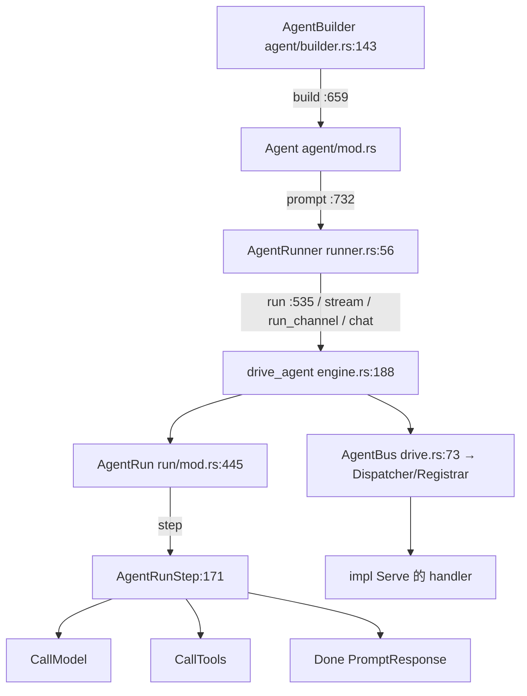
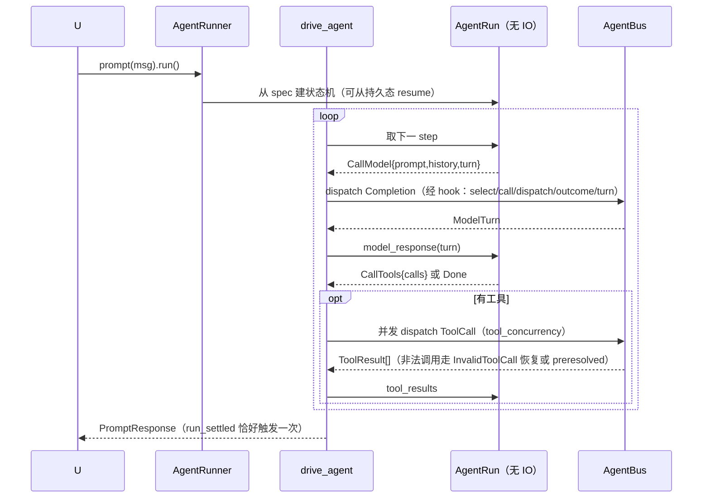

# 04-01 · AgentBuilder 与运行时：sans-IO 状态机、Runner、两个驱动面

> rig-agent 分三层：**AgentRun**（`run/`，可序列化的 sans-IO 状态机）→ **AgentRunner**（`agent/runner.rs`，hook/bus/未来装配与入口）→ **drive_agent**（`agent/engine.rs:188`，run/stream 共用的驱动循环）。构造面是 **AgentBuilder**（`agent/builder.rs`）。另有实验性的 **rig-ecs** 运行时复用同一份 rig-core 契约。

## 1. 定位



## 2. Why：三层切分的理由

1. **AgentRun 无 IO**：它只持有消息、轮次、usage、输出模式状态，全部 `Serialize/Deserialize`。可以单步执行（`examples/agent_run_stepping`）、持久化后在另一进程 `resume`、被记录重放。步骤枚举只有三个值，模型/工具的实际执行由外部"driver"喂回结果。
2. **Runner 负责一切不可序列化的东西**：模型值、hook 栈、bus dispatcher、`ToolContext` scopes；`run`（一次性 future）、`stream`（future + 事件流）、`run_channel`（future 与 `RunEvents` 分离，可先拿接收端再驱动）共享同一个 `drive_agent`，保证两种表面语义一致。
3. **Builder 类型状态**：`.tool(..)` 把 builder 从无工具态切到 `WithBuilderTools`（`:651`），`build()` 直接返回 `Agent`（无 `Result`，配置期错误在方法上避免）。
4. **ECS 是另一个 driver**：同一个 `CompletionRequest`/效果协议，bevy 世界每 tick 推进，证明 sans-IO 核心不绑运行时。

## 3. What

### 3.1 AgentRunStep — `run/mod.rs:171`

```rust
pub enum AgentRunStep {
    CallModel { prompt: Message, history: Vec<Message>, turn: usize /* 1-based */ },
    CallTools { calls: Vec<PendingToolCall> },
    Done(PromptResponse),
}
pub struct PendingToolCall {
    pub tool_call: ToolCall,
    pub preresolved_result: Option<UserContent>,  // 非法调用恢复时的预置结果（不执行、不过工具 hook）
    pub block_id: BlockId,                        // 流式块身份，持久化恢复后不重新 mint
}
```

`AgentRun`（`:445`）字段：`max_turns`、`max_invalid_tool_call_retries`、`unhandled_invalid_tool_call: UnhandledInvalidToolCall`、`tool_choice`、输出模式三件套（`output_tool_name/output_schema/max_output_retries`，Tool 模式的合成输出工具，见 #1928）、`chat_history/new_messages/current_turn/usage`、`completion_calls`、流式回滚标记 `rollback_pending`。driver 喂回用的方法：`model_response(ModelTurn)`、`tool_results(..)`、`record_streamed_completion_call(..)`。

### 3.2 PromptResponse — `run/response.rs:119`

`output: String`（终轮拼接文本）、`usage: Usage`（全 run 聚合）、`completion_calls: Vec<CompletionCall>`（每次成功补全；最后一个的 usage 是末次上下文长度）、`messages: Option<Vec<Message>>`（run 产出的转录：prompt、被接受的轮次、已提交工具结果、重试纠正反馈；**不含输入历史**）、`memory_append`（记忆 append 的结局）、`raw: CompletionResponse`（末次原始响应）。

### 3.3 OutputMode — `run/output.rs:28`

| 模式 | 行为 |
|---|---|
| `Auto`（默认） | 有 `output_schema` 且至少一个函数工具且 tool_choice 允许时取 `Tool`，否则 `Native`；只在"工具+schema"组合上改行为 |
| `Tool` | 把 schema 注册成合成"输出工具"，模型调它即终局；不发原生结构化约束，可先自由调其他工具；尽力而为，需校验；缺字段会按 `max_output_retries` 重问 |
| `Native` | 用 provider 原生结构化输出（`response_format`），每轮强约束、保证合 schema，但可能压制工具调用（如 Ollama） |
| `Prompted` | schema 注入 system prompt，终轮文本原样返回（可能带散文/markdown），调用方自行解析 |

### 3.4 AgentBuilder — `agent/builder.rs`

链式方法（选录）：`name:163`、`description:169`、`preamble:175`/`append_preamble:187`、`context:197`、`dynamic_context(samples, index):208`（每轮检索 top-N）与 `dynamic_context_handler:230`、`tool_choice:246`、`default_max_turns:252`、`temperature:258`、`max_tokens:264`、`additional_params:270`、`output_schema::<T>():282`/`output_schema_raw:291`/`output_mode:297`、`memory(backend):304`/`memory_handler:319`/`conversation(id):327`、`model_route(label, model):334`（多模型路由）与 `model_route_handler:352`、`owner:372`、`configure_bus(ServingPolicy):382`、`record_effects:396`/`record_effects_with_events:404`（rig-effect-log）、`add_hook:411`。构造：`Agent::new(model):567`、`Agent::named_model(label, model):576`、`AgentBuilder::over_bus:597`、`.tool_server_handle:639`；`.tool(..):651` 切态、`.build():659` 返回 `Agent`。

### 3.5 AgentRunner 入口 — `agent/runner.rs:56`、`agent/completion.rs`

`agent.prompt(msg):732 -> AgentRunner`；类型化 `prompt_typed::<T>(msg):821 -> TypedRun<T>`。Runner 配置方法（每 run 覆盖 builder 默认）：`add_hook:131`、`max_turns:144`、`using_model(label):155`/`using_model_value(model):164`、`tool_context:175`、`history:182`、`preamble:192`、`document/documents:204/210`、`temperature:216`、`max_tokens:228`、`merge/replace_additional_params:244/260`、`tool_choice:273`、`unhandled_invalid_tool_call:301`、`tool_concurrency:341`（工具并发）、`conversation:356`/`without_memory:362`、`max_invalid_tool_call_retries:370`。终端入口：`run():535`、`stream()`、`run_channel()`、`chat()`（多轮会话句柄）、`resume()`。

### 3.6 drive_agent 与总线

- `engine.rs:188 drive_agent<S: TurnSource>`：非流式/流式只是两个 `TurnSource`（`StreamingTurnSource:815`）；`DriveItem:95` 是 yield 项（delta、turn、终项）；`drive_tool_calls:583` 并发执行工具。
- `drive.rs:73 AgentBus`：包 `Dispatcher + Registrar + owner`，注册模型/工具/记忆 handler（`register_erased:230`、`model_key:216`、`raw_key:204`），可开录制（`enable_recording:133`）；`AnonymousModel:54` 是未命名模型的占位。
- 流式错误归并 `streaming_error_into_prompt:165`；usage 落账 `store_error_usage:173`。

## 4. How：一次 run 的驱动时序



**rig-ecs 对应面**：效果是实体（`PendingEffect→InFlight→EffectOutcome`，流式挂 `Streamed`），handler 是带 `Bound` 的实体，取消=despawn，`fold_request` 是全 crate 唯一请求构造点，host 每 tick `run_to_quiescence`（上限 64）；细节见 04-02 篇尾与 `tests/ecs_parity/`。

## 5. 从零实现的映射

要自己写一个驱动：① 从 `RunSpec` 建 `AgentRun` → ② loop：`step()` 得 `CallModel` 就自己发补全（或 dispatch 到 bus）并 `model_response` 喂回；得 `CallTools` 就执行并 `tool_results`；`Done` 退出 → ③ 流式时按 BlockId 增量记录、turn 被拒时回滚（`record_streamed_completion_call`）。`examples/agent_run_stepping` 是标准范本。

## 6. 边界与坑

- `build()` 返回 `Agent` 不是 `Result`；缺配置的组合用类型状态与方法可见性排除，别给它加 `?`。
- 流式 turn 在 `on_model_turn_finished` 接受前都是临时的；重试会回滚该 turn 的 completion 记录。
- `resume` 的 run 不再做 memory append（持久化它的 driver 拥有 append）。
- `OutputMode::Tool` 是尽力而为：必须读 `completion_calls`/校验输出，不能假设模型一定调了输出工具。
- `AgentRun` 的字段多为私有；推进只能通过喂回方法，外部不能跳过步骤。

## 7. 自检问题

1. 为什么 `AgentRun` 能跨进程持久化而 `Agent` 不能？
2. `run` 与 `stream` 共用哪个函数？流式特有的部分以什么抽象注入？
3. `Auto` 输出模式在什么条件下解析成 `Tool`？为什么需要这个默认？
4. `preresolved_result` 解决什么场景？
5. 自己写 driver 时，如何把一个模型响应喂回状态机？工具结果呢？
