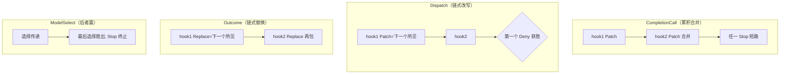
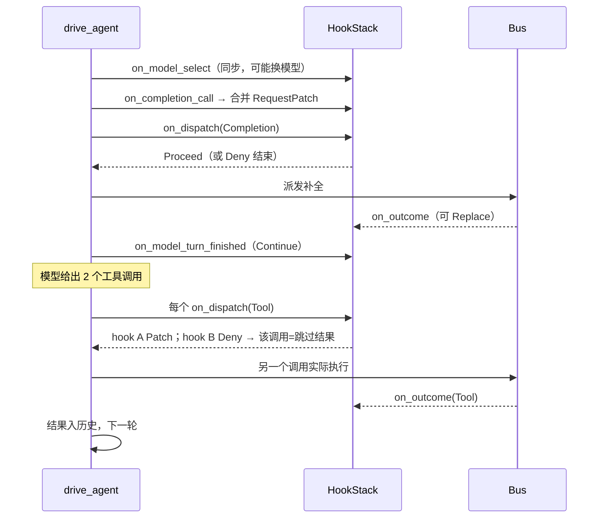

# 04-02 · Hook 系统：13 个生命周期、每事件独立动作、合并与门控

> Hook 是"每 run 一次装配、每事件被回调"的观察者/转向器。它的设计约束是：**每个事件返回自己的动作枚举**（不支持的组合在编译期被拒绝）、**流式与非流式行为完全一致**、**效果派发是唯一硬边界**。
> 主文件：`crates/rig-agent/src/agent/hook.rs`；动作/补丁在 `run/patch.rs`、`run/policy.rs`。

## 1. 定位

```mermaid
flowchart LR
    subgraph Stack[HookStack 按注册序]
        H1[观测 hook 先注册] --> H2[转向 hook]
    end
    subgraph Events["事件（每类一个 Action 枚举）"]
        RS[RunStart → RunStartAction]
        MS[ModelSelect → ModelSelectionAction]
        CC[CompletionCall → CompletionCallAction]
        TD[Text/Reasoning/ToolCall delta → ObservationAction]
        MTF[ModelTurnFinished → ModelTurnAction]
        ITC[InvalidToolCall → Option&lt;InvalidToolCallAction&gt;]
        DP[Dispatch → DispatchAction]
        OC[Outcome → OutcomeAction]
        SET[RunSettled → ()]
    end
    Stack --> Events
```

## 2. Why：动作按事件分裂

一个补丁能改请求，但不能"批准工具"；一个拒绝只能发生在派发边界。若所有 hook 方法都返回同一个 `HookResult { patch, stop, deny, retry }`，非法组合只能运行时报错。当前设计让"补全调用不能 deny、delta 不能 patch、模型选择必须同步"全部由类型系统表达。

## 3. What：trait 全貌（`agent/hook.rs`）

`AgentHook: WasmCompatSend + WasmCompatSync`，默认实现全为 no-op，所以只需覆写关心的事件：

| 方法 | 时机 | 动作枚举（文件:行） | 动作值 |
|---|---|---|---|
| `name()` | hook 身份（默认类型名；有状态时显式命名，进 effect log 头、replay 比对） | `Option<String>` | — |
| `on_run_start` | 首次模型调用前，见初始 prompt | `RunStartAction`（hook.rs:816） | `Continue` / 改 prompt / `Stop` |
| `on_run_settled` | 结局已定（终值或终止错误），恰一次；此处在 `entries` 追加不落盘 | `()` | 仅观测 |
| `on_model_select` | 待发模型调用边界选模型；**同步**、只读已构造的 `ModelRef`、可写 `Scratchpad`、禁阻塞 IO；每次 CallModel（含重试/工具后调用）一次 | `ModelSelectionAction`（:1181） | `Continue` / 换模型 / `Stop` |
| `on_completion_call` | 补全请求发送前 | `CompletionCallAction`（:1213） | `Continue` / `Patch(RequestPatch)` / `Stop` |
| `on_model_turn_finished` | 一个 model turn 结束（仅无工具 turn 可重试，消耗模型调用预算） | `ModelTurnAction`（:727） | `Continue` / `Retry` / `Stop` |
| `on_invalid_tool_call` | 模型给的工具调用无法照发；返回 `None` 交给后一个 hook，全 `None` 保持 fail-fast | `Option<InvalidToolCallAction>`（run/policy.rs:47） | `Fail / Retry / Repair / Skip / Stop` |
| `on_text_delta` / `on_reasoning_delta` / `on_tool_call_delta` | 流式增量（reasoning 按 correlator 分块；turn 接受前均临时） | `ObservationAction`（:1241） | `Continue / Stop` |
| `on_dispatch` | 任意效果即将上 bus | `DispatchAction`（:949） | `Proceed / Patch / Deny`（completion/tool 可干预；内部族默认观察） |
| `on_outcome` | 任意效果在 bus 上 resolved | `OutcomeAction`（:1093） | `Proceed / Replace` |
| `observes(kind)` | 兴趣门控（见 §5） | `bool` | 默认关闭内部五族 |

`HookContext`（run 作用域）：run id、turn、streaming 标志、agent 名、共享 `Scratchpad`、`entries()`（本 run 已追加的日志条目，settled 前已 flush）。

## 4. How：组合语义（HookStack）



- **补全 patch 按注册序合并**；`Stop` 短路整个栈。
- **Dispatch**：每 hook 的 `Patch` 是下一 hook 看到的请求；第一个 `Deny` 获胜——被拒的**工具调用变成模型看到的"已跳过"结果**（不是 run 错误）；completion 被拒则按策略结束。
- **Outcome**：每个 `Replace` 是下一 hook 与运行时看到的结果。
- **ModelSelect**：选择向后传递，最后写者赢，`Stop` 终止；flight 中的尝试绝不重绑。
- 注册顺序约定：**观测 hook 在前、转向 hook 在后**，因为 stop/deny 短路。
- 嵌套 `HookStack` 必须保持同样的 merge/chaining 语义（宏 `for_each_boxed_hook_event` 与手写的 select/invalid 分派保证擦除后一致，见 hook.rs 后半的 `DynAgentHook`）。

### RequestPatch 合并规则（`run/patch.rs:25`）

| 字段 | 合并 |
|---|---|
| `extra_context` | 追加 |
| `additional_params` | 浅合并 |
| `active_tools` | 交集（只能收紧） |
| 标量（preamble/temperature/max_tokens/history/…） | 后写者赢，并对覆盖发 warn |

Patch 是**逐轮非黏性**的：只作用于当前补全调用，不修改 Agent 配置。

### 非法工具调用恢复（`run/policy.rs:47`）

`Fail`（默认 fail-fast）/ `Retry`（让模型重试，消耗预算）/ `Repair`（修好名字/参数后照发）/ `Skip`（以跳过结果回到模型）/ `Stop`。run 级默认由 `UnhandledInvalidToolCall` 策略与 `max_invalid_tool_call_retries` 决定。

## 5. observes：不是提示，是硬门

默认 `observes` 对五个内部族返回 `false`：`EmbedDispatch / RerankDispatch / MemoryDispatch / RetrieveDispatch / CustomDispatch`。对 `CompletionDispatch` 与 `ToolDispatch` 默认 `true`。

- 对两个派发边界，`false` 会**同时静音** `on_dispatch` 与 `on_outcome`——该 hook 再也无法拒绝工具调用。
- 只想去掉 delta 噪声的覆写应只对 delta kind 返回 `false`，保留所有 `*Dispatch`。
- `impl AgentHook for ()` 对一切返回 `false`（空栈零开销）。

## 6. 流式等价性

delta 在 model turn 被 `on_model_turn_finished` 接受前是临时的：`Retry/Stop` 回滚该 turn（含其 completion-call 记录，见 AgentRun 的 `rollback_pending`）。run 与 stream 共用 `drive_agent`，因此任何 hook 语义差异都是 bug——新增 hook 事件时两条表面都要测。

## 7. 时序：一次带 patch+deny 的工具轮



## 8. rig-ecs 里的对应物

ECS 运行时不用 hook trait，而用两个用户拦截实体：**Gate**（派发前：等价 on_dispatch，可放行/改写/拒绝）与 **Judge**（结果侧：等价 on_outcome，可替换）。per-run 策略身份进 replay 头（Scope/PolicyVersion/policy hash），保证记录与重放的策略是同一份代码。

## 9. 边界与坑

- `on_model_select` 里做 await/IO 是编译期就排除的（同步签名）；需要 IO 的决策放在更早的 patch/scratchpad 准备阶段。
- 有状态 hook 必须实现 `name()` 描述状态，否则两个同类型不同状态的 run 在 replay 看来是同一个程序。
- 不要在 `on_run_settled` 里依赖追加条目持久化（run 已结束）。
- Patch 的 `active_tools` 只能取交集——别用 hook 给 run 增加 builder 没给的工具。

## 10. 自检问题

1. 为什么 delta 事件没有 `Patch` 动作？
2. 一个 hook 想审计嵌入调用，默认能收到吗？要覆写什么？代价是什么？
3. 两个 hook 都 patch 了 `temperature`，最终值是什么？有什么信号？
4. 拒绝一个工具调用后，模型看到什么？run 会失败吗？
5. 流式 turn 被 `Retry`，已经 yield 给用户的 delta 怎么办？
