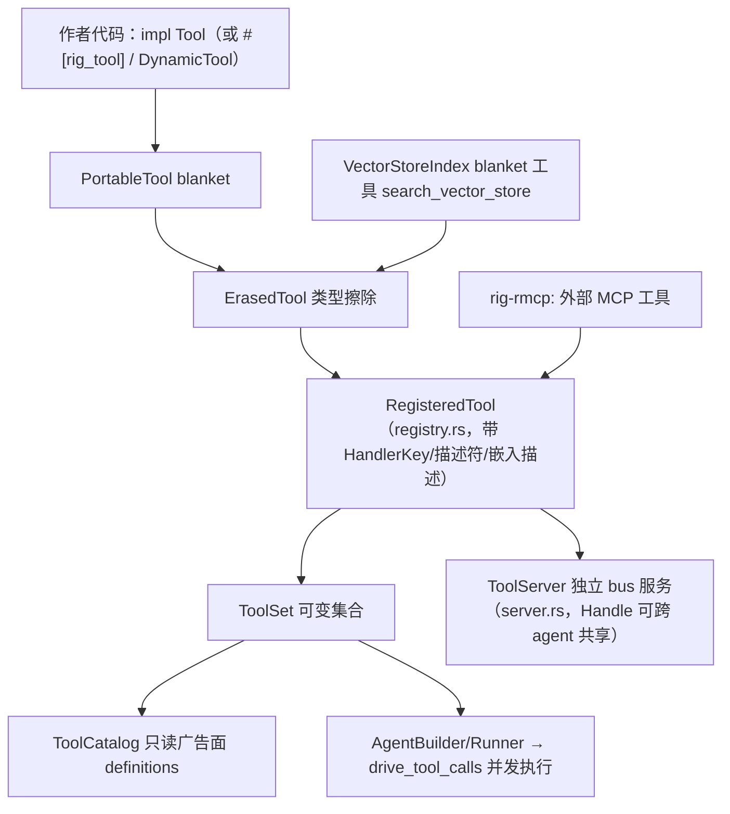
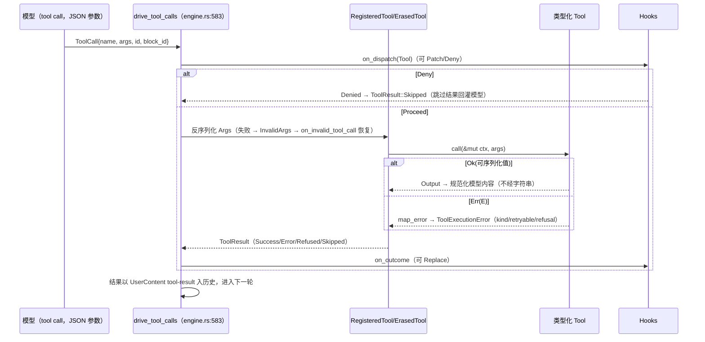

# 04-03 · 工具系统：两层 trait、一个执行路径、四套注册面

> 工具是模型唯一能调用的"动词"。Rig 的工具体系：作者写**一个**类型化 `Tool` impl（或 `#[rig_tool]` 函数）→ 内部擦成 `ErasedTool` → 经**唯一的规范化执行路径**产出 `ToolResult`（成功/错误/拒绝/跳过同一形状）→ 注册到 `ToolSet`/`ToolCatalog`/`ToolServer` 或通过 rig-rmcp 接外部 MCP 工具。

## 1. 定位



## 2. Why

1. **作者错误与运行时错误分离**：`Tool::Error` 是作者自己的枚举，直接调用与单测用 `?`；只有在擦除派发边界才归一化成 `ToolExecutionError`（不强迫作者写第二套错误类型）。
2. **四种结局一个类型**：`ToolResult` 统一表达 success/error/refused/skipped（`ToolDisposition`，`tool/result.rs:446`），hook 与模型看到的是同一种结构，"被 hook 拒绝"和"工具自己拒绝"才能用同一条路径回灌。
3. **上下文是显式插槽而非环境**：`ToolContext` 用字符串键（`ContextValue::KEY`）存取宿主注入值，而不是 `type_name`——重构、持久化 effect log、跨工具链后键稳定；运行时句柄放不上线的 `scopes`。
4. **可移植与上下文二合一**：`PortableTool` 无上下文可跨线；blanket impl 让它自动成为 `Tool`，没有第二个生态。

## 3. What：类型与签名

### 3.1 两个 trait（`rig-core/src/tool/`）

```rust
// contextual.rs:141
pub trait Tool: Sized + WasmCompatSend + WasmCompatSync {
    const NAME: &'static str;
    type Args: for<'de> Deserialize<'de> + WasmCompatSend + WasmCompatSync;
    type Output: IntoToolOutput;                 // 任何 owned Serialize 自动满足
    type Error: std::error::Error + WasmCompatSend + WasmCompatSync + 'static;
    fn description(&self) -> String;
    fn parameters(&self) -> serde_json::Value;  // JSON Schema
    fn map_error(&self, e: Self::Error) -> ToolExecutionError { ToolExecutionError::from_error(e) }
    fn call(&self, ctx: &mut ToolContext, args: Self::Args)
        -> impl Future<Output = Result<Self::Output, Self::Error>> + WasmCompatSend;
}
// blanket：impl<T: PortableTool> Tool for T（contextual.rs:185）
// portable.rs:21：PortableTool 的 call 无 &mut ToolContext
// ToolEmbedding（contextual.rs:216）：可从序列化 Context + 运行时 State 重建（RAG 动态工具）
```

`ToolContext`（`tool/context.rs:172`）：`inbound: BTreeMap<String, Value>`（宿主凭据/配置）、`result: BTreeMap`（工具发布的元数据）、`scopes: Vec<Arc<dyn Any + Send + Sync>>`（按类型取运行时，如 bus `Dispatcher`，`#[serde(skip)]` 不上线）。`ToolResultContext` 是只含持久元数据的对外视图；`ContextValue` 可 derive（`#[context(key="…")]`）。

### 3.2 `#[rig_tool]` 属性宏 — `crates/rig-derive/src/lib.rs:171` 附近

把普通函数变成工具，文档示例在 lib.rs:68-142：

```rust
#[rig_tool(description = "Perform basic arithmetic operations")]
async fn add(left: i64, right: i64) -> i64 { left + right }

#[rig_tool(name = "search-docs", description = "Search the documentation")]
// 也支持 #[rig_tool(required(a))] 覆盖字段必填性
```

宏从函数参数生成 `Args` 结构、JSON Schema 与 `Tool` impl；facade 的 `derive` feature 默认开启。

### 3.3 错误分类 — `tool/result.rs`

`ToolErrorKind:15`：`InvalidArgs / Timeout / Cancelled / NotFound / PermissionDenied / RateLimited / Provider / Network / Other`。单张表（`kind_defaults!` 宏，`:40`）同时产出稳定名、**默认可重试性**、**默认模型反馈文案**三个访问器——加一个 kind 不可能只改一半。`ToolExecutionError` 另有显式 retryable override 与 http_status/code/refusal（转 `ErrorReport` 时使用，见 07 篇）。

### 3.4 注册面（rig-agent/src/tool/）

**RegisteredTool / ToolSet（registry.rs，522 行）**

- `RegisteredTool::from_tool::<T>:54`、`from_retrievable:69`（带嵌入的动态工具）、`from_dynamic:88`、`from_handler(impl Serve):96`（直接接 bus handler，失败返回 `ErrorReport`）。
- 一个注册工具持有：`Key<family::Tool>`（`:151 with_key`）、名字、`ErasedHandler`、`FamilyDescriptor`（`:182`）、`ToolEmbeddingDescriptor`（`:192`）、liveness（`:197 is_live`）、`publish_to(ctx):267`（把结果元数据写回 ToolContext）。
- `ToolSet`（`:306`）：`from_tools:308`、`add_tool:334`（返回名字）、`add_dynamic_tool:342`、`add_portable_dynamic_tool:347`、`add_retrieved_tool:353`、`add_registered_tool:361`、`remove_tool:382`、`add_tools(并集):387`、`get:402`、`contains:329`。

**ToolCatalog（catalog.rs，142 行）**：只读广告面，`definitions():64`（喂给模型的 `ToolDefinition` 列表）、`names/contains/get/key/iter`、`take_definitions:118`；`ToolLease` 保活动态工具代际（catalog.rs:35 的 `leases`）。

**ToolServer（server.rs，842 行）**：工具作为**独立 bus 服务**——builder：`new:285`、`owner:299`、`tool:305`、`dynamic_tool:311`、`portable_dynamic_tool:322`、`registered_tool:328`、`retrieved_tools(sample, index, toolset):335`（检索式工具供给）、`retrieved_tools_handler:355`、`run():373 -> ToolServerHandle:418`（`Arc<RwLock<…>>`，可挂给多个 agent：`AgentBuilder::tool_server_handle:639`）。

**DynamicTool**（`tool/managed.rs`）：运行期拼装的 JSON-in/JSON-out 工具（无静态类型），对应 `PortableDynamicTool`。

### 3.5 外部工具：rig-rmcp（`crates/rig-rmcp/src/`）

`lib.rs` + `native.rs` + `handler.rs`：把 MCP server 暴露的工具适配成 Rig 注册工具（MCP 的 JSON Schema 直接转 `parameters`），facade feature `rmcp`，示例 `examples/rmcp`。

### 3.6 向量库即工具

任何 `VectorStoreIndex`（其 `Filter` 能用 JSON 值表示）自动 impl `PortableTool`，`NAME = "search_vector_store"`，`Args = VectorSearchRequest<F>`，`Output = Vec<VectorStoreOutput>`（vector_store/mod.rs:161-176）——`.tool(index)` 与 `.dynamic_context(..)` 是同一机制的两种用法。

## 4. How：一次工具调用的执行路径



并发由 runner 的 `tool_concurrency` 控制（runner.rs:341）；同一 block_id 贯穿 delta→执行提交→结果，持久化恢复后 id 不重 mint。

## 5. 边界与坑

- 工具返回值**不会先转字符串**：直接序列化为规范内容；要富内容（图片/多部分）返回 `ToolResultContent` 或 `ToolOutput`。
- `PermissionDenied` 同时服务"鉴权失败"与"有意拒绝"，拒绝靠 disposition 区分。
- `ToolSet` 的名字是运行期键；重名工具后注册覆盖，动态工具靠 lease 代际保活。
- `scopes` 里的运行时句柄不进 effect log/线上；工具要持久化的数据走 result 槽。
- 直接用 `impl Serve` 的 handler 注册时，构造错误是 `ErrorReport` 而非 `String`。

## 6. 自检问题

1. `Tool` 与 `PortableTool` 的关系是什么？写哪一个能同时进两个运行时？
2. 一个 hook 拒绝工具调用与工具自己返回错误，在 `ToolResult` 上分别是什么 disposition？
3. `ToolContext` 的键为什么不用 `std::any::type_name`？
4. `ToolServer` 与 `ToolSet` 的区别？什么时候需要 Handle 跨 agent 共享？
5. `#[rig_tool]` 帮你生成了哪三样东西？
