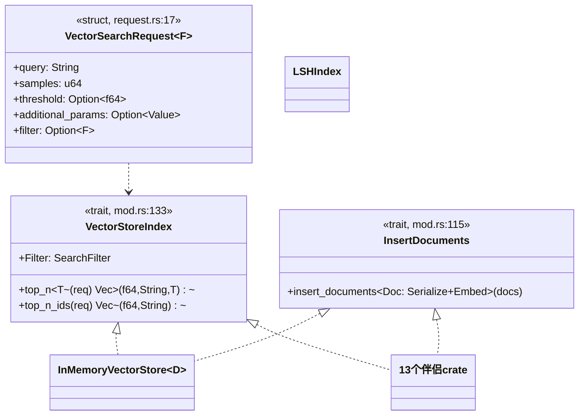

# 05-01 · VectorStore trait 与内存实现：查询、写入、LSH

> 向量检索在 Rig 里是两个 trait：**写入面 `InsertDocuments`**（接收已嵌入文档）与**查询面 `VectorStoreIndex`**（接收查询文本，存储自己负责嵌入）。外加一个请求类型 `VectorSearchRequest<F>`、一个内存实现和一个 LSH 近似索引。本篇全部对照 `crates/rig-core/src/vector_store/`。

## 1. 定位



## 2. Why：读写为什么是两个 trait、查询为什么是文本

1. **写入与查询能力不同源**：有的后端只读（外部托管索引），有的可写；分开 impl 避免"必须实现空写入"。
2. **查询入参是文本而非向量**：嵌入发生在存储内部（多数后端支持服务端 embed 或必须用与入库一致的模型），也让索引能直接成为工具（模型给文本即可）。
3. **写入要求"预计算嵌入且非空"**：`insert_documents` 的文档必须实现 `Embed`（携带至少一个嵌入）。注释（mod.rs:118-125）解释了为什么实现者不防护空列表——空列表在不同后端行为不同（静默空插入/永不可命中的文档/驱动报错），`EmbeddingsBuilder` 构造上保证非空，只有手写元组能破坏。
4. **Filter 是关联类型**：每家后端的过滤表达式不同（SQL/json/Cosmos 式），用 `type Filter: SearchFilter` 表达；canonical `Filter<Value>` 可经 `map_filter/try_map_filter` 翻译（request.rs:51/68）。

## 3. What：真实形状

### 3.1 请求类型 — `vector_store/request.rs:17`

```rust
pub struct VectorSearchRequest<F = Filter<serde_json::Value>> {
    query: String,                    // 查询文本（存储内部嵌入）
    samples: u64,                     // top-N
    threshold: Option<f64>,           // 相似度下限
    additional_params: Option<Value>,// 后端专有参数 JSON
    filter: Option<F>,                // 元数据过滤
}
VectorSearchRequest::builder() -> VectorSearchRequestBuilder<F>   // :27
// 访问器 query()/samples()/threshold()/filter()；map_filter/try_map_filter 换过滤类型
```

注意字段是私有的：只能经 builder 构造，避免"新建请求忘了 embed 模型版本"之外的半成品状态。

### 3.2 两个 trait — `vector_store/mod.rs`

```rust
pub trait InsertDocuments: WasmCompatSend + WasmCompatSync {
    fn insert_documents<Doc: Serialize + Embed + WasmCompatSend>(
        &self, documents: Vec<Doc>,
    ) -> impl Future<Output = Result<Vec<String>, VectorStoreError>> + WasmCompatSend>;
}

pub trait VectorStoreIndex: WasmCompatSend + WasmCompatSync {
    type Filter: SearchFilter + WasmCompatSend + WasmCompatSync;
    fn top_n<T: DeserializeOwned + WasmCompatSend>(
        &self, req: VectorSearchRequest<Self::Filter>,
    ) -> impl Future<Output = Result<Vec<(f64, String, T)>, VectorStoreError>> + WasmCompatSend>;
    fn top_n_ids(
        &self, req: VectorSearchRequest<Self::Filter>,
    ) -> impl Future<Output = Result<Vec<(f64, String)>, VectorStoreError>> + WasmCompatSend>;
}
```

`VectorStoreOutput { score: f64, id: String, document: Value }`（mod.rs:151）是自动工具的输出类型。blanket `impl PortableTool`（mod.rs:161）：名字 `search_vector_store`，`Args = VectorSearchRequest<F>`，要求 `F` 的 `SearchFilter::Value = serde_json::Value` 且可反序列化。

### 3.3 嵌入从哪来：EmbeddingsBuilder — `embeddings/builder.rs:52`

只有 impl `Embed`（rig-derive 可派生，文档字段标 `#[embed]`）的类型能进 builder。它批量调 `EmbeddingModel::embed_texts_response`（保序），产出 `(文档, Vec<Embedding>)` 迭代器，直接喂 `insert_documents`/`from_documents`。

### 3.4 InMemoryVectorStore — `in_memory_store.rs`

- `InMemoryVectorStore::<D>::builder():48 -> InMemoryVectorStoreBuilder<D>`（可带模型与配置）。
- `from_documents(impl IntoIterator<Item = (D, Vec<Embedding>)>):84`、`from_documents_with_ids:93`、`from_documents_with_id_f:105`（自定义 id 函数）。
- 索引类型组合构造 `::new(model, store):409`；查询时内部调模型嵌入 query。
- 适合测试与小型语料；数据在内存，不持久化。

### 3.5 LSH — `lsh.rs`

随机超平面局部敏感哈希，把高维向量映射成桶，候选集再精排：

- `LSH::new(dim, num_tables, num_hyperplanes):27`；`hash(vector, table_idx) -> u64:62`（单表哈希，多表提升召回）。
- `LSHIndex::new(dim, num_tables, num_hyperplanes):101`、`insert(id, embedding):109`、`query(embedding) -> Vec<String>:119`（候选 id）、`clear():141`。

## 4. How：一次 RAG 入库 + 检索

```mermaid
sequenceDiagram
    participant U as 用户
    participant EB as EmbeddingsBuilder
    participant EM as EmbeddingModel
    participant S as InMemoryVectorStore
    participant I as VectorStoreIndex
    U->>EB: document(d1).document(d2).build()
    EB->>EM: embed_texts_response([t1,t2])（保序）
    EM-->>EB: EmbeddingResponse（每文档 ≥1 嵌入）
    EB-->>U: Vec&lt;(Doc, Vec&lt;Embedding&gt;)&gt;
    U->>S: from_documents(..) 或 insert_documents(docs)
    U->>I: top_n(VectorSearchRequest.builder().query(q).samples(5).build())
    I->>EM: embed_text(q)
    I-->>U: Vec&lt;(score, id, Doc)&gt;
```

Agent 侧两种用法（同一机制）：

```rust
// 每轮自动检索 top-5 注入上下文
let agent = client.agent(model).dynamic_context(5, index).build();
// 或作为模型可调用工具
let agent = client.agent(model).tool(index).build();
```

## 5. 从零实现一个后端的映射

1. 定义文档/行类型与 `SearchFilter`（声明 `Value` 关联类型，能转 JSON 才能当自动工具）。
2. impl `InsertDocuments`：序列化文档 + 随 `Embed::embed(..)` 拿到的向量 upsert；返回 id 列表。
3. impl `VectorStoreIndex`：`top_n` 内先嵌入 query（或用后端服务端嵌入），执行 ANN + filter + threshold，反序列化文档为 `T`；`top_n_ids` 是免反序列化的瘦版本。
4. 错误一律 `VectorStoreError`（含 `ExternalAPIError` 等变体），不要返回字符串。
5. bound 用 `WasmCompatSend/WasmCompatSync`。完整范式见 05-02 篇（rig-sqlite/ rig-qdrant）。

## 6. 边界与坑

- 手写 `(doc, embeddings)` 元组必须保证嵌入非空；优先用 `EmbeddingsBuilder`。
- 查询用**文本**；要直接用向量查询是底层构造（`LSHIndex::query(&[f64])`、内存 store 的 with-id 构造），不是 `VectorSearchRequest`。
- `embed_texts_response` 保序是硬契约，自己实现模型时乱序会造成静默脏数据。
- LSH 是近似索引：召回随表数/超平面数变化，需要精确结果用后端原生 ANN。
- `Filter` 不能表达为 JSON 的后端拿不到"自动成为工具"的 blanket impl，仍可手动包装。

## 7. 自检问题

1. 为什么 `top_n` 的入参不是一个向量？嵌入在哪发生？
2. `insert_documents` 为什么不检查空嵌入列表？谁来保证？
3. 一个索引要满足什么条件才能 `.tool(index)` 直接给 agent 用？
4. `map_filter` 解决什么实际问题？
5. LSH 的 `num_tables` 增大时召回/延迟如何变化？
