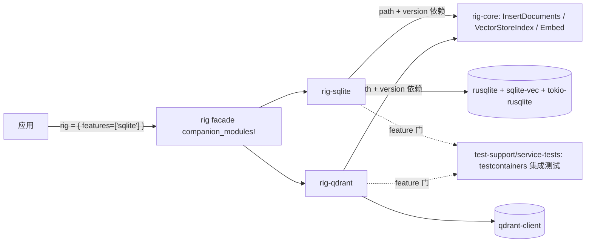

# 05-02 · 向量库伴侣 crate 模式：以 rig-sqlite / rig-qdrant 为范本

> 向量库后端不放进 rig-core：每家客户端依赖体积大、发布节奏不同。12 个后端各是一个伴侣 crate，依赖 `rig-core` 的两个 trait（`InsertDocuments` + `VectorStoreIndex`），通过 facade 的同名 feature 暴露为 `rig::sqlite`、`rig::qdrant` 等。本篇用两个真实实现讲清"加一个后端"的标准范式。

## 1. 定位



12 个向量 crate 与 facade 模块（`src/lib.rs:347-358`，feature 名=模块名）：

`helixdb`、`lancedb`、`milvus`、`mongodb`、`neo4j`、`postgres`、`qdrant`、`s3vectors`、`scylladb`、`sqlite`、`surrealdb`、`vectorize`。

## 2. 范式总览（两个范本对比）

| 维度 | rig-sqlite（嵌入式，2056 行） | rig-qdrant（服务式，208 行） |
|---|---|---|
| Cargo 依赖 | `rig-core { path, version="0.42.0", default-features=false, features=["derive"] }`（Cargo.toml:15）；rusqlite:18、sqlite-vec:21、tokio-rusqlite:23 | rig-core 同版本路径依赖，**不带 derive**（:14）；qdrant-client:17、uuid:18 |
| store 类型 | `SqliteVectorStore<T>`（lib.rs:348，`T: SqliteVectorStoreTable:109`） | `QdrantVectorStore<M>`（lib.rs:35） |
| 构造 | `new(conn, &impl EmbeddingModel):413`、`with_distance_metric:425`；无独立 builder | `new(client, model, query_params: QueryPoints):52`；无 builder |
| index 类型 | `SqliteVectorIndex<T,M>`（:1549，`new:1558`），由 `store.index(model):557` 产出 | store 即 index（直接 impl trait） |
| Filter | `SqliteSearchFilter:727`（impl `SearchFilter:896`） | `QdrantFilter(serde_json::Value)`（filter.rs:14，impl:16，`interpret:134`） |
| 写入 | `impl InsertDocuments:683`，`insert_documents<Doc: Serialize+Embed>:691` → `add_rows:664`/`add_rows_with_txn:561` | `impl InsertDocuments:119`，`insert_documents:120` upsert `PointStruct` |
| 查询嵌入 | `search_rows:1575` 内 `embed_text:1585` | `generate_query_vector:65` |
| trait impl | `impl VectorStoreIndex:1929`，`top_n:1932`、`top_n_ids:1993` | `impl VectorStoreIndex:166`，`top_n:171`、`top_n_ids:192` |

**观察**：嵌入式后端把"建表/事务/行映射"写厚（T 是用户表类型，`SqliteVectorStoreTable` 描述列与元数据），服务式后端薄到只有"请求翻译 + 响应映射"。两端的 trait 形状完全一致。

## 3. What：每个伴侣 crate 的固定组成

1. **Cargo.toml**：`rig-core` 用 `path + version` 双写（workspace 内开发、发布后按版本解析），`default-features = false` 避免拉入 reqwest 等；需要 `Embed` derive 才开 `features = ["derive"]`（qdrant 不需要）。
2. **Store（写侧）**：持有连接/客户端与嵌入模型；`new(..)` 配置，初始化后端专有结构（sqlite-vec 扩展、collection）。
3. **Index（读侧）**：可与 store 同类型（qdrant）或分开（sqlite 的 `store.index(model)`），持有查询所需模型。
4. **Filter**：一个后端专有类型 impl `SearchFilter`；canonical JSON 过滤在此翻译为 SQL where / Qdrant Filter（`interpret`）。
5. **两个 trait impl**：
   - `insert_documents<Doc: Serialize + Embed>`：从 `Doc` 取嵌入（构造保证非空）+ 序列化文档 → 行/点；返回 id。
   - `top_n::<T: DeserializeOwned>(VectorSearchRequest<Self::Filter>)`：嵌入 query（库内模型）→ ANN 查询 → 阈值/过滤/`samples` → `(score, id, T)`；`top_n_ids` 免文档反序列化。
6. **错误**：用 rig-core 的 `VectorStoreError`（后端错误包进 `ExternalAPIError`/对应变体），不自定义字符串错误。
7. **模块挂载**：根 `src/lib.rs` 顶部 `mod`，facade `companion_modules!` 加一行 `xxx = rig_xxx ["xxx"]`。
8. **examples/**：每个 crate 自带最小可跑示例。

## 4. How：一次跨层查询的路径（qdrant）

```mermaid
sequenceDiagram
    participant A as Agent/用户
    participant I as QdrantVectorStore（impl VectorStoreIndex）
    participant E as EmbeddingModel（构造时持有）
    participant Q as qdrant-client
    A->>I: top_n(VectorSearchRequest{query,samples,threshold,filter})
    I->>I: QdrantFilter.interpret(json)（filter.rs:134）
    I->>E: generate_query_vector(query)（:65）
    E-->>I: 向量
    I->>Q: QueryPoints（vector + limit + filter + score threshold）
    Q-->>I: Vec&lt;ScoredPoint&gt;
    I-->>A: Vec&lt;(score, id, T: DeserializeOwned)&gt;
```

sqlite 路径同构，差别是查询在 `search_rows`（lib.rs:1575）里走 SQL + sqlite-vec 距离，事务写入走 `add_rows_with_txn`。

## 5. 测试组织（重要差异）

- **单元/契约测试**：sqlite 用兄弟测试文件——lib.rs:2055 `#[cfg(test)] mod tests;`，实体在 `src/tests.rs`（2968 行，mock `TestEmbeddingModel` 在 :2942）。这符合仓库"测试模块必须为兄弟文件"的硬规则（`cargo xtask check-test-layout`）。qdrant 另有 `tests/filter_export.rs`。
- **真实后端集成测试**：统一在独立 workspace 包 `test-support/service-tests/`（Docker/testcontainers + httpmock，慢车道 CI）。其 `integrations.rs:21-29` 用 `#[path]` 引入仓库根 `tests/integrations/qdrant.rs`、`sqlite.rs`，由 feature `qdrant`/`sqlite` 门控。伴侣 crate 本地回放/单测不需要起服务。
- 发布注意：`test-support/service-tests` 在 default-members 里，但服务测试依赖容器，普通本地检查不跑。

## 6. 从零加一个向量后端：清单

1. `cargo new --lib crates/rig-<backend>`，加 workspace（自动，members=`crates/*`）。
2. Cargo.toml 依赖 rig-core（path+version、default-features=false、按需 derive）与后端客户端。
3. 定义 store（+ 可选 index）、后端 filter 并 impl `SearchFilter`。
4. impl `InsertDocuments` 与 `VectorStoreIndex`（含 `top_n_ids`，两者都要）；bound 用 `WasmCompatSend/Sync`。
5. 错误映射到 `VectorStoreError`；写 `src/tests.rs` 兄弟测试（mock 嵌入模型）+ 一个 per-crate example。
6. 根 facade `companion_modules!` 加 feature/模块；Cargo features 矩阵与文档同步。
7. 服务测试：在 `tests/integrations/<backend>.rs` 写 testcontainers 用例，在 service-tests 的 `integrations.rs` 挂 feature。

## 7. 边界与坑

- 版本双写（path+version）不能漏，否则发布到 crates.io 后解析失败。
- `top_n` 的文档反序列化是泛型 `T`，后端只能存/取 JSON；用户文档字段改名是破坏性数据迁移，与 crate 无关。
- 查询嵌入必须用**与入库相同的模型**（维度一致）；store 在构造时持有模型就是为了强制这一点。
- 不要把服务测试放进伴侣 crate 的 `#[cfg(test)]`：CI 无容器时会红；走 service-tests feature。
- sqlite 这类嵌入式后端注意文件锁与 tokio 运行时（tokio-rusqlite），别在 async 里阻塞调用 rusqlite。

## 8. 自检问题

1. 为什么 qdrant crate 只要 208 行而 sqlite 要 2000+？差异集中在哪？
2. 新增后端时，什么情况下需要 rig-core 的 `derive` feature？
3. Filter 从模型侧 JSON 到后端表达式的翻译函数在两个范本里分别叫什么？
4. 为什么集成测试不放在伴侣 crate 自己的 tests/ 里？
5. facade 上启用 `rig::qdrant` 需要改哪两处？
