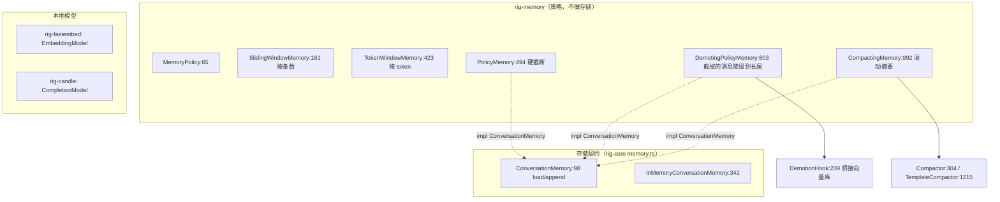
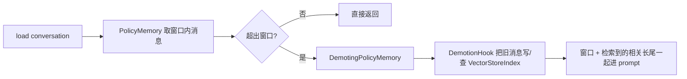

# 05-03 · 记忆策略与本地模型生态：rig-memory、rig-fastembed、rig-candle

> 记忆在 Rig 里是两层：**存储契约** `ConversationMemory`（rig-core，load/append）与**策略层** rig-memory（窗口截断、降级、摘要压缩）。本地模型则是两个方向不同的伴侣 crate：rig-fastembed 实现 `EmbeddingModel`（ONNX 嵌入），rig-candle 实现 `CompletionModel`（CPU 上跑 LLM）。

## 1. 定位



## 2. 记忆：契约与策略分离的原因

同一份"截断到最近 N 条"策略要能用在内存 map、SQLite、远端记忆服务上；反之，向量记忆是一种**降级钩子**而不是内置后端（策略层不绑定向量库）。所以 rig-core 只定义存储与三个策略钩子，rig-memory 提供可套在任意 `M: ConversationMemory` 外的适配器组合。

## 3. What：rig-core 侧（`memory.rs`）

```rust
pub enum MemoryError { Backend(..), Policy(..), Internal(..) }     // :59
pub trait ConversationMemory {                                    // :98
    fn load<'a>(&'a self, id: &'a ConversationId) -> WasmBoxedFuture<'a, Result<Vec<Message>, MemoryError>>;
    fn append<'a>(&'a self, id: &'a ConversationId, msgs: Vec<Message>)
        -> WasmBoxedFuture<'a, Result<(), MemoryError>>;
}
pub trait MessageFilter: .. { /* 哪些消息进窗口 */ }             // :197
pub trait DemotionHook {                                          // :239
    // 被挤出窗口的消息送往何处（向量库/长尾存储）
}
pub trait Compactor {                                             // :304
    // 把旧消息压成摘要
}
pub struct InMemoryConversationMemory { .. }                      // :342（参考存储实现）
```

## 4. What：rig-memory 策略族（`crates/rig-memory/src/lib.rs`，1420 行单文件 + tests.rs 66 个测试）

| 类型:行 | 语义 |
|---|---|
| `MemoryPolicy:65` | 策略核心：`apply:68`、`apply_with_demoted:83`，决定历史如何裁剪 |
| `IntoFilter:129` | blanket（:162）：策略可直接当消息过滤器用 |
| `NoopMemoryPolicy:166` | 不裁剪 |
| `SlidingWindowMemory:181` | 保留最近 `last_messages`（:187）条；impl :192 |
| `TokenWindowMemory:423` | 按 token 预算裁剪（`new:430`，impl:450） |
| `TokenCounter:235` | token 计数抽象 |
| `HeuristicTokenCounter:306` | 零依赖启发式计数（impl:402） |
| `PolicyMemory<M,P>:494` | 硬失败裁剪适配器，impl `ConversationMemory` :521 |
| `DemotingPolicyMemory<M,P,H>:603` | 截断消息经 `DemotionHook` 送往长尾/向量存储（impl:731）——**"向量记忆"的挂接点**，crate 本身不含内置向量后端 |
| `CompactingMemory<M,P,C>:992` | 超出窗口时滚动摘要（impl:1027） |
| `TemplateCompactor:1215` | 摘要器参考实现（impl `Compactor:1288`），产物 `TextSummary:1268` |

组合方式：选一个存储 `M`（rig-core 内存实现或自建）→ 选一个策略 `P` → 套进三个适配器之一；要向量记忆就给 `DemotingPolicyMemory` 一个写入 `VectorStoreIndex` 的 hook。Agent 侧经 `AgentBuilder::memory(backend):304`/`memory_handler(serve):319` 与 `conversation(id):327` 接入；run 在成功轮次后 append（prompt、终轮、工具对），resume 的 run 不重复 append。

## 5. 嵌入生态：rig-fastembed（`crates/rig-fastembed/src/lib.rs`，227 行）

- `Client`（:27）：配置模型与后端，`embedding_model():84` 取模型句柄；`FastembedError:30`。
- `EmbeddingModel`（:128）：`impl rig_core::embeddings::EmbeddingModel`（:175），`ndims:180`、实现者方法 `embed_texts_response:184`（保序契约同云端模型）。
- 推理：底层 `fastembed` crate（ONNX Runtime/`ort`），模型从 Hugging Face Hub 下载；facade feature 三件套 `fastembed` / `fastembed-hf-hub` / `fastembed-ort-download-binaries`（`src/lib.rs:341`，任一启用即暴露 `rig::fastembed`）。
- 适用：离线/无密钥、要确定性成本的嵌入；注意模型下载与二进制体积。

## 6. 本地补全：rig-candle（`crates/rig-candle/`）

- 门面 `lib.rs` 仅 22 行（模块 re-export）；主类型 `CandleModel`（`src/model.rs:114`）与 `CandleModelBuilder`（:119，`builder():151`）。
- **实现的是 `CompletionModel` 不是 `EmbeddingModel`**（impl :540）：用 candle-core/candle-nn/transformers（Cargo.toml:14-16）+ tokenizers（:29）本地加载 GGUF/safetensors 权重跑 LLM；示例 `examples/candle_local`、`examples/candle_wasm_chat`（WASM 内本地推理）。
- facade 文档说明（src/lib.rs:339）："本地 CPU 推理，已验证 Llama/SmolLM2 与原生支持工具的 Qwen3 模型"。

## 7. rerank 生态（回顾）

`trait RerankModel`（rig-core `rerank.rs:22`）的两类接线：

- provider 直接实现：voyageai（`providers/voyageai.rs:546`）、cohere 等；
- 通用 Jina 协议：`internal::rerank::GenericRerankModel`（impl :216，trait `JinaCompatibleRerank:26`），llamacpp 通过 `providers/llamacpp/rerank.rs:27` 与 client 工厂（`llamacpp/client.rs:322`）接入。

Agent 侧检索可在 vector top-N 后接 rerank 缩小注入上下文。

## 8. How：拼一个"窗口 + 向量长尾"记忆



装配点：自定义 `ConversationMemory`（或包 `InMemoryConversationMemory`）+ `TokenWindowMemory` + 实现 `DemotionHook`（调 05-01/02 的索引），最后 `AgentBuilder::memory(adapter).conversation(id)`。

## 9. 边界与坑

- rig-memory **不内置向量记忆后端**；"长期记忆"是你用 `DemotionHook` 接任意 `VectorStoreIndex` 拼出来的。
- `HeuristicTokenCounter` 是近似值；要精确计费/截断，按 provider tokenizer 自己 impl `TokenCounter`。
- 记忆 append 只在成功轮次后发生，且由发起 run 的 driver 负责；resume 不重复写。
- fastembed 的 ort 二进制与 HF 下载由 feature 控制；离线环境要预装模型。
- rig-candle 是补全模型，不要拿它当嵌入模型用。

## 10. 自检问题

1. `ConversationMemory` 与 `MemoryPolicy` 各处在哪一层？为什么不合一个 trait？
2. 不写新后端，如何实现"向量长期记忆"？
3. `TokenWindowMemory` 用的 token 数从哪来？如何精确化？
4. rig-fastembed 与 rig-candle 分别实现 rig-core 的哪个 trait？
5. 一个被 rerank 的文档列表顺序语义是什么（回看 02-01 的 `RerankResult.index`）？
