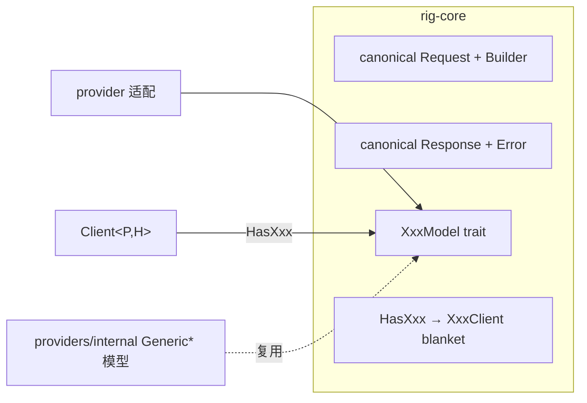

# 06-01 · 嵌入、重排、转录与图像/音频生成

> 除补全外的五个能力面共享同一套设计：canonical 请求/响应类型 + 一个模型 trait + `Has*` 客户端能力 trait + builder 构造。本篇给每个面的真实坐标与形状，并汇总各 provider 的接线情况。

## 1. 定位与共同形状



每个能力面新增的套路完全一致（见 02-01 篇 §4 "五步法"）：trait 方法接收/返回 canonical 类型，错误是该域自己的 thiserror 枚举并能转 `ErrorReport`。

## 2. 嵌入 — `embeddings/`

模块（`embeddings/mod.rs:8-17`）：`builder`、`embed`、`embedding`、`tool`、`distance`；导出 `EmbeddingsBuilder`、`Embed/EmbedError/TextEmbedder/to_texts`、`embedding::*`（`EmbeddingModel`、`Embedding`、`EmbeddingResponse`、`EmbeddingError`）、`ToolSchema`。

- trait：`EmbeddingModel`（`embedding.rs:100`）——实现者写 `embed_texts_response`（保序、带 usage/provider/identity），`embed_texts:130`/`embed_text:139`/`embed_text_response:154` 默认派生。
- 文档侧：`trait Embed`（`embed.rs:65`，可 derive；`#[embed]` 标字段）；`EmbeddingsBuilder<M,T>`（`builder.rs:52`）批量嵌入；`distance.rs` 距离度量；`tool.rs::ToolSchema` 把可嵌入数据用于动态工具。
- 接线：OpenAI（`openai/embedding.rs:365`）、Gemini（`gemini/embedding.rs:154`）、Voyage AI、Cohere、本地 rig-fastembed 等。

## 3. 重排 — `rerank.rs`

```rust
pub trait RerankModel { // :22
    fn max_documents(&self) -> usize;
    fn rerank(&self, query: &str, documents: Vec<String>)
        -> impl Future<Output = Result<RerankResponse, RerankError>> + WasmCompatSend;
}
pub struct RerankResult { pub index: usize /* 原列表下标 */, pub score: f64, pub document: .. }  // :41
pub struct RerankResponse { .. }  // :72
```

接线方式两类：provider 直接 impl（voyageai `providers/voyageai.rs:546`、cohere）；Jina 形通用协议 `internal::rerank::{JinaCompatibleRerank:26, GenericRerankModel:118}`（impl `RerankModel` :216），llamacpp 经 `providers/llamacpp/rerank.rs:27` 接入。典型链路：vector `top_n` 粗召回 → rerank 精排 → 取前 K 进 prompt。

## 4. 转录 — `transcription.rs`

- `TranscriptionResponse:37`、`TranscriptionRequest:155`、`TranscriptionRequestBuilder<M,D>:221`（M=模型，D=文件/数据状态，`Missing` 类型状态机）。
- trait：`TranscriptionModel:124`（`transcription(req)` + 默认 `transcription_request()` builder）。
- 协议复用：`internal::transcription.rs` 的 `OpenAiTranscriptionClient:23`/`OpenAiTranscriptionModel:44`（multipart，`transcription_form:171`、`send_transcription:227`）与 `GenericTranscriptionModel:143`。OpenAI 打 `/audio/transcriptions`；Groq 声明自己的路径/头（`groq.rs:307`）；**Gemini 的转录借用 `:generateContent`**（`gemini/transcription.rs:24/96`），不是 multipart。
- multipart 构造在 `http_client/multipart.rs`：`Part::bytes(name, data).filename(..).content_type(..)`。

## 5. 图像生成 — `image_generation.rs`（feature `image`）

`ImageGenerationResponse:33`、`ImageGenerationRequest:141`、`ImageGenerationRequestBuilder<M,P=Missing>:150`；trait `ImageGenerationModel:113`（`image_generation(req)` + `image_generation_request()`）。

通用件 `internal/image_generation.rs`：`JsonImageGenerationProvider:44`、`GenericImageGenerationModel:81`、`send_image_generation:165`。OpenAI（`/images/generations`，常量 `DALL_E_2/3`、`GPT_IMAGE_1/1_5/2`）与 Gemini（复用 generateContent，`gemini/image_generation.rs`）接线。示例：`examples/gemini_nanobanana_image_generation`、`examples/cohere_image_embeddings`。

## 6. 音频生成 — `audio_generation.rs`（feature `audio`）

`AudioGenerationRequest`、`AudioGenerationResponse`；trait `AudioGenerationModel:118`，builder `AudioGenerationRequestBuilder<Self, Missing, Missing>:125`。通用件 `internal/audio_generation.rs`：`RawAudioGenerationProvider:17`、`GenericAudioGenerationModel:76`、`send_audio_generation:158`（返回原始音频字节）。OpenAI TTS（`/audio/speech`，常量 `TTS_1/TTS_1_HD`，`openai/audio_generation.rs`）。Gemini **无**此能力。

## 7. 模型列表与探活（回顾）

- `ModelLister<H>`（`client/model_listing.rs:118`）：`list_models` 负责翻完全部页；通用分页在 `internal/model_listing.rs`（`paginate_models:218`、`list_models:325`、宏 `impl_model_lister!:50`）。
- `VerifyClient::verify()`（`client/verify.rs:34`）打 `Provider::VERIFY_PATH`；rig-verify crate 是不发布的探活工具。

## 8. 能力 × Provider 速查

| 能力 | OpenAI | Gemini | 其他代表 |
|---|---|---|---|
| Completion | Chat + Responses（+WS） | GenerateContent + Interactions | 26 家 |
| Embeddings | ✅ | ✅ | voyageai/cohere/fastembed/ollama |
| Rerank | ❌ | ❌ | voyageai/cohere/llamacpp(Jina 形) |
| Transcription | ✅ multipart | ✅（generateContent 借道） | groq |
| Image | ✅ | ✅ | — |
| Audio TTS | ✅ | ❌ | — |
| Model listing | ✅ | ✅（两面各一） | 多数用 internal 宏 |

## 9. 边界与坑

- 图像/音频在 facade 上分别要 `image`/`audio` feature；不开 feature 时 provider 模块里的相关类型不编译。
- `embed_texts_response` 保序是所有下游（zip 入库）的前提。
- 转录 multipart 的文件 part 需要文件名与 content type，部分 provider 据此选解码器。
- 不要假设 rerank 结果按原顺序：用 `RerankResult.index` 映射回原文。
- 新增能力字段先确认 provider 真实 API 存在（仓库规则：不发明字段）。

## 10. 自检问题

1. 五个能力面中哪些在 rig-core 有 `internal` 通用模型？分别叫什么？
2. Gemini 的转录与图像为什么不走 OpenAI 那套 multipart/JSON 端点？
3. 给一个新厂商加 rerank，何时直接 impl trait、何时复用 `GenericRerankModel`？
4. builder 上的 `Missing` 类型参数表达什么？
5. `EmbeddingsBuilder` 与 `insert_documents` 如何衔接？
