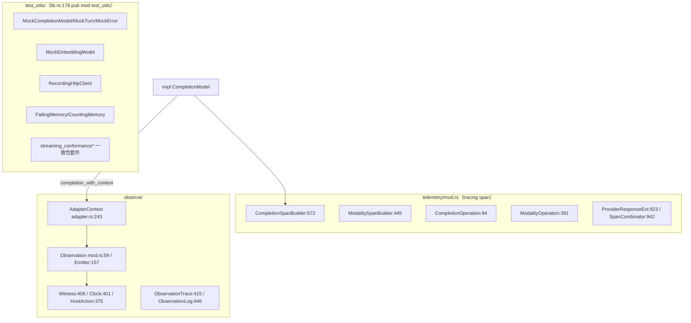

# 06-02 · 遥测、观测与测试基础设施

> Rig 有两套互补的可观测面：**telemetry**（基于 `tracing` 的 GenAI 语义约定 span，给 OTel/日志管道）与 **observe**（provider 调用的结构化证据/Witness 管线，给测试与宿主审计）。测试侧则有 `test_utils/`（mock 模型/传输/记忆 + 流式一致性套件）与仓库根的 cassette 体系。本篇讲清坐标与用法。

## 1. 定位

## 2. telemetry：GenAI 语义约定 span

`crates/rig-core/src/telemetry/mod.rs`：

- `CompletionOperation:94`：`Chat / ChatStreaming / GenerateContent / Interactions / InteractionsStreaming`（每个 provider 线一个变体）。
- `ModalityOperation:391`：`Embeddings / Rerank / Transcription / ImageGeneration / AudioGeneration`。
- `CompletionSpanBuilder::new(provider, request_model, operation):581`，`.system_instructions(..):592`，`.build():602 -> tracing::Span`；模态版 `ModalitySpanBuilder:445/453/462`。
- span 字段助手：`system_instructions_json:876`、`record_model_input:895`（消息，受 content-telemetry 开关控制）、`record_model_output:911`。
- `ProviderResponseExt:923`：`response_id / response_model_name / text_response / Usage`，provider 在自己的响应类型上实现（OpenAI 在 completion/mod.rs:1404、responses_api/mod.rs:2489）。
- `SpanCombinator:942`：为 `tracing::Span` 记 Rig 归一化 token usage 等 GenAI 约定字段。
- 内容默认不进 span（可能含 PII）：builder 的 `record_content_telemetry(bool)`（agent/builder.rs:276）控制。
- 端到端示例：`examples/otel`、`examples/agent_with_tools_otel`、`examples/openai_agent_completions_api_otel`（注意 `examples/otel` 是排除在 workspace 外的数据包）。

## 3. observe：结构化调用证据

`crates/rig-core/src/observe/`（`adapter.rs` + `mod.rs`）：

- 模型 trait 的第三方法 `completion_with_context(req, Option<AdapterContext>)`（见 02-01 篇）：每次 provider 调用携带上下文；非 HTTP 传输（本地模型/SDK）的默认实现直接委托。
- `AdapterContext`（adapter.rs:243）携带这次调用的观测上下文；投影类型 `AdapterObservation:31`、`AdapterVerdict:102`、`AdapterAnalysis:115`、`AdapterErrorEnvelope:125`、`AdapterUsage:141`——证据覆盖请求、响应、厂商裁决、错误信封、usage、结束方式。
- 证据汇流：`Observation:59`（含 `at` 时间戳）、`Subject:97`、`Emitter:157`、`Reason:199`。
- 宿主接缝：`Witness:408`（共享、`&self`、`observe(Observation)`，**绝不能阻塞调用方**）、`Clock:401`（宿主单调钟，测试给计数器；rig-core 自己不读钟）、`HostAction:375`（`KIND` 常量 + 可序列化 host 事实，如人工批准 `rigcoder/approval`；序列化失败是错误不是静默丢弃）。
- 产物：`ObservationTrace:415`（带 session 血缘、按序事实）、`ObservationLog:446`。
- **流式一致性 harness 要求** provider 线实现 `completion_with_context`（trait 文档明示），保证重试/跨任务的 per-call 身份不丢；转发式包装要把 context 透传。

## 4. test_utils：单测里的假世界（`crates/rig-core/src/test_utils/`）

`mod.rs:18-27` 导出：

| 设施 | 用途 |
|---|---|
| `MockCompletionModel / MockTurn / MockError`（completion.rs） | 脚本化模型响应/错误，驱动 run 循环与 hook 测试 |
| `MockEmbeddingModel / MockTextDocument / MockMultiTextDocument`（embeddings.rs） | 向量库与嵌入流程测试 |
| `RecordingHttpClient`（http.rs:78） | 不发网络：`new(body):85`、`with_error:93`、`with_error_response:102`（保留状态体）、`with_error_headers:115`（如 429 + Retry-After）；还能录制发出的请求做断言 |
| `FailingMemory / CountingMemory / AppendFailingMemory`（memory.rs） | 记忆后端故障与调用计数 |
| `MockModelLister`（model_listing.rs） | 列模型分页 |
| `MOCK_PROVIDER / MockStreamEvent / mock_final(_with_total_tokens)`（streaming.rs） | 脚本化流事件 |
| tracing 隔离（tracing_isolation.rs） | 测试内捕获 span 而不互相污染 |
| `internal_streaming_profiles.rs`、`observations.rs` | internal 线 profile 与观测断言 |

## 5. 流式一致性套件（conformance harness）

`test_utils/streaming_conformance.rs` + `streaming_conformance_suite.rs`：

- `SuiteCapabilities:111`（`from_names:143`）：声明一条 provider 线支持哪些场景。
- `ScenarioReport:71`、`xfail_reason:206`/`invalid_xfail_entries:214`：预期失败必须登记且不可残留无效条目。
- `check_gated_outcome:234` / `check_ungated_outcome:273`：门控/非门控结果断言。
- 喂帧工具：`event_frame:339`、`ok_chunks:348`、`transport_error_chunk:354`；`WireInput/WireChunks`（:307 起）。
- 主断言 `assert_valid_event_stream:386`；排干结果 `DrainedStream:571`，可查 `texts:582`、`tool_call_names:596`、`unknown_values:611`（未识别负载必须可见）、`error_count:622`、`final_count:627`、`choice_texts:640`。
- 它与 `internal/sequence_law.rs`（debug 流事件序列法则）、`streaming/unknown_payload_tests.rs` 共同保证：所有 provider 线产出同一套合法流事件，未知帧不静默。

## 6. cassette 体系（仓库根，详见 08 篇）

- 测试代码 `tests/providers/<provider>/cassette/`，录制流量 `tests/cassettes/<provider>/`（1,100+ YAML，不进发布包）。
- 回放默认无 key；`RIG_PROVIDER_TEST_MODE=record` 覆盖录制。
- `rig-cassette` crate 提供录制/回放 HTTP 传输；安全检查 `tests/common/cassette_safety.rs` 扫密钥/token/cookie/账号标识。
- ECS 另有 parity 矩阵：`tests/ecs_parity/`（golden `identities.json`），多个 provider 线在两个运行时上行为对齐。

## 7. 测试布局规则

测试模块必须是**兄弟文件**：`#[cfg(test)] mod tests;` + `foo/tests.rs`（或 `tests.rs` 邻 `mod.rs`），由 `cargo xtask check-test-layout` 在 CI 强制。内联 `mod tests {}` 不合规。

## 8. 边界与坑

- 写 `Witness` 不能阻塞；重活导出 trace 后异步处理。
- 测试不要直接读系统钟/全局 tracing subscriber——用 `Clock` 计数器与 tracing 隔离设施。
- 新增 provider 流场景要同时进 conformance 套件并声明能力；未识别 SSE 负载必须出现在 `unknown_values`，不能悄悄吞。
- cassette 录制后必须人工审 diff（即使有安全扫描）。
- content telemetry 默认关，示例里显式打开时不要把真实 PII 录进 fixture。

## 9. 自检问题

1. telemetry span 与 observe Witness 的消费者分别是谁？为什么需要两套？
2. 如何在单测里模拟一个带 `Retry-After` 的 429？
3. provider 的非 HTTP 本地模型（rig-candle）如何满足 `completion_with_context`？
4. 一个 provider 流式产出未知 JSON 帧，一致性套件如何让它"藏不住"？
5. 测试文件为什么不能写内联 `mod tests {}`？
