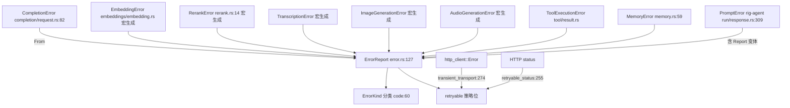
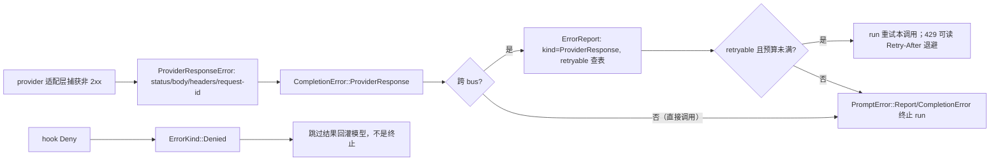

# 07 · 错误模型：域错误、线错误 ErrorReport 与唯一重试表

> Rig 的错误要穿过函数边界、effect bus、任务、进程（record/replay、ECS、远程 worker），具体错误类型无法越过这些边界。设计是：**域内**用各自的 thiserror 枚举（`CompletionError` 等，可含 `Box<dyn Error>`）；**跨线**统一转成可序列化的 `ErrorReport`；可重试性只有一个判定函数。
> 主文件：`crates/rig-core/src/error.rs`。

## 1. 定位



## 2. Why：两个层次

1. **域错误保留具体来源**：`CompletionError::HttpError(http_client::Error)` 保留传输错误链、`ProviderResponse(ProviderResponseError)` 保留原始响应——本进程内 `?` 与 `source()` 链完整。
2. **线错误只保留策略需要的一切**：`ErrorReport` 是 serde 数据：分类、可重试、HTTP 状态、厂商码、是否拒绝、Display 链、request-id、**完整原始响应**（status/body/headers）。跨 bus/进程后诊断能力不丢。
3. **重试判定单点化**：`retryable_status` 是状态码→可重试的唯一表，`CompletionError::is_retryable` 与所有 `From` impl 都咨询它；不可能两处写出不一致的 429 策略。

## 3. ErrorKind — `error.rs:34`

| 变体 | 含义 | 带状态? |
|---|---|---|
| `Http` | 无 provider 回复的传输失败（reset/超时/协议/不可读） | 从不 |
| `Json` | 序列化/反序列化 | 否 |
| `Url` | URL 解析 | 否 |
| `Request` | 请求构造失败 | 否 |
| `Response` | 响应解析失败 | 否 |
| `Provider` | 厂商失败但未保留原始响应 | 否 |
| `ProviderResponse` | 厂商回复了并保留原始响应（非 2xx 带体、2xx 错误信封、非 HTTP 传输的错误负载） | 是 |
| `Tool(ToolErrorKind)` | 工具失败，内部是工具自分类 | 工具 kind |
| `MemoryBackend` / `MemoryPolicy` | 记忆后端故障 / 策略或过滤器拒绝 | 否 |
| `Internal` | 内部不变量被违反 | 否 |
| `Cancelled` / `Timeout` | 取消 / 超deadline | 否 |
| `BusClosed` | effect bus 的 driver 已 drop；生命周期事件，同一 bus 上不可重试 | 否 |
| `HandlerUnavailable` | bus 活着但该 key 无 handler（未注册/已注销/家族不符）；键在消息里 | 否 |
| `Divergence` | replay 分歧：记录在该位置是别的效果，或效果超出记录长度；绝不重试 | 否 |
| `Denied` | 策略在派发前拒绝（bus Layer deny、宿主拦截）；引擎把它变成模型看到的跳过结果，不是失败 | 否 |
| `Other` | 其他 | 否 |

`code()`（:60 附近）给稳定机器码 `snake_case`，载荷（状态、tool kind）不进 code——重命名变体必须是显式改动。

## 4. ErrorReport — `error.rs:127`

```rust
pub struct ErrorReport {
    pub kind: ErrorKind,
    pub retryable: bool,                    // 转换时按来源自身分类决定
    pub message: String,                    // 来源的 Display
    pub code: Option<String>,               // 厂商/工具机器码
    pub http_status: Option<u16>,
    pub refusal: bool,                      // 有意拒绝而非故障
    pub source_chain: Vec<String>,          // 每个 source() 链接的 Display，由外到内
    pub request_id: Option<String>,
    pub provider_response: Option<Box<ProviderResponseError>>,  // skip_serializing_if None
}
```

- 构造器：`ErrorReport::new(kind, msg)`、`.with_retryable()`、`.with_code()`、`.with_http_status()`、`.refused()`、`.with_request_id()`；读取 `is_retryable()`、`provider_response_body()`、`provider_response_json()`、`provider_response_headers()`、`provider_response_status()`、`provider_request_id()`。
- `impl Display` 输出 message；`impl std::error::Error`（无 source 链——链已摊平进 `source_chain`）。
- `ProviderResponseError`（`provider_response.rs:15`）：`status`、`body`、`provider_request_id`（没有 id 是文档化的正常结果，不是二次错误，rig#2314）、box 化的 headers（429 时读 `Retry-After`/`x-ratelimit-*`，rig#2210；box 是为 `result_large_err`）。

## 5. 唯一的重试表 — `error.rs:255`

```rust
pub const fn retryable_status(status: Option<u16>) -> bool {
    match status {
        None => false,
        Some(408 | 425 | 429) => true,
        Some(s) => (500..=599).contains(&s),
    }
}
```

无状态的传输失败由 `transient_transport(&http_client::Error):274` 分类：

- 可重试：`StreamEnded`（流在终帧前结束）、`Instance(..)`（connect reset、DNS/TLS、超时——请求未到达决策点）；
- 不可重试：`Protocol`、`InvalidHeaderValue`、`NoHeaders`、`InvalidContentType`（请求都没正确成形/响应读不了）；
- `InvalidStatusCodeWithDetails { status, .. }` 咨询 `retryable_status`。

## 6. 域错误枚举

### CompletionError — `completion/request.rs:82`

七变体：`HttpError(#[from] http_client::Error)`、`JsonError(#[from] serde_json::Error)`、`UrlError(#[from] url::ParseError)`、`RequestError(Box<dyn Error…>>)`（平台分支 bound）、`ResponseError(..)`、`ProviderError(String)`、`ProviderResponse(ProviderResponseError)`。`is_retryable()` 按上面两张表判定；`From<&CompletionError> for ErrorReport`（error.rs 中）保留状态、request-id、response 与机器码/refusal。

### 其他能力错误：宏生成

`EmbeddingError`（`embeddings/embedding.rs:15` 的 `provider_error_enum!`）除公共变体（Http/Json/Url/Request/Response/Provider/ProviderResponse）外有 `UnsupportedParameter`、`InvalidParameterValue`、`UnsupportedResponseEncoding`、`MissingUsage`、`MismatchedDimensions`、`DocumentError`。`RerankError`（`rerank.rs:14`）、`TranscriptionError`、`ImageGenerationError`、`AudioGenerationError` 用同一宏生成公共形状，`is_retryable` 由宏统一。

### VectorStoreError — `vector_store/mod.rs:32`

`EmbeddingError(#[from])`、`JsonError`、`DatastoreError(Box<dyn Error…>>)`（平台分支）、`FilterError(#[from] FilterError)` 及外部 API 变体。伴侣 crate 一律用它，不造字符串错误。

### MemoryError — `memory.rs:59`

`Backend(..)` / `Policy(..)` / `Internal(..)`；转 report 时映射 `MemoryBackend/MemoryPolicy/Internal`，默认不可重试。

### ToolExecutionError — `tool/result.rs`

归一化在擦除派发边界；`ToolErrorKind:15`（InvalidArgs/Timeout/Cancelled/NotFound/PermissionDenied/RateLimited/Provider/Network/Other）各有默认重试性与默认模型反馈（单表宏 `kind_defaults!` 保证三访问器同步）。可显式 override retryable；带 code/http_status/refusal。转 report：`kind = ErrorKind::Tool(..)`，`is_retryable = override.or(kind 默认).unwrap_or(false)`。

### PromptError — rig-agent `run/response.rs:309`

run 表面的用户错误：

- `CompletionError(#[from])`；
- `Report(#[from] ErrorReport)`——bus/handler 失败、hook deny、流项错误都以线错误到达；
- `MemoryError(#[from])`；
- `MaxTurnsError { max_turns, chat_history, prompt }`（预算耗尽，带着当时历史与未发出的 prompt）；
- `PromptCancelled { chat_history, reason, .. }`（取消，:335）。

## 7. 转换链与 run 内重试



匹配示例（429 + Retry-After）：

```rust
if let Err(e) = result {
    let report = ErrorReport::from(&e);
    if report.is_retryable() {
        let wait = report.provider_response_headers()
            .and_then(|h| h.get("Retry-After"))
            .and_then(|v| v.to_str().ok());
        // 按 wait 退避重试（预算由 run 持有）
    }
    if report.refusal { /* 有意拒绝，区别于故障 */ }
}
```

## 8. 边界与坑

- `Http` 与 `ProviderResponse` 的分界：**服务器有没有做出回复**。无回复（连接失败）永不带状态；有回复无论状态都保留原始响应。
- `Denied` 不是 run 失败：completion 被拒按策略结束，工具被拒是模型可见的跳过结果。
- `Divergence`/`BusClosed` 不可重试——换 bus 或让 replay 失败，不要自动重发。
- 新增错误变体要同时更新：域枚举、`From<&X> for ErrorReport` 的 kind 映射（能力错误走宏）、需要时的 `retryable` 规则；不要在转换处复制重试表。
- WASM 上 boxed source 的 bound 去掉 `Send + Sync`（平台分支），宏已处理，自写枚举要照做。

## 9. 自检问题

1. 一个 500 响应与一个连接 reset，在 `ErrorKind` 上分别是什么？谁可重试？
2. `ErrorReport` 跨进程后还能读出 429 的退避秒数吗？从哪读？
3. hook 拒绝一个工具调用最终成为哪个错误变体？run 会终止吗？
4. 工具作者自己的 `Error` 枚举在什么时候变成 `ToolExecutionError`？默认可重试性由什么决定？
5. replay 时记录里第二步是 Embed、程序却要发 Completion，得到什么错误？
