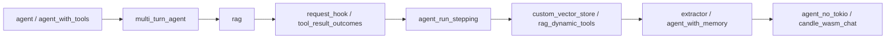

# 10 · 示例导读：`examples/` 知识点索引

> 68 个示例是**独立 Cargo 包**（每个有自己的 Cargo.toml，`examples/*` 自动成员；`discord_bot` 除外，它是独立 workspace）。多数需要 `OPENAI_API_KEY` 等环境变量（文件头注释注明）。本篇按知识点分组，标注对应的本文集章节。

## 1. 入门：第一个 agent / 补全

| 示例 | 知识点 |
|---|---|
| `calculator_chatbot` | 最小对话循环 |
| `agent` | `client.agent(model).preamble/tool/build()` 基础形态（03/04-01） |
| `agent_stream_chat` | `prompt().stream()` 消费 MultiTurnStream 事件（02-03/04-01） |
| `agent_run_stepping` | **sans-IO 单步驱动**：直接操作 run 状态机（04-01/04-04，重点） |
| `agent_no_tokio` | 用 bevy_tasks 而非 tokio 驱动 run——证明运行时中立（01/04-01） |
| `multi_turn_agent` / `multi_turn_agent_extended` | 多轮工具循环与历史（04-01） |
| `complex_agentic_loop_claude` | Anthropic 上的复杂循环（03 provider 差异） |

## 2. 工具系统

| 示例 | 知识点 |
|---|---|
| `agent_with_tools` | 类型化 `Tool` / `#[rig_tool]`（04-03，首选入门） |
| `agent_with_context` | `ToolContext` 入站槽位与 scopes（04-03） |
| `agent_with_agent_tool` | agent 本身作为工具 |
| `manual_tool_calls` | 绕过 agent，直接在 raw `CompletionModel` 请求里手工处理 tool call |
| `force_tool_first_turn` | **首turn强制工具的 RequestPatch 坑与正确写法**（04-02） |
| `tool_result_outcomes` | 把工具失败分类成结构化事实、在 hook 里做策略（04-03/07） |
| `enum_dispatch` | 用枚举在多个工具实现间分发 |
| `rmcp` | rig-rmcp 接外部 MCP 工具（04-03，需 `rmcp` feature） |
| `rag_dynamic_tools` / `rag_dynamic_tools_multi_turn` | `ToolEmbedding`：按检索动态供给工具（04-03/05-01） |

## 3. Hook / 策略 / 运行时控制

| 示例 | 知识点 |
|---|---|
| `request_hook` | `on_completion_call` 逐轮 RequestPatch（04-02） |
| `agent_with_retry_hook` | turn/错误重试 hook（04-02/07） |
| `agent_with_approval_policy` | 派发前人工/策略批准（对应 observe 的 host action） |
| `agent_with_durable_approval` | 可持久化的批准（序列化边界，04-04） |
| `agent_with_human_in_the_loop` | 人工介入循环 |
| `agent_with_default_max_turns` | 模型调用预算与 MaxTurnsError（07） |
| `agent_with_echochambers` | 自定义运行时反馈 |

## 4. 工作流模式（多 agent 编排）

| 示例 | 模式 |
|---|---|
| `agent_prompt_chaining` | 两个 agent 顺序串联 |
| `agent_routing` | 一个 prompt 路由到不同后续 |
| `agent_parallelization` | 并行 fan-out（`IntoFuture`） |
| `agent_orchestrator` | orchestrator-worker 编排 |
| `agent_evaluator_optimizer` | 评估-优化迭代 |
| `debate` / `reasoning_loop` | 多角色辩论 / 推理循环 |
| `agent_autonomous` | 自主提取器回喂循环 |

## 5. 记忆 / RAG / 向量

| 示例 | 知识点 |
|---|---|
| `agent_with_memory` | ConversationMemory 接入（05-03） |
| `agent_with_memory_streaming` | 流式 + 记忆 |
| `rag` | 标准 RAG：EmbeddingsBuilder + 索引 + 检索注入（05-01） |
| `chain` | 检索后手工 fold 进 prompt 的轻量 RAG |
| `vector_search` / `vector_search_cohere` / `vector_search_ollama` | 不同嵌入提供方的向量检索 |
| `custom_vector_store` | 自实现 `VectorStoreIndex`/`InsertDocuments`（05-01/05-02） |
| `gemini_extractor_with_rag` | Gemini 提取 + RAG |
| `cohere_image_embeddings` | 多模态（图像）嵌入 |

## 6. 结构化提取 / 输出模式

| 示例 | 知识点 |
|---|---|
| `extractor` | `Extractor<T>` 基础（04-04） |
| `multi_extract` | 批量/多对象提取与重试预算 |
| `sentiment_classifier` | 用提取器做分类 |
| `gemini_extractor_with_rag` | provider 差异下的提取 |

## 7. Provider / 传输 / 中间件

| 示例 | 知识点 |
|---|---|
| `rag_ollama` / `transcription` | 本地 Ollama；转录能力（06-01） |
| `http_middleware` | `HttpMiddleware` 包装传输（02-03） |
| `reqwest_middleware` | reqwest 层中间件（与 Rig middleware 的分层） |
| `gemini_default_api_recovery` | Gemini 鉴权/API 面恢复（03-02） |
| `gemini_deep_research` | Interactions/长任务形态 |
| `gemini_video_understanding` | generateContent 多模态 part |
| `gemini_nanobanana_image_generation` | Gemini 图像生成（`image` feature，06-01） |
| `gemini_stream_kill_token_count` | 流式中断与用量记账（04-01/06-02） |
| `openai_streaming_per_call_usage` | Responses/Chat 每次调用 usage |

## 8. 可观测性 / 本地模型 / 文档加载

| 示例 | 知识点 |
|---|---|
| `otel`（数据包，workspace 外） | OpenTelemetry 采集配置参考（06-02） |
| `agent_with_tools_otel` | 工具调用的 GenAI span |
| `openai_agent_completions_api_otel` | Chat Completions 面遥测 |
| `openai_streaming_with_tools_otel` | 流式 + 工具遥测 |
| `candle_local` | rig-candle 本地 LLM（CompletionModel，05-03） |
| `candle_wasm_chat` | WASM 内本地推理（08 WASM 构建） |
| `pdf_agent` | `pdf` loader feature |
| `agent_with_loaders` | 文件/epub 等 loader（06-01 之外的 loaders 模块） |

## 2. 阅读建议路线

- 想理解**架构**而不是用法：直接读 `agent_run_stepping`（sans-IO）、`agent_no_tokio`（运行时中立）、`tool_result_outcomes`（错误/策略过线）。
- 想理解 **provider 协议差异**：对照 `complex_agentic_loop_claude` 与 OpenAI 系示例，以及 gemini_* 一组。
- 所有示例默认走 facade `rig::prelude::*`；要研究纯契约写法时把 `rig::` 换为 `rig_core::` 路径对照 02 篇。

## 3. 运行注意

- 示例包独立编译：`cargo run -p <package-name>`（包名见各自 Cargo.toml，目录名与包名通常一致）。
- 需要真实服务的示例不要在离线 CI 跑；协议学习优先配合 cassette 测试（08 篇）。
- 特性化示例（rmcp/pdf/epub/image/audio/candle/fastembed/websocket）先在 Cargo.toml 确认启用的 feature。
